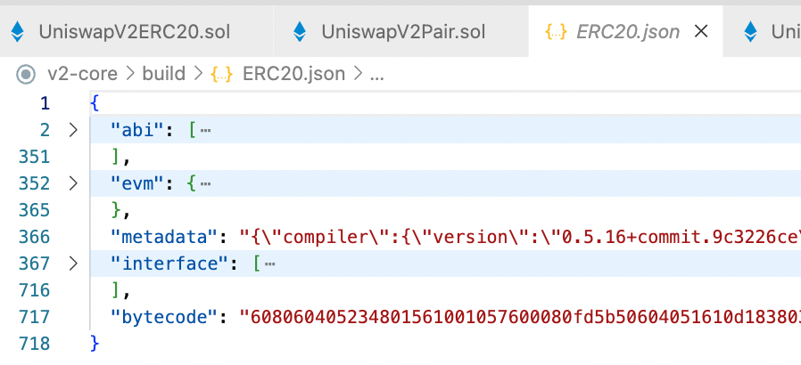
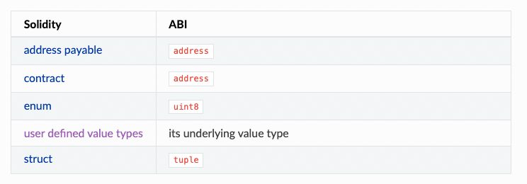
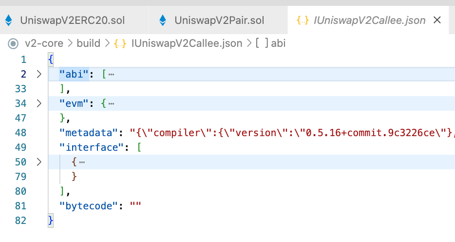
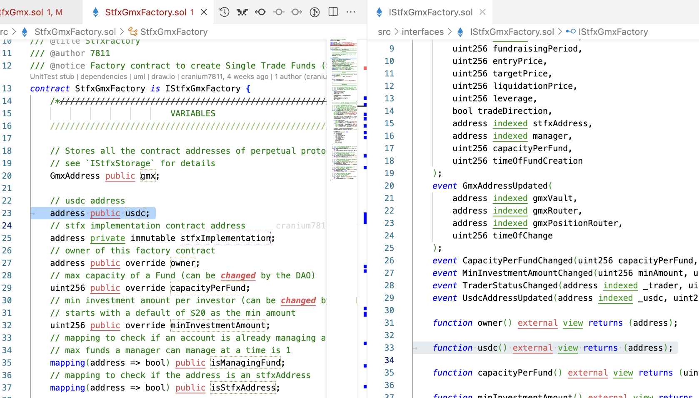
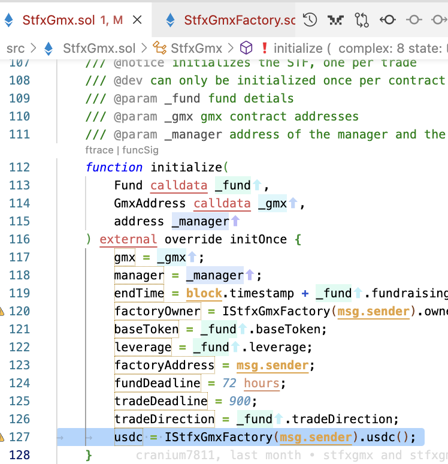
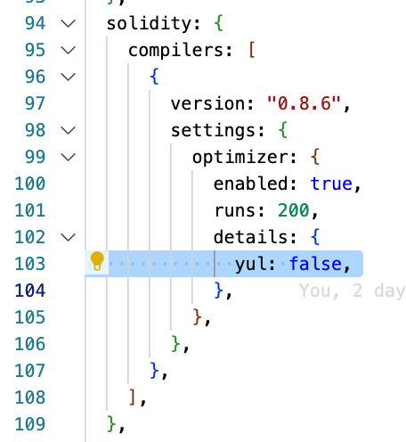
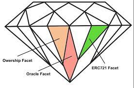
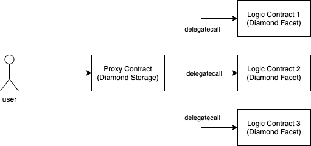
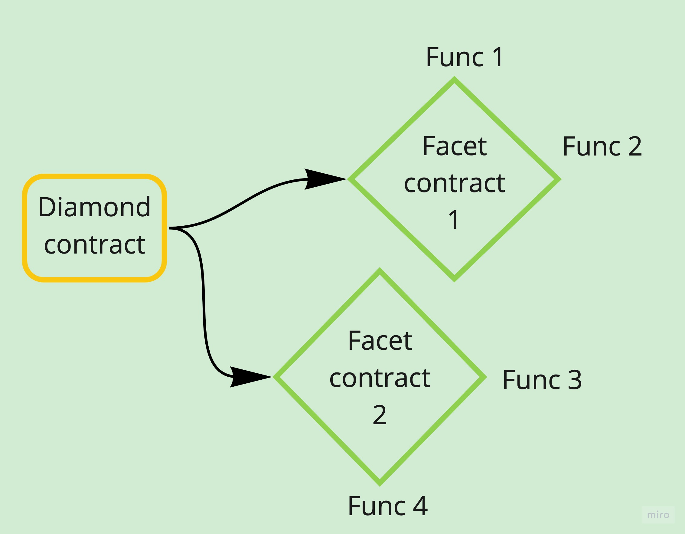
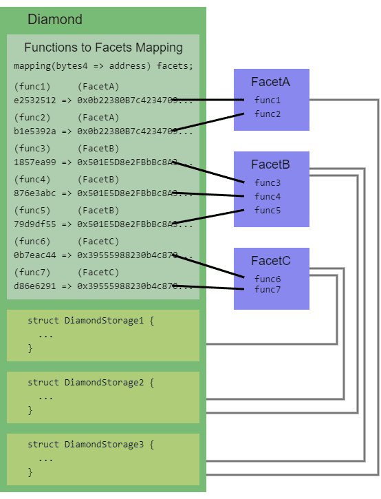

# EVM Playground

Contracts on Ethereum & EVM compatible Blockchains [also helpful for EOSIO Developers]

## Introduction

- The contract code can't be updated (by default), but all the state variables can be updated.
- The contract code can be updated via proxy method using technique proposed by Openzeppelin (Transparent, UUPS), Diamond standard (more robust, modular).

## Installation

### Editor

- #### Visual Studio Code [Recommended]

  - [evm-boilerplate](https://github.com/abhi3700/evm_boilerplate)
  - [formatter](https://marketplace.visualstudio.com/items?itemName=esbenp.prettier-vscode) [YouTube](https://www.youtube.com/watch?v=PX6xb8sRlFc)
    - Open Settings
    - type 'save format' >> tick the "Editor: Format on Save"
    - type 'formatter' >> set the "Editor: Default Formatter" to Prettier (by esbenp....)
    - type 'solidity formatter' >> set the "Solidity: Formatter" from `none` to `prettier`
    - Now, on saving any solidity (`*.sol`) file, it will automatically format.
  - packages:
    - [solidity](https://marketplace.visualstudio.com/items?itemName=juanblanco.solidity)
    - [Slither](https://marketplace.visualstudio.com/items?itemName=trailofbits.slither-vscode)

- #### Sublime Text 3

  - packages
    - [Solidity Docstring Generator](https://packagecontrol.io/packages/Solidity%20Docstring%20Generator)
    - [Ethereum](https://packagecontrol.io/packages/Ethereum)
    - [Ethereum​Solidity​Snippets](https://packagecontrol.io/packages/EthereumSoliditySnippets)

### Remix IDE

- Write Solidity based contracts [here](https://remix.ethereum.org/).
- Deploy, test as a user like an IDE using a local file

  - Follow this [guide](https://remix-ide.readthedocs.io/en/latest/remixd.html)
  - Install remixd using `npm install -g @remix-project/remixd` globally or `npm install @remix-project/remixd` locally.
  - And then "Connect to localhost" in the Remix Website.

- Use inside a project dir like this: `$ remixd -s <project_dir> --remix-ide https://remix.ethereum.org`. E.g. `$ remixd -s ./contracts --remix-ide https://remix.ethereum.org` or `$ remixd -s . --remix-ide https://remix.ethereum.org`

## Compile

- Ethereum smart contracts are generally written in Solidity and then compiled into EVM bytecode and ABI via `solc`.

> NOTE: most people do not compile contracts directly through commands, because there are very convenient tools and frameworks such as remix or truffle or hardhat.

- Comparo

|                     | Solidity                                | EOSIO                                              |
| ------------------- | --------------------------------------- | -------------------------------------------------- |
| Compile Contract    | solcjs --abi --bin hello.sol            | eosio-cpp hello.cpp -o hello.wasm                  |
| Deployment contract | hello=(web3.eth.contract([…])).new({…}) | cleos set contract hello ./hello -p hello@active   |
| Call contract       | hello.hi.sendTransaction(…)             | cleos push action hello hi '["bob"]' -p bob@active |

- The EVM bytecode is further converted into OPCODE which looks like this:

```bytecode
PUSH1 0x80 PUSH1 0x40 MSTORE CALLVALUE DUP1 ISZERO PUSH3 0x11 JUMPI PUSH1 0x0 DUP1 REVERT JUMPDEST POP PUSH1 0x40 MLOAD PUSH3 0xB7A CODESIZE SUB DUP1 PUSH3 0xB7A DUP4 CODECOPY DUP2 DUP2 ADD PUSH1 0x40 MSTORE DUP2 ADD SWAP1 PUSH3 0x37 SWAP2 SWAP1 PUSH3 0x1E4 JUMP JUMPDEST CALLER PUSH1 0x0 DUP1 PUSH2 0x100 EXP DUP2 SLOAD DUP2 PUSH20 0xFFFFFFFFFFFFFFFFFFFFFFFFFFFFFFFFFFFFFFFF MUL NOT AND SWAP1 DUP4 PUSH20 0xFFFFFFFFFFFFFFFFFFFFFFFFFFFFFFFFFFFFFFFF AND MUL OR SWAP1 SSTORE POP DUP2 PUSH1 0x1 SWAP1 DUP1
```

- The EVM opcode gives instruction to EVM to execute commands.
- [Bytecode to Opcode converter tool](https://etherscan.io/opcode-tool)

> NOTE: It's almost impossible to generate Smart contract code from EVM ABI & Bytecode.

## Deploy

- The address of the contract account (not external account) is automatically generated at deployment time, and the contract can never be changed once deployed.
- In EVM chains, gas fee is analogous to EOS's CPU, NET (follow staked or pay-per-use model). `EOSIO's CPU & NET` <-> `ETH's gas fee`
- In EVM chains, the contract data storage is unlimited unlike EOSIO's RAM (follow staked or pay-per-use model). `EOSIO's RAM` <-> `ETH's unlimited storage`.
  > But, the contract code is limited to 24KB in EVM chains.
- The EVM has a 256-bit address space, which is 2^256 addresses. The first 20 bytes of the address are the address of the contract, and the last 12 bytes are the address of the account that created the contract. So, each slot of stack in machine is of `uint256` type.
- In ETH, an object is created based on ABI in the `geth` console and then calls the `new()` method to initiate a contract creation txn (parameters contain bytecode), whereas in EOSIO's `cleos` tool, `set()` method is used to specify the bytecode and the directory where the ABI is located.
  > In EOSIO, the contract account name is not generated automatically, but it has to be created manually/automatically by the user i.e. RAM, CPU, NET has to be provided. The contract account name is the same as the contract name in terms of rules.
- [Remix](https://remix-ide.readthedocs.io/en/latest/run.html)
  - [Environments](https://remix-ide.readthedocs.io/en/latest/run.html#environment)
    > For seeing the contract data, function details, Remix IDE is the best tool for EVM contracts.

```
JavaScript VM: All the transactions will be executed in a sandbox blockchain in the browser. This means nothing will be persisted when you reload the page. The JsVM is its own blockchain and on each reload it will start a new blockchain, the old one will not be saved.
Injected Provider: Remix will connect to an injected web3 provider. Metamask is an example of a provider that inject web3.
Web3 Provider: Remix will connect to a remote node. You will need to provide the URL to the selected provider: geth, parity or any Ethereum client.
```

## Call

- The call method is only executed locally, does not generate transactions and does not consume gas, `sendTransaction()` method will generate transactions and consume gas, the transaction is executed by the miner and packaged into the block, while modifying the account status.

## Coding

### [Style Guide](https://docs.soliditylang.org/en/v0.8.6/style-guide.html)

- Summary: Prefer CamelCase for contracts & firstSecond type of font style for functions, variables.

### Layout

- Elements
  1. The pragma statement
  1. Import statements
  1. Interfaces
  1. Libraries
  1. Contracts

> NOTE: Libraries, interfaces, and contracts have their own elements as well. They should go in this order:

> - Type declarations

> - State variables

> - Events

> - Functions

### Contract

- max code size: **`24 KB`**
- max storage size: `2^261` i.e. `3.7 x 10^69 GB`.
- Contracts and libraries should be named using the CapWords style. Examples: SimpleToken, SmartBank, CertificateHashRepository, Player, Congress, Owned.
- Contract and library names should also match their filenames.
- If a contract file includes multiple contracts and/or libraries, then the filename should match the core contract.
- Contracts consist of 2 main types:

  - Persistent data kept in **state variables**
  - Runnable **functions** that can modify state variables

- Each contract can contain declarations of State Variables, Functions, Function Modifiers, Events, Errors, Struct Types and Enum Types.
- Furthermore, contracts can inherit from other contracts.

> NOTE: unlike in other languages, you don’t need to use the keyword `this` to access state variables.

- Creating contracts programmatically on Ethereum is best done via using the web3 packages: `web3.js`, `ethers` (typescript). It has a function called `web3.eth.Contract` to facilitate contract creation.
- A constructor is optional. Only one constructor is allowed, which means overloading is not supported.
- When a contract is created, its constructor (a function declared with the constructor keyword) is executed once. All the values are `immutable`: they can only be set once during deploy.
- A constructor is optional. Only one constructor is allowed, which means overloading is not supported.
- Constructor can't be called from inside another function
- Inheritance:

```
// SPDX-License-Identifier: GPL-3.0
pragma solidity >=0.4.0 <0.9.0;

import "./Owned.sol";


contract Congress is Owned, TokenRecipient {
        //...
}
```

- The contract should be named using the CapWords specification (first letter)capital）

```
contract BucketCrow {
        // ...
}
```

- After build, a contract looks like this:



where, there is a bytecode.

> NOTE: When a transaction is sent to a block all it's actions are considered confirmed i.e.

        based on which some values can be set like `id` here.
        Either of the action if fails, the whole transaction is failed.

> [Try this example](./sol/MyArray/TestArray.sol) on Remix.

- Each of the action/operation is executed provided all are successful. E.g.

```solidity
    function createAuction(address _asset, uint256 _startsAt, uint256 _endsAt)
        external
        whenNotPaused
        nonReentrant
        returns (address auction)
    {
        ...
        ...

        bytes memory bytecode = type(Auction).creationCode;
        bytes32 salt = keccak256(abi.encodePacked(_asset, _startsAt, _endsAt));
        assembly {
            auction := create2(0, add(bytecode, 32), mload(bytecode), salt)
        }
        // console.log("Auction created: %s", auction);
        IAuction(auction).initialize(owner(), msg.sender, _asset, _startsAt, _endsAt);

        ...
        ...

        // transfer ownership of the auction to the Auction contract created
        bool success = IGenericERC20(_asset).transferFromOwnership(auction);
        require(success, "transferFromOwnership failed");
    }
```

In the above code snippet, there are 3 actions:

- `create2` action
- `initialize` action
- `transferFromOwnership` action

#### Constructor

- A constructor is optional. Only one constructor is allowed, which means overloading is not supported.
- A constructor is executed when the contract is created.
- A constructor can't be called from inside another function.
- A constructor can't be called directly.
- A constructor can't be inherited.
- During inheritance of abstract, contract the constructor gets run by default. E.g.:

```solidity
contract AuctionRepository is Ownable, Pausable, CheckContract {

}
```

Here, the constructor of `Ownable`, `Pausable`, `CheckContract` will be called, if available.

---

#### Bytecode

- The **Solidity**/**Vyper**/**Fe** (or any language) code can be converted into a binary (represented in hexadecimal format) understandable by the machine: EVM i.e. Bytecode
- You can get bytecode from the source code which can then be compiled to bytecode or `.bin` format.
- You can download the bytecode (which is normally uploaded by the contract author/owner).

---

#### ABI

- The EVM bytecode above is nothing more than a sequence of EVM opcodes written in hexadecimals.
- ABI is what creates the interaction link between a client (directly from an EOA or an interface) and a smart contract bytecode (the contract logic in EVM opcodes).
- ABI defines clear specifications of how to encode and decode data and contract calls.
- Therefore in Ethereum and any EVM based chain, the ABI is basically how contracts calls are encoded for the EVM (so that the EVM understands which instructions to run).
- `ABI = specification for encoding + decoding`
- [understand function signature](https://ethereum.stackexchange.com/a/76254/76168)

There are some standard (`abi.encode` for encoding data), non-standard/packed (`abi.encodePacked`) encoding functions associated with abi:

```solidity
---1---
abi.encode("AbhijitRoy")
> 0x0000000000000000000000000000000000000000000000000000000000000020000000000000000000000000000000000000000000000000000000000000000a416268696a6974526f7900000000000000000000000000000000000000000000

abi.encode("Abhijit Roy")
> 0x0000000000000000000000000000000000000000000000000000000000000020000000000000000000000000000000000000000000000000000000000000000b416268696a697420526f79000000000000000000000000000000000000000000
---2---
abi.encodePacked("AbhijitRoy")
> 0x416268696a6974526f79
abi.encodePacked("Abhijit Roy")
> 0x416268696a697420526f79
---3---
abi.encodePacked("Abhijit", "Roy")
> 0x416268696a6974526f79
abi.encodePacked("Abhijit", " Roy")
> 0x416268696a6974526f79
```

> In EOSIO, all the account names are encoded into a 64-bit integer. This is done by taking the first 12 characters of the account name and converting them to a base-32 number. The remaining characters are ignored. This is done to save space on the blockchain.

- In `1`, if space occurs in input, the encoded output is different along with the offset.
- In `2`, if space occurs in input, the encoded output is different without the offset.
- In `3`, if space occurs in input, the encoded output is same without offset. So, it trims the spaces used for before & after `comma`.

Here, `encodePacked` drops the offset when compared to `encode`.

When calling SC, to encode function calls for external contract interaction, there are 2 functions:

- `abi.encodeWithSignature(...)`

```solidity
function _safeTransfer(address token, address to, uint value) private {
    (bool success, bytes memory data) = token.call(abi.encodeWithSignature("transfer(address,uint256)"), to, value);
    ...
}
```

- `abi.encodeWithSelector(...)`

```solidity
bytes4 SELECTOR = bytes4(keccak256(bytes("transfer(address,uint256)")));

function _safeTransfer(address token, address to, uint value) private {
    (bool success, bytes memory data) = token.call(abi.encodeWithSelector(SELECTOR, to, value));
    ...
}
```

These are the 2 functions which can be used in Solidity to prepare payloads in raw bytes for external contract calls. Such payloads can be passed as parameters to the low level Solidity `.call` ✅, `.delagateCall` ✅, `.staticCall` [❌Deprecated].

Both are same functions implemented differently. Easy to use `abi.encodeWithSignature` [Personal preference though].

```solidity
abi.encodeWithSignature(string memory signature, ...) returns (bytes memory)
```

is equivalent to

```solidity
abi.encodeWithSelector(bytes4(keccak256(bytes(signature))), ...)
```

The Solidity variable types are converted into ABI as shown below:


These are the observations:

- In a nutshell, a variable of type `address payable` or `contract` will be encoded/decoded under the hood by the ABI as a standard `address`.
- `enum` is converted to the lowest uint i.e. 8 bits or 1 byte. `uint8` => max. 256 items can be held by an enum since `^0.8.0` Solidity version.

Read [more](https://coinsbench.com/solidity-tutorial-all-about-abi-46da8b517e7)

#### Interface

- After build, Interface looks like this:
  

where, no bytecode.

Read [more](https://docs.soliditylang.org/en/v0.8.14/contracts.html#interfaces)

We don't need to implement the `view` functions with the exact same name as public state variable. Like in this eg:



Here, `usdc` is defined as `public` state variable. That means we don't need to define a `usdc()` function. But, it can be added to contract's interface in order to access the `usdc` state variable inside another contract like this:



---

#### Verify Signature

This is related to ECDSA. Inside SC, a message can be checked whether it was signed by the required address or not.

Here, the process goes like this [Video](https://youtu.be/NP4db_UPVwc).

**Theory**:

1. Create a message
2. Sign the message with your private key
3. Send these to verifier/validator
   1. original message
   2. signed message
   3. signer address (can be public key like in EOSIO chains)
4. Now, the validator use `ecrecover` method to check whether `signer address == address obtained from (original_msg, signed_msg)`.

**Practical: The steps for usage (in coding) is as follows:**

```c
msg = "I am unwell"

messageHash = keccak256(msg);

signedMessageHash = keccak256(messageHash);

ecrecover(signedMessageHash, _signature) ==_signer;
```

To use the actual solidity code, refer [this](https://github.com/OpenZeppelin/openzeppelin-sdk/blob/master/packages/lib/contracts/cryptography/ECDSA.sol).

---

#### EIP-712

---

#### Gasless (Meta-transactions)

We know that every (write) interaction on the Ethereum blockchain requires a small amount of ETH on the interacting address.

This sounds really awful from a UX perspective for token holders, as users first need to acquire ETH via a centralized exchange and transfer it to the wallet address accordingly. But wait, isn’t it the case — very simplified — that at the most foundational blockchain level, it is simply a matter of verifying the signed payload, i.e. off-chain cryptography?

Ah yes, that sounds right! So how about the wallet user simply signs the payload off-chain and someone else (e.g. an operator) broadcasts and pays for the transaction?

There you go, we have the solution: **meta-transactions**.

**Definition**:

> A meta-transaction is a regular Ethereum transaction which contains another transaction, the actual transaction. The actual transaction is signed by a user and then sent to an operator or something similar; no gas and blockchain interaction required. The operator takes this signed transaction and submits it to the blockchain paying for the fees himself. The forwarding smart contract ensures there is a valid signature on the actual transaction and then executes it. [More](https://betterprogramming.pub/ethereum-erc-20-meta-transactions-4cacbb3630ee)

Now, with EVM SC, the transactions can be gasless (meta-transactions) for users, where the contract owner would pay the gas fee.

> This feature is accessed via off-chain method through cloud infrastructure setup by [Biconomy](https://www.biconomy.io/). So, access via setting up on their website. <br/>
> Unlike EVM chains, this gasless feature is available on-chain with EOSIO chains where the SC developer can program so that the contract pays the gas (CPU, NET) instead of the caller (user).

Following are the steps: [Video](https://www.youtube.com/watch?v=hZjk4D6wxGA)

1. Sign up on Biconomy with email address & then verify.
1. Give a native coin value limit like ETH amount (for Ethereum) per DApp, per user, per API key.

   - Here, Biconomy has deployed a `Forwarder.sol` SC for paying the gas-fee on behalf of the the contract deployer (who ensures native coin in the Biconomy setup page). So, Biconomy is the submitter (on behalf of SC owner/deployer) of the signed message by caller (user).

1. Add DApp: name, sc_address, sc_abi
1. Go to "Manage API": add DApp by name (filter), then select the function for which this gasless feature (meta-transaction) has to be enabled.
1. Use the generated API during Biconomy SDK installation inside the code (FE, BE) via `$ npm install @biconomy/mexa` & then add this code:

```ts
import {Biconomy} from "@biconomy/mexa";
const biconomy = new Biconomy(<web3 provider>, {apikey: <API Key>});
web3 = new Web3(biconomy);

biconomy.onEvent(biconomy.READY, ()=> {
    // initialize your dApp here like getting user accounts etc.
}).onEvent(biconomy.ERROR, (error, message) => {
    // Handle error while initializing mexa
});
```

Read [more](https://docs.openzeppelin.com/learn/sending-gasless-transactions).

---

#### Reduce Contract size

Q. Why Limit?

A. This is to prevent **DoS** attacks. If a big contract is deployed on-chain, then during the call of SC, the node (which adds the transaction into block) has to do the computation (based on the optimizer run's value). So, **more** the **optimizer run's** value => **higher** is the **contract size** => **lesser** would be the **gas fees** (more optimized). Hence, it is advised to set the optimizer close to 200 optimum value. Hence, a programmer can write a long SC that is very **cheap** to call and can make the nodes do a lot of work, which may cause **blockage**.

...

These are some ways to reduce the contract size:

- Directly call the variable. Don't define the variable, unless it's used multiple times in a function. [Source](https://soliditydeveloper.com/max-contract-size).
- replace assertion message with error code.
- Reducing Optimizer Run: Reducing the no. of runs in the optimizer decreases the contract size but then leads to high call cost. So, if your deployed SC is to be called a few times or you don't care about the user's pocket, you can reduce the runs or disable the optimizer. So, by default it should be set as 200 which is considered optimum value. Rest can be tuned as per your application.
- In Diamond Standard (DS), separate out the function from a facet to a new facet. Anyways, the facets address are mapped to function signature.
- wrap the code present in function modifier with a function (private, view) outside & just call the function inside the modifier. [Source](https://youtu.be/XDqD3X8DCiw).
- Disable `yul` in hardhat ‘optimizer’ in `hardhat.config.ts` file. [Source](https://github.com/ethereum/solidity/issues/11638#issuecomment-878055215)
  
- Manually found the function which caused this via "comment & compile" for each function in a Solidity (contract) file in the repo. When function is found, then check for 2 things:
  - Change function local variables type from `calldata` to `memory`. [Source](https://forum.openzeppelin.com/t/stack-too-deep-when-compiling-inline-assembly/11391/5)
  - Shorten the function size by cascading method. It could be that the function is using more than 16 (max.) local variables including input, output, inside arguments. Break down `f1` (responsible function) into `f1`, `f2`, `f3` & use inside of each other: `f1 <— f2 <— f3`
- Although using Diamond Standard (DS), the chances of reaching the size limit is less. But, still it might be due to usage of `FacetCut[] memory _diamondCut` in the constructor. So, an alternative method is to try for another method. [Source](https://discord.com/channels/730508054143172710/730508054877175911/990971789024829470)
  - Define the constructor like [this](https://github.com/mudgen/diamond-1-hardhat/blob/main/contracts/Diamond.sol),
  - Also then modify the deployment script accordingly. Refer [this](https://github.com/mudgen/diamond-1-hardhat/blob/main/scripts/deploy.js)
- Try to call the state variable directly rather than calling via `view`, `public` function like in this case:

```solidity
    function createCollectible(string memory _tokenURI)
        external
        returns (uint256)
    {
        uint256 _newTokenId = _tokenCounter;
        _safeMint(msg.sender, _newTokenId);
        _setTokenURI(_newTokenId, _tokenURI);
        ++_tokenCounter;

        emit CollectibleMinted(msg.sender, _newTokenId);

        return _newTokenId;
    }

    function getNextTokenId() external view returns (uint256) {
        return _tokenCounter;
    }
```

> In this case, the function `getNextTokenId` is defined as `external` & in the line: `uint256 _newTokenId = _tokenCounter;` the state variable is called directly inside `createCollectible` function.

#### [State Variable types](https://docs.soliditylang.org/en/develop/types.html#types)

---

#### Variable

- constant variable can be defined like this:

```
uint256 constant INITIAL_RATE = 2_474_410 * 10 ** 18 / WEEK;
```

- By default, the variables are private (i.e. not accessed from external).

> Note: It's actually not private storage var, as ETH is a public blockchain.

- For array variable declarations, the parentheses in types and arrays cannot have spaces directly.

```
The way to standardize:

uint[] x;

 ❌ Unregulated way:

uint [] x;
```

- There must be a space on both sides of the assignment operator

```
The way to standardize:

x = 3;x = 100 / 10;x += 3 + 4;x |= y && z;

 ❌ Unregulated way:

x=3;x = 100/10;x += 3+4;x |= y&&z;
```

- In order to display priority, there must be spaces between the precedence operator and the low priority operator, which is also to improve the readability of complex declarations. The number of spaces on either side of the operator must be the same.

```
The way to standardize:

x = 2**3 + 5;x = 2***y + 3*z;x = (a+b) * (a-**b);

 ❌ Unregulated way:

x = 2** 3 + 5;x = y+z;x +=1;
```

- Visibility: private, public, internal
- [More style guides](https://docs.soliditylang.org/en/v0.8.6/style-guide.html#variable-declarations)

#### [Enums](https://docs.soliditylang.org/en/develop/types.html#enums) cannot have more than 256 members

- Statement initialscapital, define the first letter of the enum enumeration variablelower case,Such as:

```
// Game status
enum GameState {
                 GameStart, // Game starts
                 InGaming, // In game
                 GameOver // Game is over
}

 GameState public gameState; // The state of the current game
```

#### Constructor

- The constructor is a special function run during the creation of the contract and you cannot call it afterwards.
- Syntax

```
constructor() <functionModifiers> {}
    // Code
}
```

- A constructor can only use the public or internal function modifiers.

#### [Function](https://docs.soliditylang.org/en/develop/types.html#enums)

```
function <function name> (<parameter types>)
        [internal | external | public | private]
        [pure | constant | view | payable]
        [modifiers]
        [returns (<return types>)]
{
                <body>
}
```

- cannot give the paramter the same name as a state variable.
- by default, functions are internal, so no need to write anything, or else, mention `public`
- Getter methods are marked `view`.
- `view` & `pure` are used to describe a function that does not modify the contract's state.
- `constant` on functions is an alias to `view`, but this is deprecated and is planned to be dropped in version 0.5.0.
- `constant`/`view` functions are free to access.
- Functions can be declared pure in which case they promise not to read from or modify the state.
- Overloading is possible with multiple functions named same with different params.
- function visibility

```
public - all can access
external - Cannot be accessed internally, only externally
internal - only this contract and contracts deriving from it can access
private - can be accessed only from this contract
```

- In private access, the function is defined by prefixing underscore `_`. E.g. `function _getValue() returns(uint) { }`. Also, the function is no more visible in the IDE (e.g. Try in Remix)
- multiple output function

```
// M-1
function getValue() external view returns(address, address) {
        return (tx.origin, msg.sender);
}

// M-2
function getValue2() external pure returns(uint sum, uint product) {
        uint v1 = 1;
        uint v2 = 2;

        sum = v1 + v2;
        product = v1 * v2;
        return (sum, product);
}
```

- For function declarations with more parameters, all parameters can be displayed line by line and remain the same indentation. The right parenthesis of the function declaration is placed on the same line as the left parenthesis of the function body, and remains the same indentation as the function declaration.

```
The way to standardize:

function thisFunctionHasLotsOfArguments(
        address a,
        address b,
        address c,
        address d,
        address e,
        address f
) {
        do_something;
}

 ❌ Unregulated way:

function thisFunctionHasLotsOfArguments(address a, address b, address c,
        address d, address e, address f) {
        do_something;
}
```

- If the function includes multiple modifiers, you need to branch the modifiers and indent them line by line. The left parenthesis of the function body is also branched.

```
The way to standardize:

function thisFunctionNameIsReallyLong(address x, address y, address z)
        public
        onlyowner
        priced
        returns (address)
{
        do_something;
}

 ❌ Unregulated way:

function thisFunctionNameIsReallyLong(address x, address y, address z)
        public onlyowner priced returns (address){
        do_something;
}
```

- For a derived contract that requires a parameter as a constructor, if the function declaration is too long or difficult to read, it is recommended to display the constructor of the base class in its constructor independently.

```
The way to standardize:

contract A is B, C, D {

        function A(uint param1, uint param2, uint param3, uint param4, uint param5)
                B(param1)
                C(param2, param3)
                D(param4)
        {
                // do something with param5
        }

}

 ❌ Unregulated way:

contract A is B, C, D {

        function A(uint param1, uint param2, uint param3, uint param4, uint param5)
        B(param1)
        C(param2, param3)
        D(param4)
        {
                // do something with param5
        }

}
```

- [More style guides](https://docs.soliditylang.org/en/v0.8.6/style-guide.html#function-declaration)
- Fallback functions

```
        // This fallback function
        // will keep all the Ether
        function() public payable
        {
                balance[msg.sender] += msg.value;
        }
```

    - The solidity fallback function is executed if none of the other functions match the function identifier or no data was provided with the function call.
    - contracts can have one unnamed function
    - Can not return anything.
    - It is mandatory to mark it external.
    - It is limited to 2300 gas when called by another function. It is so for as to make this function call as cheap as possible.

- NOTE: Because they don't modify the state, view and pure functions do not have a gas cost - which is to say they are FREE!
- Every function has a signature which is of 4 bytes like `fdacd576`. It is formed via hashing a contract's function with name & argument type like this `setCompleted(uint256)` [Source](https://www.youtube.com/watch?v=3kIYXBjsQT4).

#### constant

- Constant definitions are all usedcapitalEasy to distinguish from variables and function parameters, such as:

```
uint256 constant public ENTRANCE_FEE = 1 ether; // admission fee
```

#### Event

- Contracts can emit events on the Blockchain that Ethereum clients such as web applications can listen for without much cost. As soon as the event is emitted, the listener receives any arguments sent with it and can react accordingly.
- It's also a way to print debug. Although this can also be done using `console.sol` using Hardhat.
- Blockchain nodes can subscribe to events of a contract.
- Syntax

```
// create event
event <eventName>(<List of parameters and types to send with event>);

// emit event
emit <eventName>(<List of variables to send>);
```

- Statement initialscapital, variable initialslower case, send event to add keywordsemit,Such as:

```
event Deposit(
                 Address from, // transfer address
                 Uint amount // transfer amount
);

function() public payable {
        emit Deposit(msg.sender, msg.value);
}
```

- indexing a field inside an event. This is done using `indexed`, shown [here](./base/MyEvent/MyEvent.sol).
- Max. 3 indexing can be done.
- Events can't be read from smart contract. This happens from blockchain to the outside world.
- Events consume very less gas, as they are not `storage` variables.
- The common uses for events can be broken down into three main use cases:
  - Events can provide smart contract return values for the User Interface
  - They can act as asynchronous triggers with data and
  - They can act a cheaper form of storage.
- Logs cost 8 gas per byte whereas contract storage costs 20,000 per 32 bytes, or 625 gas per byte.
- Events are inheritable members of contracts. You can call events of parent contracts from within child contracts.
- Remember that events are not emitted until the transaction has been successfully mined.
- Logging an event for every state change of the contract is a good heuristic for when you should use events. This allows you to track any and all updates to the state of the contract by setting up event watchers in your javascript files.

> NOTE: Inside a function, events are emitted before the return statement like this:

```
// deploy a new purchase contract
function newPurchase()
    public
    payable
    returns(address newContract)
{
    Purchase c = (new Purchase).value(msg.value)(address(msg.sender));
    contracts.push(c);
    lastContractAddress = address(c);
    emit newPurchaseContract(c);
    return c;
}
```

#### Data Location

##### Storage

```
// according to roomId => gameId => playerId => Player
mapping (uint => mapping (uint => mapping (uint => Player))) public players;
```

- Storage keywords in Solidity is analogous to Computer’s hard drive.
- Storage holds data between function calls.
- State variables and Local Variables of structs, array, mapping are always stored in storage by default.
- Storage on the other hand is persistent, each execution of the Smart contract has access to the data previously stored on the storage area.

For more, read these

- [official guide](https://docs.soliditylang.org/en/v0.8.6/internals/layout_in_storage.html).
- [Good examples](https://enderspub.kubertu.com/understand-solidity-storage-in-depth)

> In case of selection between `gas optimization`, `contract size`. Put this as priority: `gas optimization` > `contract size`.

##### Memory

- Memory keyword in Solidity is analogous to Computer’s RAM.
- Much like RAM, Memory in Solidity is a temporary place to store data
- The Solidity Smart Contract can use any amount of memory during the execution but once the execution stops, the Memory is completely wiped off for the next execution.
- Function parameters including return parameters are stored in the memory.
- Whenever a new instance of an array is created using the keyword ‘memory’, a new copy of that variable is created. Changing the array value of the new instance does not affect the original array.
- Therefore, it is always better to use Memory for intermediate calculations and store the final result in Storage.
- The memory location is temporary data and cheaper than the storage location.
- Usually, Memory data is used to save temporary variables for calculation during function execution.
- Local variables with a value type are stored in the memory. However, for a reference type, you need to specify the data location explicitly. Local variables with value types cannot be overriden explicitly.

```
function doSomething() public  {

    /* these all are local variables  */

    bool memory flag2; //error
    uint Storage number2; // error
    address account2;
}
```

##### Calldata

- `calldata` is non-modifiable and non-persistent data location where all the passing values to the function are stored. Also, `calldata` is the default location of parameters (not return parameters) of external (≤ `0.6.9` version) functions, but now all (≥ `0.7.0`) visibility functions.
- So, use as a function parameters for a function of any visibility for solidity version ≥ `0.7.0`
- Don't use for local variable to be used inside a function. Instead use memory.

#### Mapping

- Mappings act as hash tables which consist of key types and corresponding value type pairs.
- Mappings types allow you to create your own custom types, consisting of key/value pairs. Both the key and the value can be any type.
- Syntax

```
mapping (<key> => <value>) <modifiers> <mappingName>;
```

- key data is not stored in the mapping, rather its keccack256 hash.
- A mapping declared public will create a getter requiring the `_keyType` as a parameter and return the `_valueType`.
- When mappings are initialized every possible key exists in the mappings and are mapped to values whose byte-representations are all zeros.
- can't be iterated across the keys unlike arrays. But, can be iterated across keys by storing the keys into a separate state var arrays of keys.

```
mapping(address => User) userList2;
// uint mappingLen; // M-1, cons: getting only length, but not able to iterate across keys
address[] mappingKeyArr;  // M-2
```

- Another way to find whether a value exist for a key is given [here](./base/contracts/FactoryContract.sol)
- Example - [Mapping.sol](./base/Mapping/Mapping.sol)
- check if key exists:

```
if (abi.encodePacked(balances[addr]).length > 0) {
        delete balances[addr];
}
```

- Mapping length is missing, not multi-index directly, but can be made as multi-index by keeping the value as struct of many fields.
- get length of the mapping:
  - whenever add the element, try to add a key_counter or an array holding the keys;
  - that's how, the counter value or the length of the array is the length of the mapping.
- delete key: `delete balances[addr]`
- Use cases:
  - [blockchain-based puzzle game](https://github.com/upstateinteractive/blockchain-puzzle)
    - a blockchain-based puzzle game that manages user state and ETH payments to players using smart contracts
- It is present in storage always, & passed by reference whenever called.
- When using `mapping`, always remember to fire an event that shows the key-value pair. So that in the future, if one needs to check all the populated keys, they can refer to the event log (on etherscan).
- We can store the keys into an array.

> The issue with storing an array on-chain is that it will be extremely expensive, and if you needed to change one of the values you'd have to remember the index that you want to change. If you don't already know the value, you'd have to loop through the entire array to find it. You could return the array and loop through it off-chain then pass in the index, but that also leaves room for error if there's a lot of activity in the app since the position of the values in the array could change by then.

#### Array

- delete at an index using `delete myArray[3]`
- delete the last element using `delete myArray[myArray.length-1]`
- If you start with an array [A,B,C,D,E,F,G] and you delete "D", then you will have an array [A,B,C,nothing,E,F,G]. It's no shorter than before.
- Get all elements

```
function getAllElement() public view returns (uint[]) {
        return arr;
}
```

- test array variable

```
assert(a[6] == 9);
```

- pop element

```
function popElement() public returns (uint []){
        delete arr[arr.length-1];
        arr.length--;
        return arr;
 }
```

- get size/length of array using `arr.length`
- It is present in storage always, & passed by reference whenever called.

#### Struct

- They can have only fields, but not methods.
- [Example](./base/MyStruct/MyStruct.sol)
- definition

```
struct User {
        address addr;
        uint score;
        string name;
}

// here, memory/storage can be used as per the requirement. `memory` is used here as it is not required to be stored & computation happening within the function itself.
function foo(string calldata _name) external {
        User memory u1 = User(msg.sender, 0, _name);
        User memory u2 = User({name: _name, score: 0, addr: msg.sender})    // Pros: no need to remember the order. Cons: write little more variables

        // access the variables
        u1.addr;

        // update
        u1.score = 20;

        // delete
        delete u1;
}
```

- It is present in storage always, & passed by reference whenever called.
- It creates a pointer 'c' referencing a variable in storage.

```
// Campaign is a struct
// campaigns is an array
Campaign storage c = campaigns[campaignID];
```

#### Multi-index

- directly it's not possible like in EOSIO using `eosio::multi_index`, but by creating a `mapping` with values type as `struct` & then get features like:
  - to store the length of array &
  - also iterate across keys

#### Sending Ether to a smart contract (function payable keyword)

- [example](./base/SendEthToCont/SendEthToCont.sol)

- If your SC has a deposit function for native coin (like ETH), then use these functions in order to revert your transactions like:

```c
receive() external payable {
    revert("Can NOT send native coin")
}

fallback() external payable {
 revert("Can NOT send native coin")
}
```

#### Sending Ether from a smart contract

- [example](./base/SendEthfrmCont/SendEthfrmCont.sol)
- `send`, `transfer` is avoided as per latest `v0.8.6`, rather `.call()` is preferred

#### Sending ERC20 tokens from/to a smart contract

- [example](./base/SendEthfrmtoCont/SendEthfrmtoCont.sol)
- No need to declare `payable` for the `deposit` function

#### Modifiers

- [Example](./base/MyModifier/MyModifier.sol)
- Modifier definition useHump ​​nomenclature,Initialslower case,Such as:

```
modifier onlyOwner {
        require (msg.sender == owner, "OnlyOwner methods called by non-owner.");
        _;
}
```

- The default modifier should be placed before other custom modifiers.

```
The way to standardize:

function kill() public onlyowner {

        selfdestruct(owner);

}

 ❌ Unregulated way:

function kill() onlyowner public {

        selfdestruct(owner);

}
```

- Example:

```
modifier modi() {
    prolog();
    _;
    epilog();
}

function func() modi() {
    stuff();
}
```

is equivalent to

```
function func() {
    prolog();
    stuff();
    epilog();
}
```

- In the above example, if the stuff() includes any external call (say `call`, `delegatecall`), then the `epilog()` of the modifier is executed only after the whole function `func()` is executed. Watch this [Understanding Reentrancy modifier execution](https://github.com/abhi3700/ethio_playground_videos/blob/main/reentrancy_attack_demo.m4v)

#### Address

- [Member types](https://docs.soliditylang.org/en/latest/units-and-global-variables.html#members-of-address-types)
- `address payable`: Same as `address`, but with the additional members `transfer` and `send`
- The idea behind this distinction is that `address payable` is an address you can send Ether to, while a plain `address` cannot be sent Ether.
- Implicit conversions from `address payable` to `address` are allowed, whereas conversions from `address` to `address payable` must be explicit via `payable(<address>)`
- If you need a variable of type `address` and plan to send Ether to it, then declare its type as `address payable` to make this requirement visible. Also, try to make this distinction or conversion as early as possible.
- `transfer` is much safer than `send`, as the former throws an exception. And both has gas limit of 2300 gas
- `transfer` (throws exception):

```
<address>.transfer(amount);
```

- `send` (return `bool` type):

```
bool success = <address>.send(amount);
if(!success) {
    // deal with the failure case
} else {
    // deal with the success case
}
```

#### Error Handling

- Solidity uses state-reverting exceptions to handle errors. Such an exception undoes all changes made to the state in the current call (and all its sub-calls) and flags an error to the caller.
- 3 convenience functions:
  - `assert`
  - `require`
  - `revert`
- Syntax for `require`

```
require(<logicalCheck>, <optionalErrorMessage>);
```

#### Inter-Contract execution

- [Example 1: Base Caller Contracts](./base/contracts/BaseCaller.sol)
- [Example 2: Context Switcher](./base/contracts/ContextSwitcher.sol)
  - call, delegatecall
- calling a contract function with multiple arguments:

```
// w/o gas limit
x.call(abi.encodePacked(bytes4(keccak256("setNum(uint256,string,address)")), myUIntVal, myStringVal, myAddressVal));

// with gas limit (in Wei)
x.call.value(1000)(abi.encodePacked(bytes4(keccak256("setNum(uint256,string,address)")), myUIntVal, myStringVal, myAddressVal));
```

#### Time

- While the clock on a computer ticks at least once a millisecond, the clock on a blockchain only ticks as often as blocks are added to the chain.
- In the following code, the time attribute would be the same for all events emitted by this function as it is set by block.timestamp.

```
// SPDX-License-Identifier: MIT
pragma solidity ^0.8.0;

contract Time {
    event TimeLog(uint256 time);

    function reportTime() public {
        for(uint8 iterator; iterator < 10; iterator++){
            emit TimeLog(block.timestamp);
        }
    }
}
```

- The block.timestamp returns the current block timestamp in seconds since the UNIX epoch as a `unit256` number.
- As a result, the block.timestamp property will be identical for each transaction on the block.
- We can never expect an exact second due to the low-resolution clock of blockchain; therefore, our time comparison should always include greater or less than, rather than equal.
- It’s also worth remembering that block creators can influence the time a block is created and the order in which transactions are processed to their benefit, leading to a Front-Running attack, a known Ethereum protocol issue.
- In conclusion, it would be prudent not to take non-trivial decisions based on the time provided by the blockchain. When comparing time instead of exact seconds, use greater than or less than, but not equal to.

### EIP

- [EIP-20: Token Standard](https://eips.ethereum.org/EIPS/eip-20)
- [EIP-165: Standard Interface Detection](https://eips.ethereum.org/EIPS/eip-165)
- [EIP-712: Ethereum typed structured data hashing and signing](https://eips.ethereum.org/EIPS/eip-712)
- [EIP-721: Non-Fungible Token Standard](https://eips.ethereum.org/EIPS/eip-721)
- [EIP-1155: Multi Token Standard](https://eips.ethereum.org/EIPS/eip-1155)
- [EIP-2535: Diamonds, Multi-Facet Proxy](https://eips.ethereum.org/EIPS/eip-2535)
- [EIP-2771: Secure Protocol for Native Meta Transactions](https://eips.ethereum.org/EIPS/eip-2771)
- [EIP-3525: Semi-Fungible Token Standard](https://eips.ethereum.org/EIPS/eip-3525)
- [EIP-4675: Multi-Fractional Non-Fungible Tokens](https://eips.ethereum.org/EIPS/eip-4675)

### Libraries

- Libraries are contracts that do not have storage, they cannot hold ether.
- They cannot have state variables
- They cannot inherit or be inherited by other contracts.
- Libraries can be seen as implicit base contracts of the contracts that use them.
- They exist for the purpose of code reuse.
- They cannot receive Ether
- They cannot be destroyed
- Libraries are similar to contracts, but their purpose is that they are deployed only once at a specific address and their code is reused using the `DELEGATECALL` (`CALLCODE` until Homestead) feature of the EVM. This means that if library functions are called, their code is executed in the context of the calling contract, i.e. `this` points to the calling contract, and especially the storage from the calling contract can be accessed.
- Contracts can call library functions without having to implement or deploy the functions for itself - [allowing the library functions to modify the state of the calling contract](https://docs.soliditylang.org/en/latest/contracts.html#libraries).
- This is made possible by the DELEGATECALL opcode of the EVM. This enables developers to use code that has already been audited and battle-tested in the wild.
- A caveat - calling a library function from a contract is a bit more expensive than calling internal functions, so there is a trade-off to consider. If the contract functions calling the library are frequently called, it may be better to pay the higher deployment cost to get cheaper function calls. You will have to run tests to determine which is best for your use case.
- To connect to a library, you need the library contract as well as the address of the deployed instance.

#### Using For

- The directive `using A for B;` can be used to attach library functions (from the library A) to any type (B) in the context of a contract.
- The effect of `using A for *;` is that the functions from the library `A` are attached to any type.

### Oracle

### Special Variables and Functions

- There are special variables and functions which always exist in the global namespace and are mainly used to provide information about the blockchain or are general-use utility functions

```solidity
blockhash(uint blockNumber) returns (bytes32): hash of the given block when blocknumber is one of the 256 most recent blocks; otherwise returns zero
block.chainid (uint): current chain id
block.coinbase (address payable): current block miner’s address
block.difficulty (uint): current block difficulty
block.gaslimit (uint): current block gaslimit
block.number (uint): current block number
block.timestamp (uint): current block timestamp as seconds since unix epoch
gasleft() returns (uint256): remaining gas
msg.data (bytes calldata): complete calldata
msg.sender (address): sender of the message (current call)
msg.sig (bytes4): first four bytes of the calldata (i.e. function identifier)
msg.value (uint): number of wei sent with the message
tx.gasprice (uint): gas price of the transaction
tx.origin (address): sender of the transaction (full call chain)
```

## Miscellaneous

### Don'ts

- Avoid parentheses, brackets, and spaces after curly braces

```
The way to standardize:

spam(ham[1], Coin({name: “ham”}));

 ❌ Unregulated way:

spam( ham[ 1 ], Coin( { name: “ham” } ) );
```

- Avoid spaces before commas and semicolons

```
The way to standardize:

function spam(uint i, Coin coin);

 ❌ Unregulated way:

function spam(uint i , Coin coin) ;
```

- Avoid multiple spaces before and after the assignment

```
The way to standardize:

x = 1;
y = 2;
long_variable = 3;

 ❌ Unregulated way:

x             = 1;
y             = 2;
long_variable = 3;
```

- Control structure

```
The way to standardize:

contract Coin {
        struct Bank {
                address owner;
                uint balance;
        }
}

 ❌ Unregulated way:

contract Coin
{
        struct Bank {
                address owner;
                uint balance;
        }
}
```

- For the control structure, if there is only a single statement, you don't need to use parentheses.

```
The way to standardize:

if (x < 10)

        x += 1;

 ❌ Unregulated way:

if (x < 10)

        someArray.push(Coin({

                name: 'spam',

                value: 42

        }));
```

- Wrong way to use `storage`, `memory`: Here, State variables are always stored in the `storage`. Also, you can not explicitly override the location of state variables.

```
pragma solidity ^0.5.0;

contract DataLocation {

     //storage
     uint stateVariable;
     uint[] stateArray;
}
❌ Unregulated way:
pragma solidity ^0.5.0;

contract DataLocation {

     uint storage stateVariable; // error
     uint[] memory stateArray; // error
}
```

- [Names to avoid](https://docs.soliditylang.org/en/v0.8.6/style-guide.html#names-to-avoid)

### Types

- fixed-size types

```
bool isReady;
uint a;			// uint alias for uint256
address recipient;
bytes32 data;
```

- variable-size types

```
string name;
bytes _data;
uint[] amounts;
mapping(uint => string) users;
```

- user-defined data

```
struct User {
    uint id;
    string name;
    uint[] friendIds;
}

enum {
    RED,
    BLUE,
    GREEN
}
```

### Facts

- Main global variables: `block`, `msg`, `tx`
- Instead of `string`, `bytes32` data type is used for security reasons & also to save memory. This is because, in ASCII encoding, each character needs 8 bits, whereas in Unicode encoding, each character needs 16 bits
  - E.g. “Hello World”, ASCII size = ( 11 _ 8)/8 = 11 Bytes & Unicode size = ( 11 _ 16)/8 = 22 Bytes.
  - Then there are language specific things that get added up to these. For example in C, we will need an ‘\0’ at end of each string(char array), so we will need an extra byte.
  - Unicode is widely used these days, as it supports multiple languages and emotions to be represented.
- Which one to use `external` or `public`?
  - depends on what consumes more gas
  - with the latest solidity version 0.8.4:

```
// SPDX-License-Identifier: MIT

pragma solidity 0.8.4;

contract ExternalPublicTest {
        function test(uint[20] memory a) public pure returns (uint){
                 return a[10]*2;
        }

        function test2(uint[20] calldata a) public pure returns (uint){
                 return a[10]*2;
        }
}
```

    - It's actually about `memory` or `calldata`. The former would consume more gas (491 wei) & the later would consume 260 wei gas.

- `now` -> which is equivalent to `block.timestamp` may not be as accurate as one may think. It is up to the miner to pick it, so it could be up to 15 minutes (900 seconds) off.
- `view` vs `pure` in function
  - `view` demo: Here, the function is making a change (optional) into the state variables num1, num2 & getting the output.

```
// Solidity program to
// demonstrate view
// functions
pragma solidity ^0.5.0;

// Defining a contract
contract Test {

        // Declaring state
        // variables
        uint num1 = 2;
        uint num2 = 4;

     // Defining view function to
     // calculate product and sum
     // of 2 numbers
     function getResult(
     ) public view returns(
         uint product, uint sum){
             uint num1 = 10;
             uint num2 = 16;
            product = num1 * num2;
            sum = num1 + num2;
     }
}
```

    - `pure` demo: Here, the function won't be able to read the state variables num1, num2 or even modify num1, num2, but getting the output.

```
// Solidity program to
// demonstrate pure functions
pragma solidity ^0.5.0;

// Defining a contract
contract Test {

    // Defining pure function to
    // calculate product and sum
    // of 2 numbers
    function getResult(
    ) public pure returns(
        uint product, uint sum){
        uint num1 = 2;
        uint num2 = 4;
        product = num1 * num2;
        sum = num1 + num2;
    }
}
```

- check if the address is present

```
// 1. store the addresses in a mapping
mapping(address => uint256) mapAddressBool;

// 2. check if the address is blocked
require(mapAddressBool[addr] == 0, "the address is not blocked");
```

### Destroy

- It makes the contract inoperable.

### Gas Optimization

- Using 2 `require` statements is less costly than 1 `require` statement with `&&`.

```solidity
require(_stf.fundraisingPeriod >= 15 minutes, "Fundraising should be >= 15 mins");
require(_stf.fundraisingPeriod <= maxFundraisingPeriod, "Fundraising should be <= a week");
```

is better than

```solidity
require((_stf.fundraisingPeriod >= 15 minutes) && (_stf.fundraisingPeriod <= maxFundraisingPeriod), "Fundraising should be b/w 15 mins to a week");
```

- Variable packing:
  - Solidity stores data in 256-bit memory slots. Variables less than 256 bits will be stored in a single slot, Data that does not fit in a single slot is spread over several slots.
  - Each storage slot costs gas, packing the variables helps you optimize your gas usage by reducing the number of slots our contract requires.
  - [Image](./img/solidity_gasopt_1_variables_packing.png)
- Turn-on Solidity Optimizer:
  - specify an optimization flag to tell the Solidity compiler to produce highly optimized bytecode.
  - [Image](./img/solidity_gasopt_2_turnon_sol_optimizer.png)
- Delete variables that you don’t need:
  - In Ethereum, you get a gas refund for freeing up storage space.
  - Deleting a variable refund 15,000 gas up to a maximum of half the gas cost of the transaction. Deleting with the `delete` keyword is equivalent to assigning the initial value for the data type, such as `0` for integers.
- Compute known value-off chain:
  - If you know what data to hash, there is no need to consume more computational power to hash it using `keccak256` , you’ll end up consuming 2x amount of gas.
  - [Image](./img/solidity_gasopt_3_compute_known_val_offchain.png)
- Do not shrink Variables:
  - If only `uint8`, `uint16`, `uint32`, etc. are used as a state variables, then there is going to be gas consumed in converting it into `256 bit`. So, it's better if it's already defined as `uint256`
  - In solidity, you can pack multiple small variables into one slot, but if you are defining a lone variable and can’t pack it, it’s optimal to use a `uint256` rather than `uint8`.
- Data location:
  - Variable packing only occurs in storage — memory and call data does not get packed. You will not save space trying to pack function arguments or local variables.
- Reference data types:
  - Structs and arrays always begin in a new storage slot — however their contents can be packed normally. A uint8 array will take up less space than an equal length uint256 array.
  - It is more gas efficient to initialize a tightly packed struct with separate assignments instead of a single assignment. Separate assignments makes it easier for the optimizer to update all the variables at once.
  - Initialize structs like this:

```
Point storage p = Point()
p.x = 0;
p.y = 0;
```

    - Instead of:

```
Point storage p = Point(0, 0);
```

- Inheritance
  - When we extend a contract, the variables in the child can be packed with the variables in the parent.
  - The order of variables is determined by C3 linearization. For most applications, all you need to know is that child variables come after parent variables.
- Use Events:
  - Data that does not need to be accessed on-chain can be stored in events to save gas.
  - While this technique can work, it is not recommended — events are not meant for data storage. If the data we need is stored in an event emitted a long time ago, retrieving it can be too time consuming because of the number of blocks we need to search.
- User Assembly:
  - When you compile a Solidity smart contract, it is transformed into a series of EVM (Ethereum virtual machine) opcodes.
  - With assembly, you write code very close to the opcode level. It’s not very easy to write code at such a low level, but the benefit is that you can manually optimize the opcode and outperform Solidity bytecode in some cases.
- Use Libraries:
  - If you have several contracts that use the same functionalities, you can extract these common functions into a single library, and then you’re gonna deploy this library just once and all your contracts will point to this library to execute the shared functionalities.
- Minimize on-chain data:
  - The less you put on-chain, the less your gas costs.
  - When you design a Dapp you don’t have to put 100% of your data on the blockchain, usually, you have part of the system (Unnecessary data (metadata, etc .. ) ) on a centralized server.
- Avoid manipulating storage data
  - Performing operations on memory or call data, which is similar to memory is always cheaper than storage.
  - [Image](./img/solidity_gasopt_4_avoid_manipul_storage_data.png)
  - In the Second contract, before running the for loop we’re assigning the value of a storage data d to `_d` to avoid accessing the storage each time we iterate.
  - A common way to reduce the number of storage operations is manipulating a local memory variable before assigning it to a storage variable.
  - We see this often in loops:

```
uint256 return = 5; // assume 2 decimal places
uint256 totalReturn;
function updateTotalReturn(uint256 timesteps) external {
        uint256 r = totalReturn || 1;
        for (uint256 i = 0; i < timesteps; i++) {
                r = r * return;
        }
        totalReturn = r;
}
```

    - In `updateTotalReturn`, we use the local memory variable `r` to store intermediate values and assign the final value to our storage variable `totalReturn`.

- [This reporter](https://www.npmjs.com/package/eth-gas-reporter) displays gas consumption changes to each function in your smart contract.
- Use Short-Circuiting rules to your advantage:
  - When using logical disjunction (||), logical conjunction (&&), make sure to order your functions correctly for optimal gas usage.
  - In logical disjunction (OR), if the first function resolves to true, the second one won’t be executed and hence save you gas.
  - In logical disjunction (AND), if the first function evaluates to false, the next function won’t be evaluated. Therefore, you should order your functions accordingly in your solidity code to reduce the probability of needing to evaluate the second function.
- Use `ERC1167` To Deploy the same Contract many time
  - EIP1167 minimal proxy contract is a standardized, gas-efficient way to deploy a bunch of contract clones from a factory.EIP1167 not only minimizes length, but it is also literally a “minimal” proxy that does nothing but proxying. **It minimizes trust.** Unlike other upgradable proxy contracts that rely on the honesty of their administrator (who can change the implementation), the address in EIP1167 is hardcoded in bytecode and remain unchangeable.
- Avoid assigning values that You’ll never use:
  - Every variable assignment in Solidity costs gas. When initializing variables, we often waste gas by assigning default values that will never be used.
  - `uint256 value;` is cheaper than `uint256 value = 0;`.
- Use Mappings instead of Arrays:
  - Solidity is the first language in which mappings are less expensive than arrays.
  - Most of the time it will be better to use a `mapping` instead of an array because of its cheaper operations.
- Limit the string length in the Require Statements `require()`
  - define `strings` as `bytes32`
- Fixed-size Arrays are cheaper than dynamic ones:
  - If we know how long an array should be, we specify a fixed size: `uint256[12] monthlyTransfers;`
  - This same rule applies to strings. A `string` or `bytes` variable is dynamically sized; we should use a `bytes32` if our string is short enough to fit.
  - If we absolutely need a dynamic array, it is best to structure our functions to be additive instead of subtractive. Extending an array costs constant gas whereas truncating an array costs linear gas.
- In solidity version `^0.8.0`, use `unchecked` to skip the validation check i.e. overflow/underflow in order to save gas. So, the unnecessary checks are no more needed if we are sure about the variable. E.g:

```c
require(balance < value, "balance too high");
unchecked {
    balance += value;
}

// OR

require(balance > value, "balance too low");
unchecked {
 balance -= value;
}

```

- For-loops can also be written like this using `unchecked` to save additional computation cost for checking overflow/underflow, if the array is of fixed size.

  - Before:

  ```solidity
  for (uint i = 0; i < uw.length; ++i) {
    Trove memory t = users[uw[i]];

    // add reward to user's trove
    users[uw[i]].rewardedAmt += _getUSDCReward(t.depositedAmt);
  }
  ```

  - After:

  ```solidity
  for (uint i = 0; i < uw.length; ) {
      Trove memory t = users[uw[i]];

      // add reward to user's trove
      users[uw[i]].rewardedAmt += _getUSDCReward(t.depositedAmt);
      unchecked {
          ++i;
      }
  }
  ```

- Don't use `safe` methods for token transfer like `safeTransferFrom` when the contract is receiving the token. It saves additional gas.

  - Before:

  ```solidity
  IERC20(USDCToken).safeTransferFrom(msg.sender, address(this), _amount);
  ```

  - After:

  ```solidity
  IERC20(USDCToken).transferFrom(msg.sender, address(this), _amount);
  ```

#### EVM Storage:

- [Refer](https://medium.com/geekculture/hitchhikers-guide-to-the-evm-56a3d90212ac)
- [Images](./img/evm_storage/)
- Two expensive functions:
  - `SSTORE` (AKA, “Store this data in this storage slot”)
  - `SLOAD` (AKA, “Load the data from this slot into memory”)
- Summary:
  - Don’t Store if You Don’t Have To
  - Use Constants and Immutables
  - Make it Obvious You’re Touching Storage
  - Don’t Read and Write Too Often
  - Pack Your Structs

## Smart Contract Security

- The attacks & preventions are:
  1. Reentrancy attack.
  1. Use SafeMath to prevent variable overflow
  1. add all the pre-requisites in the modifier for every function
  1. Use Slither to find smart contract vulnerabilities (if any)
  1. Use gas-reporter inside hardhat to prevent functions from failing due to touching gas limit.

Use these libraries for gas-optimized & secure contracts:

#### [OpenZeppelin](https://github.com/OpenZeppelin/openzeppelin-contracts)

#### [Solmate](https://github.com/Rari-Capital/solmate)

### Reentrancy

- One of the major dangers of calling external contracts is that they can take over the control flow. In the reentrancy attack (a.k.a. recursive call attack), a malicious contract calls back into the calling contract before the first invocation of the function is finished. This may cause the different invocations of the function to interact in undesirable ways.
- It can be problematic because calling external contracts passes control flow to them. The called contract may take over the control flow and end up calling the smart contract function again in a recursive manner.

```solidity
// INSECURE
mapping (address => uint) private userBalances;

function withdrawBalance() public {
    uint amountToWithdraw = userBalances[msg.sender];
    require(msg.sender.call.value(amountToWithdraw)()); // At this point, the caller's code is executed, and can call withdrawBalance again
    userBalances[msg.sender] = 0;
}
```

- If you can’t remove the external call, the next simplest way to prevent this attack is to do the internal work before making the external function call.

```
// SECURE
mapping (address => uint) private userBalances;

function withdrawBalance() public {
    uint amountToWithdraw = userBalances[msg.sender];
    userBalances[msg.sender] = 0;
    require(msg.sender.call.value(amountToWithdraw)()); // The user's balance is already 0, so future invocations won't withdraw anything
}
```

- In this case, the attacker can call transfer() when their code is executed on the external call in withdrawBalance. Since their balance has not yet been set to 0, they are able to transfer the tokens even though they already received the withdrawal. This vulnerability was also used in the DAO attack.

```
// INSECURE
mapping (address => uint) private userBalances;

function transfer(address to, uint amount) {
    if (userBalances[msg.sender] >= amount) {
       userBalances[to] += amount;
       userBalances[msg.sender] -= amount;
    }
}

function withdrawBalance() public {
    uint amountToWithdraw = userBalances[msg.sender];
    require(msg.sender.call.value(amountToWithdraw)()); // At this point, the caller's code is executed, and can call transfer()
    userBalances[msg.sender] = 0;
}
```

- Remediation: It is generally a good idea to handle your internal contract state changes before calling external contracts, such as in the withdrawal design pattern. Use battle tested design patterns and learn from other people’s mistakes and heed their advice.
- [example-1](http://lswcregistry.io/docs/SWC-107#modifier_reentrancysol) & its [fix](https://swcregistry.io/docs/SWC-107#modifier_reentrancy_fixedsol)
- [example-2](https://swcregistry.io/docs/SWC-107#simple_daosol) & its [fix](https://swcregistry.io/docs/SWC-107#simple_dao_fixedsol)
- The best practices to avoid Reentrancy weaknesses are:
  - Make sure all internal state changes are performed before the call is executed. This is known as the Checks-Effects-Interactions pattern
  - Use a reentrancy lock (ie. OpenZeppelin's ReentrancyGuard.
- [Watch this](https://www.youtube.com/watch?v=4Mm3BCyHtDY)
- [Reentrancy by SWC](https://swcregistry.io/docs/SWC-107)
- [Reentrancy by OpenZeppelin](https://blog.openzeppelin.com/reentrancy-after-istanbul/)
- Instead of writing 1st code snippet, 2nd code snippet is preferred. This vulnerability is detected by Slither.

```sol
        // Inside a function
        ...
        vestingToken.transferFrom(msg.sender, address(this), _amount);

        emit TokenVested(_beneficiary, _amount, _unlockTimestamp, block.timestamp);
        ...
```

```sol
        // Inside a function
        ...
        bool success = vestingToken.transferFrom(msg.sender, address(this), _amount);
        if(success) {
            emit TokenVested(_beneficiary, _amount, _unlockTimestamp, block.timestamp);
        } else {
            emit VestTransferFromFailed(_amount);
            revert("vestingToken.transferFrom function failed");
        }
        ...
```

### Write Professional code

- Use Openzeppelin libs like `Context.sol`
- Debug `hardhat/console.sol`
- Any inter-contract communication is to supported with `RenetrancyGuard.sol`
- Try to minimize gas fees by reducing loop's use like "calculate total amount". Instead create a separate variable which is updated with adding of new parsed values to previous stored. [Eg-1](https://github.com/abhi3700/evm_contracts_strips), Eg-2: Prezerv/Staking-contract

```
// struct definition
struct Price {
    uint256 currentPrice;   // current price at a timestamp
    uint256 totalPrice;     // total Price yet from 1st timestamp to till date
    bool exist;             // to check if the timestamp is valid
    uint256 index;          // index of timestamp/price. This is to get the total count
}

// mapping of token address & mapping of timestamp & Price struct
mapping( address => mapping(uint256 => Price) ) public mapTstampPrice;

// total price till date
uint256 public totalPrice;

// next available index
uint256 public availableIndex;
```

instead of

```language
struct Price {
    uint256 currentPrice;   // current price at a timestamp
    uint256 timestamp;		// timestamp for current price
}

// mapping of token address & Price struct
mapping( address => Price ) public mapTstampPrice;
```

- Use verbose type naming for all (state variables, temp variables inside functions) variables.
- Use comments as much as possible & also follow NAT spec in Solidity documentation.
- Use documentation in `docs/` folder in this hierarchy:
  - `Home`
  - `Features`
  - `Implementation`
  - `Unit Testing`
  - `Deployment`
  - `Security Audit`
- Use multiple checks to avoid for security.
- Don't use redundant event firing when transactions reverted i.e. Don't use this:

```
if(false) {
    revert("failed due to transfer");
    emit TransferFailed(_msgSender(), amountWei);
}
```

### More

- [By Solidity Official](https://docs.soliditylang.org/en/latest/security-considerations.html)
- [By Consensys](https://consensys.github.io/smart-contract-best-practices/)
- [Common Bugs/Attacks and Best Practices](https://sunnya97.gitbooks.io/a-beginner-s-guide-to-ethereum-and-dapp-developme/content/smart-contract-best-practices.html)
- [To Sink Frontrunners, Send in the Submarines](https://hackingdistributed.com/2017/08/28/submarine-sends/)
- [Ethereum is a Dark Forest](https://www.paradigm.xyz/2020/08/ethereum-is-a-dark-forest/)
- [A founder’s guide to smart contact audits](https://blog.b9lab.com/https-blog-b9lab-com-saved-by-audits-bc64ea65446c)
- [SWC Registry](https://swcregistry.io/)

## DEPRECATED

- `constant` replaced by `view` in function
- `msg.gas` replaced by `gasleft()` in global variables
- `now` replaced by `block.timestamp` in global variables
- `send` ( `recipient.send(1 ether);` ), `transfer` ( `recipient.transfer(1 ether);` ) is less safer than this:

```
(bool success, ) = recipient.call{gas: 10000, value:1 ether}(new bytes(0));
require(success, "Transfer failed.");
```

    - [original discussion](https://github.com/ethereum/solidity/issues/610)
    - hence, `call` > `transfer` > `send` [More](https://docs.soliditylang.org/en/latest/types.html#members-of-addresses)

> There are some dangers in using send: The transfer fails if the call stack depth is at 1024 (this can always be forced by the caller) and it also fails if the recipient runs out of gas. So in order to make safe Ether transfers, always check the return value of send, use transfer or even better: use a pattern where the recipient withdraws the money.

- The distinction between `address` and `address payable` was introduced with version `0.5.0`. [More](https://docs.soliditylang.org/en/v0.6.10/types.html#address)
- a contract constructor can be defined by using the same name as the contract (say, "SimpleStorage"). This syntax has been deprecated as of Solidity version `0.5.0` and now the keyword constructor must be used.
- Before version 0.8.0 enums could have more than 256 members and were represented by the smallest integer type just big enough to hold the value of any member. Now, it's represented by `uint8` type. This means 256 members is the max now.
- `0` is replaced by `address(0)` like this:

```
require(_counters[account] != Counter(0));			// as per v0.5.17
require(_counters[account] != Counter(address(0)));			// as per v0.8.6
```

- `callcode` is replaced with `delegatecall`. DELEGATECALL was a new opcode that was a bug fix for CALLCODE which did not preserve msg.sender and msg.value. If Alice invokes Bob who does DELEGATECALL to Charlie, the msg.sender in the DELEGATECALL is Alice (whereas if CALLCODE was used the msg.sender would be Bob). [Reason](https://ethereum.stackexchange.com/a/3672/76168). `callcode` was until Homestead.

## EVM

### Compute Gas price

```console
Total gas fees = Gas Units x Gas Price
```

**GAS UNITS** : Gas units is a number that depends on the amount of computation required for a transaction. As complexity of transaction (action(s)) ⬆, gas units ⬆.

E.g.

```console
Sending network's native token: `21,000` gas units (min. units required for a txn)
Sending ERC20 token: `60,000` gas units
Minting NFT token: `120,000` gas units
```

**GAS PRICE**: Gas price is determined by the demand for making transactions. As the traffic ⬆, the gas price ⬆. The unit normally is `Gwei` (also in `Ether`, smallest: `wei`).

E.g. If the Gas price is `100 Gwei`, then 1 gas unit costs 100 Gwei.

Hence, the total gas fees with Gas price assumed 100 Gwei:

```console
Sending network's native token: 21,000 * 100 Gwei = 2,100,000 Gwei aka 0.0021 Ether
Sending ERC20 token: 60,000 * 100 Gwei = 6,000,000 Gwei aka 0.006 Ether
Minting NFT token: 120,000 * 100 Gwei = 12,000,000 Gwei aka 0.012 Ether
```

The price can be computed in USD. Assume 1 ETH = 1200 USD.

```console
Sending network's native token: 21,000 * 100 Gwei = 2,100,000 Gwei aka 0.0021 Ether = 0.0021 * 1200 USD = 2.52 USD
Sending ERC20 token: 60,000 * 100 Gwei = 6,000,000 Gwei aka 0.006 Ether = 0.006 * 1200 = 7.2 USD
Minting NFT token: 120,000 * 100 Gwei = 12,000,000 Gwei aka 0.012 Ether = 0.012 * 1200 = 14.4 USD
```

### Cons (when compared to EOSIO)

- **Payable**: Unlike EOSIO, function can't be triggered by sending other tokens, but only ETH.
- **Storage**: Unlike EOSIO, there is no option to keep user's data onto their storage system. Because EOAs doesn't have any storage mechanism.
- **Upgradeable**: Contracts are not upgradeable which prevents a lot of customization after deployment. And it's dangerous as well. What if there is a bug. That's why SC Audit is a must. But, if the company doesn't have sufficient budget, as the price is hefty. For info, the SC Auditor's salary is min. 250 k USD annually.

## CCIP

Cross Chain Interoperability Protocol

### LayerZero

Source: <https://layerzero.network/>

### Axelar

Source: <https://axelar.network/>

### Chainlink

Coming soon...

## Web3

Interaction with Smart contracts using binding languages like Javascript, Typescript, Python

- Using JS: Usually to interact with a smart contract on the Ethereum blockchain you use Web3js: you pass an ABI and an address, you call methods, and create transactions regarding the given smart contract.
- Using TS: Unfortunately, such dynamic interfaces (as above) — created during runtime — can’t be expressed in the Typescript type system.
  - by default, there are these problems:
    - No code completion
  - There comes "Typechain".
    - TypeChain is here to solve all these problems. It uses provided ABI files to generate typed wrappers for smart contracts. It still uses Web3js under the hood, but on the surface it provides robust, type safe API with support for promises and much more.
    - TypeChain is a code generator - provide ABI file and name of your blockchain access library (ethers/truffle/web3.js) and you will get TypeScript typings compatible with a given library.
  - Why TS over JS in Ethereum?
    - Interacting with blockchain in Javascript is a pain. Developers need to remember not only a name of a given smart contract method or event but also it's full signature. This wastes time and might introduce bugs that will be triggered only in runtime. TypeChain solves these problems (as long as you use TypeScript).
  - Installation
    - `$ npm install --save-dev typechain`
    - For ethers: `$ npm install --save-dev @typechain/ethers-v5` (requires TS 4.0 >=)
    - For web3: `$ npm install --save-dev @typechain/web3-v1`
- Using Python: refer [this](./libs/web3/py)

## Debugging

- In order to see any value inside Solidity just do this:

```sol
import "hardhat/console.sol";


// wherever needed inside the function
console.log("pre approved tokens");
console.log("print value: %s", v.d0);
```

- In order to see any value inside Typescript (inside test function) just do this:

```sol
// wherever needed inside the `describe`, `it` function
// console.log("pre approved tokens")
console.log("print value: %s", await lpToken.totalSupply())
```

## Unit Testing

Writing unit test functions for every

- `.skip()`: to skip a unit test function
- `.only()`: to run a unit test function
- `before`, `beforeEach`, `afterEach`, `after` [Explained here](https://stackoverflow.com/a/21419208/6774636)
- In case of reverting, use `await expect(fn())` instead of `expect(await fn())`.
- `BigNumber` in JS/TS is used to handle Solidity's `uint256` basically more than 64-bit.
- Try to use single return values function rather than multi-return values. It seems the multiple arrays and types seem to confuse the code causing this issue.

## Troubleshoot

### Contract

List of Warnings, Errors in Contract

#### 1. Warning: `Relevant source part starts here and spans across multiple lines`

- _Cause_: an struct inside a contract has same name as that of contract.
- _Solution_: Change struct or contract name. Rename them as different.

#### 2. hit contract size limit

- _Cause_: only 24 KB size limit
- _Solution_: Use diamond standard

#### 3. hit contract size limit even after diamond standard

- _Cause_: only 24 KB size limit per facet
- _Solution_: reduce the error message i.e. the string inside `require()` statement. replace with custom error code like "CF0" instead of "ALREADY_ALLOCATED" & document the error codes.

#### 4. of Member push not found or not visible after argument-dependent lookup in address payable[] storage ref

- _Cause_: `push` method is not available for dynamic array of type `address payable[]`. Another reason could be that the array is defined as fixed rather than dynamic in order to use `push` method.
- _Solution_: just define w/o `payable`

### Testing

List of Warnings, Errors in Unit testing

#### 1. Error: invalid ENS name

- _Cause_: The signer is parsed.
- _Solution_: The address is parsed.

```js
// Before
await token.mint(addr1, String(1e22));

// After
await token.mint(addr1.address, String(1e22));
```

#### 2. Error: invalid BigNumber string

- _Cause_: number > `1e18` parsed as number
- _Solution_: number > `1e18` should be parsed as BigNumber

```js
// Before
await token.mint(addr1.address, String(1e22));

// After
await token.mint(addr1.address, BigNumber.from("10000000000000000000000"));
```

#### 3. TypeError: Cannot read property 'stake' of undefined

- _Cause_: The object of which method is being called, has not been created yet.
- _Solution_: First create the object, & also ensure the variable if used in concatenated functions, then keep it as global.

#### 4. Error: VM Exception while processing transaction: reverted with reason string 'Invalid address'

- _Cause_: This is because of using `await` inside `expect`.
- _Solution_: Instead use `await` before `expect`.

- Before:

```js
expect(await stakingContract.getStakedAmtTot(ZERO_ADDRESS)).to.be.revertedWith(
  "Invalid address"
);
```

- After

```js
await expect(stakingContract.getStakedAmtTot(ZERO_ADDRESS)).to.be.revertedWith(
  "Invalid address"
);
```

#### 5. Error: digital envelope routines::unsupported

- _Cause_: The node has been upgraded. It’s likely that your application or a module you’re using is attempting to use an algorithm or key size which is no longer allowed by default with OpenSSL 3.0.
- _Solution_: Just downgrade the node back to the previous working version. Note: keep it > v14.0. Install via `sudo n v0.15.1`.

#### 6. Error: overflow (fault="overflow", operation="toNumber", Error: invalid BigNumber value (argument="value", value=undefined, code=INVALID_ARGUMENT, version=bignumber/5.5.0)

- _Cause_: That number is too big to use .toNumber() on as it exceeds the 53-bits JavaScript IEEE754 number allows. It seems the multiple arrays and types seem to confuse the code causing this issue.
- _Solution_: Try to use single return function in a unit testing rather than multiple return values function like returning a struct.

```
// Before
// Here, the function `getUserRecord` returns multiple values
const [stakedAmtAfterUnstaking, , unstakedAmtAfterUnstaking, , rewardAmtAfterUnstaking] = await stakingContract.getUserRecord(token.address, addr1.address);

// After
// Here, the function `getUserRecord` returns single value
const rewardAmtAfterUnstaking = await stakingContract.getUserRewardAmt(token.address, addr1.address);
```

#### 7. Error: TypeError: balanceAddr2After.sub is not a function

- _Cause_: `sub` is not defined for `BigNumber`.
- _Solution_: As `sub` is defined for `BigNumber<promise>`, so add `await` to make the function being called as `promise` type.

Before:

```ts
        // get the balance of addr2 before mint
        const balanceAddr2Before: BigNumber =
          erc20TokenContract.balanceOf(addr2.address);

  ...
  ...

        // get the balance of addr2 after mint
        const balanceAddr2After: BigNumber = erc20TokenContract.balanceOf(
          addr2.address
        );

        await expect(balanceAddr2After.sub(balanceAddr2Before)).to.eq(
          BigNumber.from(String(1))
        );

```

After:

```ts
        // get the balance of addr2 before mint
        const balanceAddr2Before: BigNumber =
          await erc20TokenContract.balanceOf(addr2.address);

        ...
        ...

        // get the balance of addr2 after mint
        const balanceAddr2After: BigNumber = await erc20TokenContract.balanceOf(
          addr2.address
        );

        await expect(balanceAddr2After.sub(balanceAddr2Before)).to.eq(
          BigNumber.from(String(1))
        );

```

#### 8. AssertionError: expected 9863013698630136986 to be a number or a date

- _Cause_: using arithmetic operation on `String`.
- _Solution_: All the `promise` based functions output into `String`. So, convert to `number` using `parseInt`

Before:

```ts
        const depositedAmt = await vaultContract
          .connect(addr1)
          .getDepositedAmt();

        // get the pUSD balance of addr1 after withdraw pUSD
        const balance1Pre = await pusdCoinContract.balanceOf(addr1.address);

  ...
  ...

        // get the pUSD balance of addr1 after withdraw pUSD
        const balance1Post = await pusdCoinContract.balanceOf(addr1.address);

        expect(balance1Post.sub(balance1Pre)).to.be.lessThan(depositedAmt);

```

After:

```ts
  const depositedAmt = await vaultContract
          .connect(addr1)
          .getDepositedAmt();

        // get the pUSD balance of addr1 after withdraw pUSD
        const balance1Pre = await pusdCoinContract.balanceOf(addr1.address);

  ...
  ...

        // get the pUSD balance of addr1 after withdraw pUSD
        const balance1Post = await pusdCoinContract.balanceOf(addr1.address);

         expect(parseInt(balance1Post.sub(balance1Pre))).to.be.lessThan(
          parseInt(depositedAmt)
        );

```

#### 9. reason: 'cannot estimate gas; transaction may fail or may require manual gas limit' code: 'UNPREDICTABLE_GAS_LIMIT',

- _Cause_: There is some kind of ERC20 token being transferred to the contract using a function e.g. `allocatePC` for SC: `crowdfunding-sc`. So, the caller doesn't have enough ERC20 token. Hence, it is throwing error. This happens in proxy based architecture including architecture like diamond standard, openzeppelin proxy pattern.
- _Solution_: Mint PC to deployer & then interact with the contract's function - `allocatePC`
  > NOTE: `allocatePC` function accepts ERC20 token & then set some activity based on requirement.

#### 10. Error HH9: Error while loading Hardhat's configuration. You probably tried to import the "hardhat" module from your config or a file imported from it. This is not possible, as Hardhat can't be initialized while its config is being defined.

- _Cause_: use of `require("hardhat")` inside `hardhat.config.*` directly or indirectly.
- _Solution_: It could be that this line is being used in deployment scripts in order to read hardhat raw values. So, it's beter to comment the line calling `require("hardhat")` indirectly into config file. Although we can deploy scripts otherwise.

#### 11. TypeError: Cannot read properties of undefined (reading 'owner')

- _Cause_: This happens when the contract variable is defined as `const`.
- _Solution_: Just define as `let`

Before:

```ts
const clipFactory: ContractFactory = await ethers.getContractFactory("Clip");
const clipContract: Contract = await clipFactory.deploy(
  usdcTokenContract.address
);
await clipContract.deployed();
```

After:

```ts
const clipFactory: ContractFactory = await ethers.getContractFactory("Clip");
clipContract = await clipFactory.deploy(usdcTokenContract.address);
await clipContract.deployed();
```

> declare `clipContract` in `beforeEach()` or outside.

## Upgrading

### Methods

#### 1. Simple

- Deploy a contract at `addr1` and then upgrade the contract at `addr2`. Now, `pause` the previous contract at `addr1`.
- Cons:
  - the storage variables data has to be moved from old contract to new contract address.
  - the old contract address has to be replaced with new contract address wherever referenced. E.g. In case of Uniswap, the new version address is to be updated in the 3rd party's referenced contract addresses.

#### 2. Proxy [RECOMMENDED]

- Deploy a contract at `addr1` and then upgrade the contract at the same address `addr1`.
- DAO governance based control over the contract can be added on the top so as to prevent centralized decision-making about updating contracts.
- Cons:

  - the contract deployed is difficult for the security auditors as it is updateable all the time.

- Proxy method is the most robust method to upgrade any contract. It is the 1st layer before interacting with the main contract. The contract's address is fed into the proxy contract.


- To update the contract, just change the `implementation` address in the proxy contract. And then the it will be routed to the new contract address.


- To change the contract address, a DAO contract can be created inside the `upgrade` function and based on the voting result the `implementation` address would be allowed to change.

- In order to let your contracts get upgraded, create a proxy smart contract using OpenZeppelin by following [this](https://simpleaswater.com/upgradable-smart-contracts/).

##### Diamond standard





Watch this [video](https://www.youtube.com/watch?v=9-MYz75FA8o).

- List of projects using Diamond standard: <https://eip2535diamonds.substack.com/p/list-of-projects-using-eip-2535-diamonds>
- The [EIP-2535 Diamonds](https://github.com/ethereum/EIPs/issues/2535) is a way to organize your Solidity code and contracts to give them the right amount of modularity and cohesion for your system. In addition, flexible upgrade capability is a key part of it.
- <u>Diamond</u>: A diamond is a contract that uses the external functions of other contracts as its own.
- <u>Facet</u>: The contracts that a diamond uses for its external functions.



- A diamond has a mapping which stores contract addresses corresponding to functions as key. When an external function is called on a diamond the diamond looks in the mapping to find the facet to retrieve the function from and execute.

```c
mapping(bytes4 => address) facets;
```



In the diagram above you can see that functions `func1` and `func2` are associated with `FacetA`. Functions `func3`, `func4`, `func5` are associated with `FacetB`. Functions `func6` and `func7` are associated with `FacetC`.

Also in this diagram you see that different structs within the diamond are used by different facets. `FacetA` uses `DiamondStorage3`. `FacetB` uses `DiamondStorage3` and `DiamondStorage2`. `FacetC` uses `DiamondStorage2` and `DiamondStorage1`.

- <u>Storage</u>: All the data is stored in the diamond storage in form of a `struct`, not in the facets. The facets contain only the functions, but can use multiple diamond storage.

- By default, when you create new state variables like unsigned integers, structs, mappings etc. Solidity automatically takes care of where exactly these things are stored within contract storage. But this default automatic functionality becomes a problem when upgrading diamonds with new facets. New facets declaring new state variables clobber existing state variables -- data for new state variables gets written to where existing state variables exist.
- **Diamond Storage** solves this problem by bypassing Solidity's automatic storage location mechanism by enabling you to specify where your data gets stored within contract storage.

> This might sound risky but it is not if you use a hash of a string that applies to your application or is specific to your application. Use the hash as the starting location of where to store your data in contract storage.

```js
bytes32 constant DIAMOND_STORAGE_POSITION = keccak256("diamond.standard.diamond.storage");
```

- Doing that might seem risky to you too. But it is not. Realize that this is how Solidity's [storage location mechanism works](https://solidity.readthedocs.io/en/v0.6.11/internals/layout_in_storage.html#mappings-and-dynamic-arrays) for maps and arrays. Solidity uses hashes of data for starting locations of data stored in contract storage. You can do it too.
- <u>Diamond storage</u>: Since Solidity 0.6.4 it is possible to create pointers to structs in arbitrary places in contract storage. This enables diamonds and their facets to create their own storage layouts that are separate from each other and do not conflict with each other, but can still be shared between them.

- Never explicitly define any state variable inside interface, library, facet, but only inside Diamond library which shall be put inside the Diamond proxy contract. The state variables shall be made available at Diamond storage position.
- To interact with any Logic Contract, you interact with the Diamond Proxy Contract which in turn does 3 things
  - It searches for where your [function selector](https://solidity-by-example.org/function-selector/) is stored and retrieves the facet address.
  - After retrieving the facet address where that function selector is implemented, it performs a [delegate call](https://solidity-by-example.org/delegatecall/) to that address in the context of \* Diamond storage and returns any output to the caller(if any).
  - To upgrade a diamond, you can either **Add**, **Remove** or **Replace** existing functions.
- The Diamond templates all come with two pre-written facets that help to manage your diamond. [Source](https://medium.com/conflux-network/deploying-eip2535-diamond-proxy-contracts-on-conflux-6647dcf436f6)

> **DiamondLoupeFacet**: A Lopue is a magnifying glass used to inspect diamonds. This facet contains functions to help inspect the current state of your diamond, providing data about the current state of facets and function selectors.
>
> **DiamondCutFacet**: A facet which allows you to make upgrade changes to your diamond.

- Deploy sequence:To deploy a Diamond, you need to
  1. deploy the DiamodCutFacet then bind it to the Proxy Diamond contract(Diamond.sol).
  2. The diamond can now be upgraded with the other facets(DiamondcutFacet, DiamondToken and DiamondloupeFacet) using the DiamondcutFacet.

To make things easier, a script is available to do this. [Reference](https://gist.github.com/Timidan/91dcc6d3c6829e785d3790bcef2dedc7#file-deploydiamond-ts)

[Idiots Guide to Using an EIP-2535 Diamond Proxy](https://andrewedwards.substack.com/p/coming-soon)

## Other Blockchain Protocols

### Solana

| EVM                                         | Solana                                                                                                 |
| ------------------------------------------- | ------------------------------------------------------------------------------------------------------ |
| Event                                       | Event                                                                                                  |
| Modifier                                    | Attach `#[access_control()]` attribute to a function                                                   |
| Function                                    | Function                                                                                               |
| Variable, Array                             | Accounts in `struct` which store data                                                                  |
| `public`, `private`, `external`, `internal` | `pub`, by default all are private                                                                      |
| Code, data stored in contract               | Code, Data stored separately in different accounts. Each data account is owned by code/program account |
| EOA, SCA                                    | EOA, PDA, PA                                                                                           |
| mapping                                     | multiple derived PDAs                                                                                  |

For more, refer to [Interview Q.s](https://github.com/abhi3700/sol-playground/blob/main/interview_qa.md)

#### Glossary

- **EOA**: Externally Owned Account
- **SCA**: Smart Contract Account
- **PDA**: Program Derived Account
- **PA**: Program Account

### EOSIO

## References

- [From Solidity to EOS contract development](https://www.programmersought.com/article/6940225644/)
- [Solidity contract development specification](https://www.programmersought.com/article/4362686832/)
- [Contract Hacks challenges](https://capturetheether.com/challenges/)
- [Solidity Tutorial playlist](https://www.youtube.com/watch?v=jPHXG82WCYA&list=PLbbtODcOYIoE0D6fschNU4rqtGFRpk3ea)
- [Mappings in Solidity Explained in Under Two Minutes](https://medium.com/upstate-interactive/mappings-in-solidity-explained-in-under-two-minutes-ecba88aff96e)
- [Gas Optimization in Solidity](https://yamenmerhi.medium.com/gas-optimization-in-solidity-75945e12322f)
- [Gas Optimization in Solidity Part I: Variables](https://medium.com/coinmonks/gas-optimization-in-solidity-part-i-variables-9d5775e43dde)
- [Solidity: A Small Test of the Self-Destruct Operation](https://betterprogramming.pub/solidity-what-happens-with-selfdestruct-f337fcaa58a7)
- [The Curious Case of `_;` in Solidity](https://medium.com/coinmonks/the-curious-case-of-in-solidity-16d9eb4440f1)
- [Ethernaut Solutions by CMichel](https://cmichel.io/ethernaut-solutions/)
- [How to Write Upgradable Smart Contracts](https://simpleaswater.com/upgradable-smart-contracts/)
- [EVM Opcodes](https://github.com/crytic/evm-opcodes)
- [Hitchhikers Guide to the EVM](https://medium.com/geekculture/hitchhikers-guide-to-the-evm-56a3d90212ac)
- [Upgrading your Smart Contracts | A Tutorial & Introduction](https://www.youtube.com/watch?v=bdXJmWajZRY)
- [Deploying More Efficient Upgradeable Contracts](https://www.youtube.com/watch?v=kWUDTZhxKZI)
- [Understanding Diamonds on Ethereum](https://dev.to/mudgen/understanding-diamonds-on-ethereum-1fb)
- [What is Diamond Storage?](https://dev.to/mudgen/what-is-diamond-storage-3n7c)
- [EIP-2535](https://github.com/ethereum/EIPs/issues/2535)
- [How to Share Functions Between Facets of a Diamond](https://dev.to/mudgen/how-to-share-functions-between-facets-of-a-diamond-1njb)
- [Ethereum Diamonds Solve These Problems](https://dev.to/mudgen/ethereum-diamonds-solve-these-problems-3fmp)
- [Aavegotchi follows Diamond standard](https://github.com/aavegotchi/aavegotchi-contracts/tree/master/contracts/Aavegotchi)
- [Solidity Cheatsheet](https://telegra.ph/Solidity-Cheatsheets-Pack-03-20)
- [List of SC Auditing companies](https://matricksdecoder.medium.com/a-z-list-smart-contract-auditing-companies-804db9157a8f)

### Gas optimization

- [Awesome Solidity Gas Optimization](https://github.com/iskanderandrews/awesome-solidity-gas-optimization)
