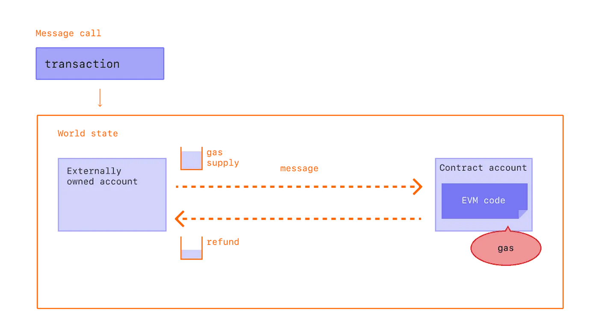
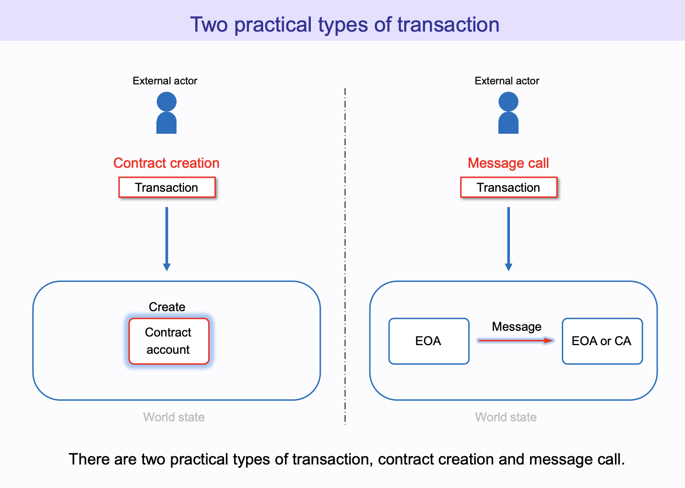
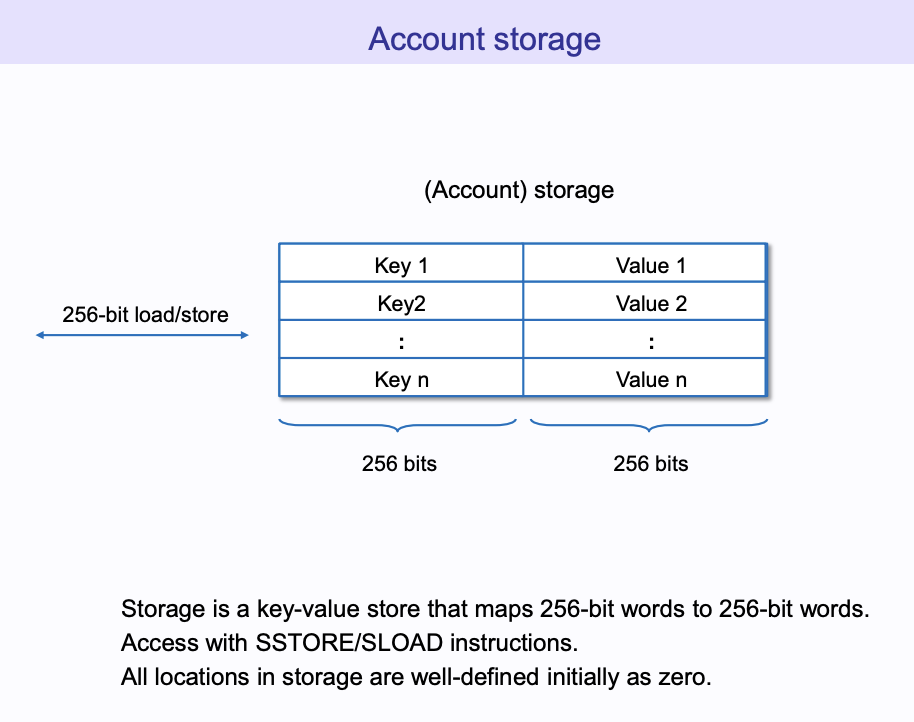
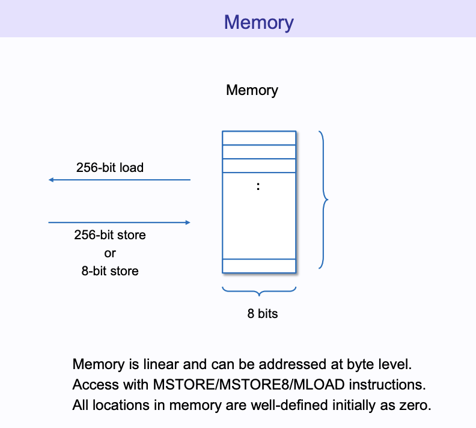
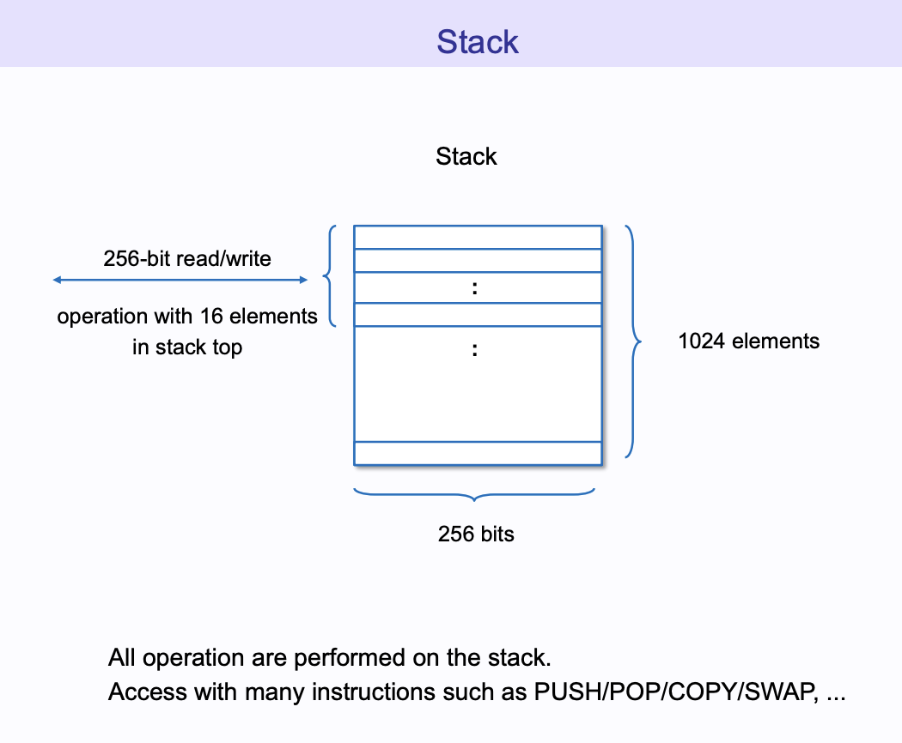
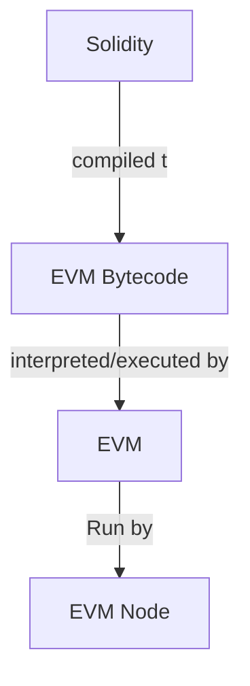
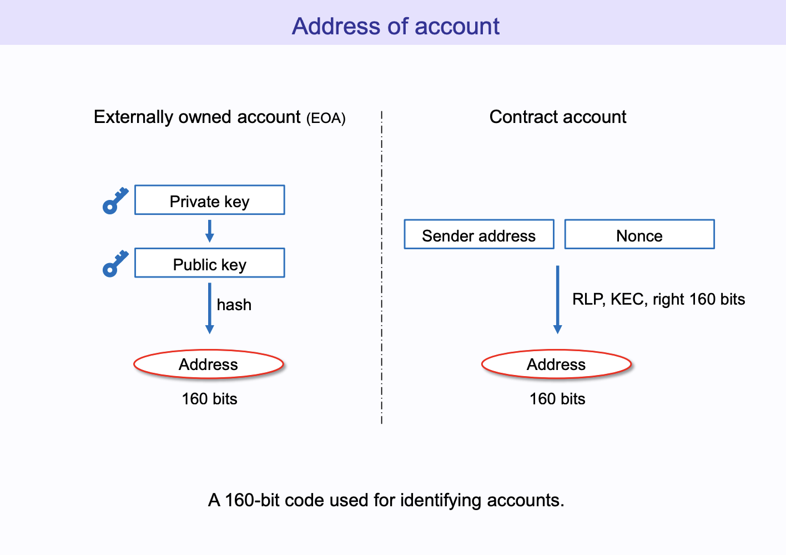

## Overview

This doc is all about intricacies of EVM core, which is the core of the EVM implementation in the Ethereum Virtual Machine.

## Concepts

<!-- TODO: EVM architecture diagram -->

> In the pre-EVM era, this would have been a nightmare as a new blockchain with custom logic had to be created every time a new app with specific use case was to be built.

**State Machine**:

- stores state
- define the rules for state transition

An EVM blockchain's **World State** gets changed if any state of the accounts changes.

> EVM Storage DB is a globally shared, decentralized, ACID transactional database.

---

**<u>How is EVM different than Bitcoin blockchain?</u>**

Instead of simply recording the currency ownership states, it has the power to transition to a new state in response to an arbitrary smart contract input data as well.

This is incredibly significant because such flexibility in the state transitions is what allows us to create custom currencies(ERC-20 tokens), NFTs, complicated Defi protocols, or even a complete DAO using smart contracts.

---

**<u>Turing Completeness</u>**

It gives Ethereum the ability to run rules for the state transition.

> As per turing completeness definition by Alan Turing, they can basically run forever and use infinite memory.

But, in case of Ethereum, the turing completeness can't be infinite in terms of _time_ & _memory_ i.e. we cannot really have programs that _run forever_ or uses _infinite memory_.

While regular computers can simply **halt** such infinitely running programs, we cannot do the same with Ethereum as it’s a global computer(and a distributed ledger) that must be accessible/online at all times.

So, in order to halt, Ethereum has a concept of **Gas**. It is a unit of measurement of the amount of work that an EVM program needs to do.

This means the EVM keeps track of every instruction that is to be executed and charges a particular amount of Gas fees (in ETH) for every **computation** or **storage** being used in the transaction. In other words, if you run out of gas (_basically money_) you can no more execute the transaction, thus resolving the issue of transactions/computations that run infinitely.

In simpler terms, Ethereum is indeed a Turing complete system. However, it does impose **limitations using gas** which doesn’t really allow this system to include forever running computations or those that use infinite storage.

Therefore, while EVM doesn’t belong completely in the category of a Turing-Complete system, we call it a **Quasi-Turing Complete System**.

---

**<u>Quick Review</u>**:

1. **Accounts**:
   1. **EOA**: Store _only state_. 2 EOAs can have only token or ether transfer between each other and nothing else. But, EOA can initiate a contract call.
   2. **Contract**: Store both **state & codes**. Contract can be called by EOA or another contract.
2. **Gas**: computation unit that allows EVM to halt the execution of a transaction if it runs out of gas.

   > Some transactions can also include a higher gas limit, i.e., the amount of gas that the sender is allowing to be consumed in his/her transaction.
   >
   > However, if the provided gas limit is way higher than the required gas in the transaction, EVM simply refunds the unused gas back to the sender.

   

3. **Transaction**: A transaction is a message that is sent from one account to another account. It can be either a message from an EOA to another EOA or from an EOA to a contract or from a contract to another contract. Broadly it can be of 2 types:

   

   1. _Message Call_: A message call is a transaction that is sent from an EOA to another EOA or a contract. It can be either a simple value transfer or a contract call.
   2. _Contract Creation_: A contract creation transaction is a transaction that is sent from an EOA to the EVM. It is used to create a new contract on the blockchain.

   **Fields**:

   - `nonce`: A nonce is a counter that is used to prevent replay attacks. It is incremented by 1 for every transaction that is sent from an account.
     > In case of SC, the nonce is incremented by 1 during _Contract Creation_, unlike in case of EOA, the nonce is incremented by 1 during both _Message Call_ & _Contract Creation_.
   - `recipient or to`: address of the recipient of this transaction.
   - `value`: the amount of ether to be transferred from the sender to the recipient address. It can be left zero if no eth transfer is supposed to happen in your transaction.
   - `data`: an optional field to include any arbitrary data. This field can contain code in a specific transaction for a Contract account
   - `gaslimit`: the amount of gas that can use in a particular transaction.
   - `maxPriorityFeePerGas as well as maxFeePerGas`: These are the two new fields that are used to set the maximum fee that you are willing to pay for a transaction. These are used to set the gas price for a transaction.
   - `signature`

   ```json
   {
     "from": "0xEA674fdDe714fd979de3EdF0F56AA9716B898ec8",
     "to": "0xac03bb73b6a9e108530aff4df5077c2b3d481e5a",
     "gasLimit": "21000",
     "maxFeePerGas": "300",
     "maxPriorityFeePerGas": "10",
     "nonce": "0",
     "value": "10000000000",
     "data": "0xabcd",
     "signature": "0x..."
   }
   ```

---

**<u>EVM Architecture and its components</u>**:

- **Account Storage**:

  - like hard drive of the computer
  - data stored even after execution of the program
  - key-value store
    - _key_: 256-bit (32 bytes) slots
    - _value_: 256-bit (32 bytes) values
  - 💡 Considering the fact that storage operations are costs more gas, (= more money), it’s always recommended to optimize your contracts to only use storage operations where necessary and remove wipe out the rest.
  - Opcodes: `SLOAD` (read), `SSTORE` (write).

  

- **Memory**:

  - While EVM storage resembles a Hard drive, Memory is more of a RAM in the computer, a temporary data holder.
  - EVM memory is not really persistent and is wiped out as soon as the function execution is completed.
  - Unlike storage, memory usage in smart contracts is comparatively a cheap operation that costs less gas. However, it must be kept in mind that the cost of using memory can increase as memory usage increases in a function.

    

- **Calldata**:
  - special data location of EVM that contains the function arguments, return data to the execution of function.
  - non-persistent data and is cleared as soon as the function execution is completed.
  - gas cost-wise `calldata < memory < storage`
  - read-only
  - Opcodes: `CALLDATALOAD`, `CALLDATASIZE`, and `CALLDATACOPY`.
- **Stack**:

  - EVM is technically a stack-based VM.
  - The stack is a list of 32-byte elements used to store smart contract instruction (function) inputs and outputs.
  - EVM stack max. limit/capacity: _1024 words/values_
  - Each word/value is _256-bit (32 bytes)_

  ```
  [value-1]
  [value-2]
  [value-3]
  [.......]
  [value-1024]
  ```

  

  - All instructions interact with the stack, but it can be directly manipulated with instructions like `PUSH1`, `POP`, `DUP1`, or `SWAP1`.

- **Program Counter**:
  - It loads the next instruction Opcode to be executed into EVM stack (depth of 1024 words with each word being 256-bit)
  - It is set to 0 at the beginning of the execution of a smart contract.
  - When contract method is called, the PC sets to the 1st 4 bytes of SHA-3 has of the method signature.
  - And then the PC is incremented by 1 byte for every instruction that is executed.
  - The program counter now helps the machine to step through the entire code which allows the EVM to interpret and execute the given instructions one-by-one.
  - A program/SC function is a combination of instruction like add, sub, mul, load, store, etc. Each function is indexed inside a storage (that contains both code & logic) where the data & code is stored.

---

**How does EVM work?**



> In order to execute any tasks, storing data in state variables or executing a swap of tokens, the EVM uses these opcodes.
>
> Total unique Opcodes: `140`

Preparation for EVM execution:

- the program counter of the EVM being set to zero,
- Storage being loaded from the contract account,
- Environment variables being set as well as memory initialized to zero, etc.
- When a SC is called, the function is loaded by PC into its stack & then executed.
- The PC takes care of incrementing the instruction by 1 byte.

---

**How address of accounts (EOA, SC) are generated?**



---

**How is atomicity relevant to EVM world state?**

- Atomicity is a property of a transaction that guarantees that either all of the transaction is executed or none of it is.
- This ensures:
  - **Data Integrity**: data is either fully updated or not updated at all.
  - **Isolation**: each transaction is indivisible/independent of other transactions.
  - **Efficiency**: Atomicity helps ensure that database transactions are performed in a timely and efficient manner. If a database transaction is not atomic, it may take longer to complete, as the database may have to roll back the transaction and start over if one part of the transaction fails. This can lead to slower performance and decreased efficiency

## Resources

- [EVM Part1: The ABCs of Ethereum Virtual Machine](https://medium.com/coinmonks/evm-part1-the-abcs-of-ethereum-virtual-machine-3669cbac0b4) ✅
