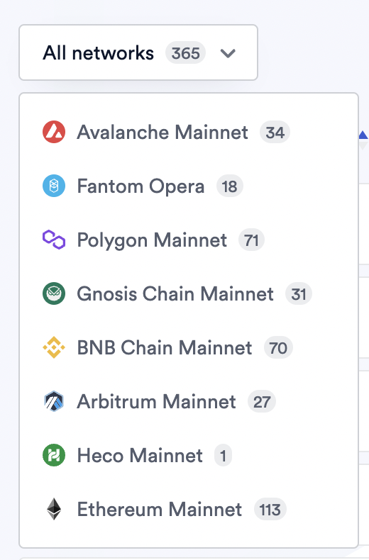
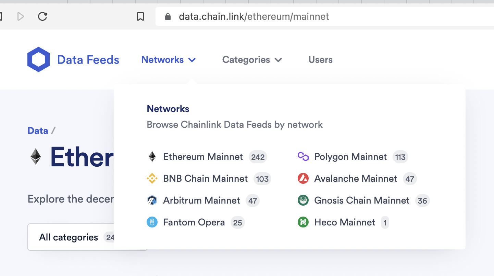
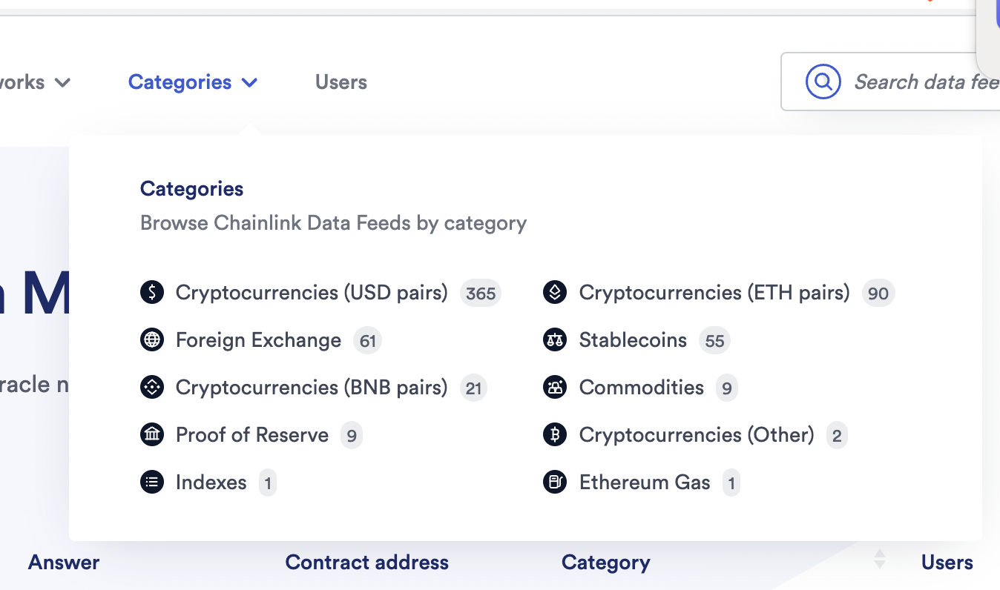
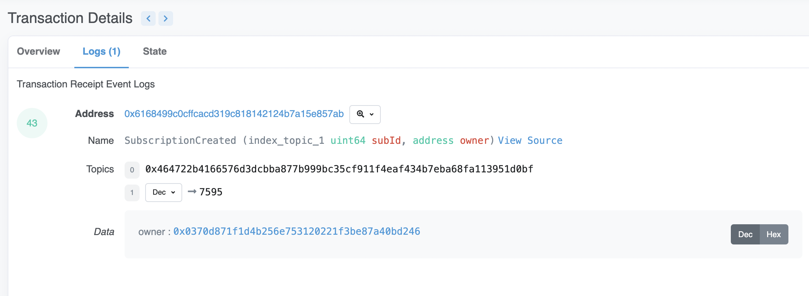
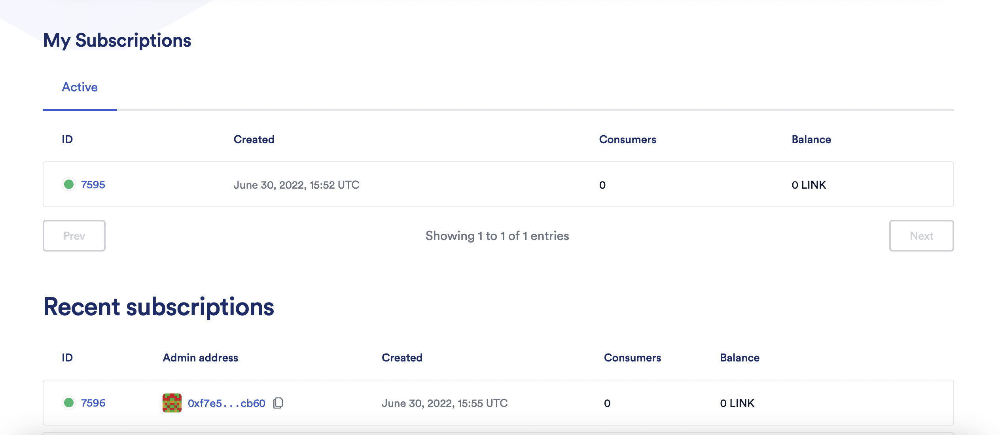

# Chainlink

## About

- It provides Oracle service.

## Coding

- Follow this [tutorial](https://blog.chain.link/using-chainlink-with-hardhat/). I did it locally under the folder name - `"chainlink_hardhat"`

After deploying the contracts, this is the info:

```console
❯ npx hardhat deploy --network rinkeby
Nothing to compile
----------------------------------------------------
deploying "PriceConsumerV3" (tx: 0xc23e34b97fc7abab068724c9cd65e43ea68e4fbc9a2f39eb9d0e08f1a54fce77)...: deployed at 0x90C426bb7041a50026147F415e8013b4520093b2 with 245612 gas
Run Price Feed contract with command:
yarn hardhat read-price-feed --contract 0x90C426bb7041a50026147F415e8013b4520093b2 --network rinkeby
----------------------------------------------------
deploying "APIConsumer" (tx: 0xeee671a00e2c4b70d8fe8eff4704ec749e099557a9a002d74a11904ebfa49532)...: deployed at 0xB6648ADBaebc9eB2f7CAf5b231a81ca142c84a99 with 1404981 gas
Run API Consumer contract with following command:
yarn hardhat request-data --contract 0xB6648ADBaebc9eB2f7CAf5b231a81ca142c84a99 --network rinkeby
----------------------------------------------------
deploying "RandomNumberConsumerV2" (tx: 0x59c55e4896c90ea6ca469b8c32e0e84d4da4e24e63283e1da7746d699a09487f)...: deployed at 0x2B66E696D2455295e07C250bC3615C923D381Eb0 with 564357 gas
Then run RandomNumberConsumer contract with the following command
yarn hardhat request-random-number --contract 0x2B66E696D2455295e07C250bC3615C923D381Eb0 --network rinkeby
----------------------------------------------------
deploying "KeepersCounter" (tx: 0xfab4b94226f3d2312c3efc8f83ab566279: deployed at 0x6ad8e6bdc17728C09993867C03A108e99a13a97B with 448166 gas
Head to https://keepers.chain.link/ to register your contract for upkeeps. Then run the following command to track the counter updates:
yarn hardhat read-keepers-counter --contract 0x6ad8e6bdc17728C09993867C03A108e99a13a97B --network rinkeby
----------------------------------------------------
```

It has been done with the deployer address: `0x0370D871f1D4B256E753120221F3Be87A40bd246`

### Using Chainlink Price Feeds

```console
❯ yarn hardhat read-price-feed --contract 0x90C426bb7041a50026147F415e8013b4520093b2 --network rinkeby
yarn run v1.22.17
warning ../../../../package.json: No license field
$ /Users/abhi3700/F/coding/github_repos/chainlink_hardhat/node_modules/.bin/hardhat read-price-feed --contract 0x90C426bb7041a50026147F415e8013b4520093b2 --network rinkeby
Reading data from Price Feed consumer contract  0x90C426bb7041a50026147F415e8013b4520093b2  on network  rinkeby
Price is:  103181360877
```

### Fund SC with LINK

```console
❯ npx hardhat fund-link --contract 0xB6648ADBaebc9eB2f7CAf5b231a81ca142c84a99 --network rinkeby
Funding contract 0xB6648ADBaebc9eB2f7CAf5b231a81ca142c84a99 on network rinkeby
Contract 0xB6648ADBaebc9eB2f7CAf5b231a81ca142c84a99 funded with 1 LINK. Transaction Hash: 0x30a0d4b7cbab701873fab3170f544ff5d862688f61cf944b51867d114b4ee243
```

### Requesting External Data

The API Consumer contract has two tasks:

- one to request external data based on a set of parameters, and
- one to check to see what the result of the data request is.

This contract needs to be funded with LINK first as shown above.

Once it’s funded, you can request external data by passing in a [number of parameters](https://github.com/pappas999/chainlink-hardhat-box#request--receive-data) to the **request-data** task. The contract parameter is **mandatory**, the rest are **optional**.

#### request-data

```console
❯ yarn hardhat request-data --contract 0xB6648ADBaebc9eB2f7CAf5b231a81ca142c84a99 --network rinkeby
yarn run v1.22.17
warning ../../../../package.json: No license field
$ /Users/abhi3700/F/coding/github_repos/chainlink_hardhat/node_modules/.bin/hardhat request-data --contract 0xB6648ADBaebc9eB2f7CAf5b231a81ca142c84a99 --network rinkeby
Calling API Consumer contract  0xB6648ADBaebc9eB2f7CAf5b231a81ca142c84a99  on network  rinkeby
Contract  0xB6648ADBaebc9eB2f7CAf5b231a81ca142c84a99  external data request successfully called. Transaction Hash:  0xa640a7c43821db27d6ab12ad47c170f9b4cc9ea8a45e3476b99164ad2b5d621e
Run the following to read the returned result:
npx hardhat read-data --contract 0xB6648ADBaebc9eB2f7CAf5b231a81ca142c84a99 --network rinkeby
✨  Done in 5.86s.
```

#### read-data

Once you have successfully made a request for external data, you can use the read-data task to read the returned result from the Chainlink [oracle](https://chain.link/education/blockchain-oracles).

```console
❯ npx hardhat read-data --contract 0xB6648ADBaebc9eB2f7CAf5b231a81ca142c84a99 --network rinkeby
Reading data from API Consumer contract  0xB6648ADBaebc9eB2f7CAf5b231a81ca142c84a99  on network  rinkeby
Data is:  0
```

### Using Chainlink VRF

The VRFConsumer contract has two tasks:

- one to request a random number, and
- one to read the result of the random number request.

This contract needs to be funded with LINK first as shown above.

```console
❯ yarn hardhat fund-link --contract 0x2B66E696D2455295e07C250bC3615C923D381Eb0 --network rinkeby
yarn run v1.22.17
warning ../../../../package.json: No license field
$ /Users/abhi3700/F/coding/github_repos/chainlink_hardhat/node_modules/.bin/hardhat fund-link --contract 0x2B66E696D2455295e07C250bC3615C923D381Eb0 --network rinkeby
Funding contract 0x2B66E696D2455295e07C250bC3615C923D381Eb0 on network rinkeby
Contract 0x2B66E696D2455295e07C250bC3615C923D381Eb0 funded with 1 LINK. Transaction Hash: 0xd6e0a6bc72bd024cd168828b22b61b7ba60e1024f5f1fa5ae1b6014d6bdeb4c2
```

## Data Feed

All the cryptocurrencies price (in USD) is listed [here](https://data.chain.link/categories/crypto-usd) for all networks.


For individual network, view like this:



We can also browse by categories like this:



## VRF

Get VRF subscription ID for your smart contract to fetch the Oracle features like this:


**Steps**:

1. Go to this [website](https://vrf.chain.link/)
2. View your subscriptions for the selected network (by default it is taken from Metamask selected network) on the top right.
   
3. Click on "Create Subscription" button & just approve by signing in using your web3 wallet.

## References

-
