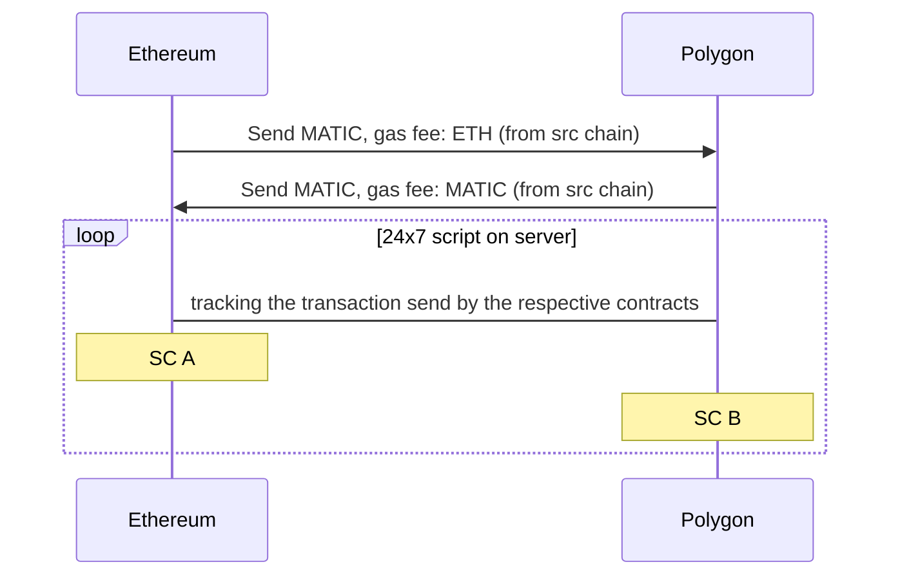

# Cross chain

```mermaid
sequenceDiagram
    participant Ethereum
    participant Polygon
    Ethereum ->> Polygon: Send MATIC, gas fee: ETH (from src chain)
    Polygon ->> Ethereum: Send MATIC, gas fee: MATIC (from src chain)
    loop 24x7 script on server
        Ethereum -> Polygon: tracking the transaction send by the respective contracts
    Note over Ethereum: SC A
    Note over Polygon: SC B
    end
```
