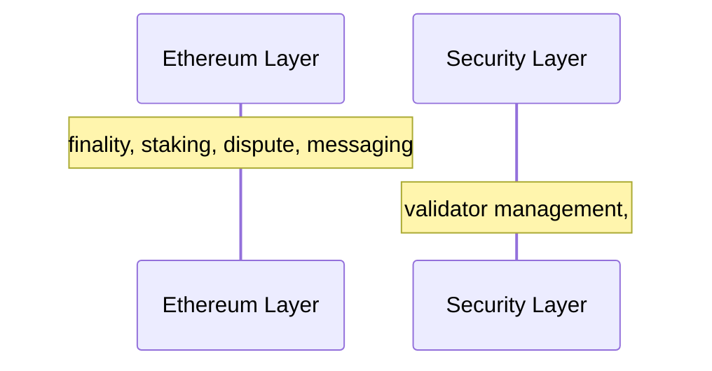
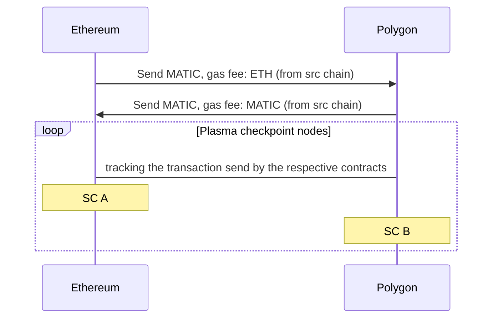

# Polygon PoS Bridge

## About Polygon

It is based on 2 main concepts:

- **secured chains** - "L2" i.e. plasma, optimistic-rollup, zk-rollup. It gives security. A set of validators checks the proof submitted instead of a fee charged.
- **stand-alone** chains also called "sidechains" (based on individual consensus mechanism) like Matic PoS, xDAI. It has flexibility of selecting their own consensus mechanism like PoS, DPoS, etc. It gives scalability. This is similar to parachains in Polkadot.

**Polygon architecture**:

---

## Diagram

## References

- Architecture overview: https://docs.matic.today/docs/contribute/matic-architecture/

## Glossary

- SC: Smart Contract
- src: source
