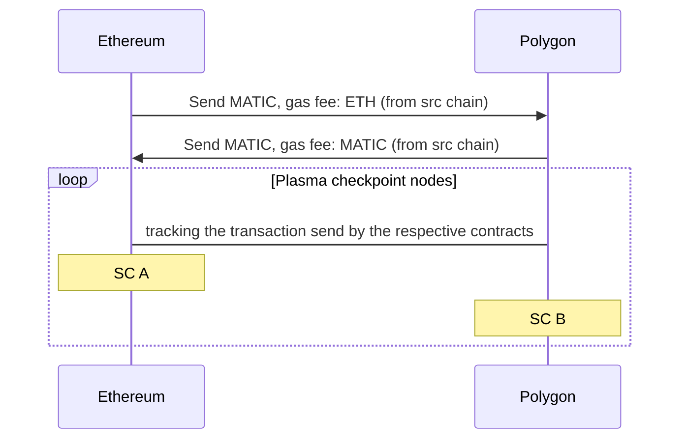

# Polygon PoS Bridge

## Diagram

```mermaid
sequenceDiagram
    Ethereum ->> Polygon: Send MATIC, gas fee: ETH (from src chain)
    Polygon ->> Ethereum: Send MATIC, gas fee: MATIC (from src chain)
    loop Plasma checkpoint nodes
        Ethereum -> Polygon: tracking the transaction send by the respective contracts
    Note over Ethereum: SC A
    Note over Polygon: SC B
    end
```

## References

- Architecture overview: https://docs.matic.today/docs/contribute/matic-architecture/

## Glossary

- SC: Smart Contract
- src: source
