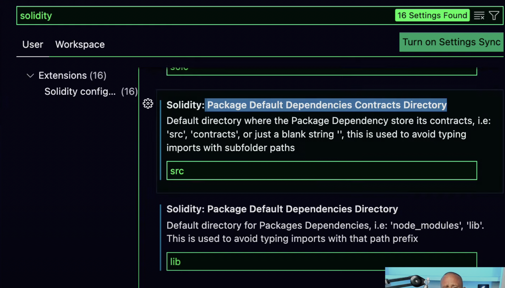

# Foundry

## Installation

Following are the steps:

1. Install `foundryup`

```console
❯ curl -L https://foundry.paradigm.xyz | bash
  % Total    % Received % Xferd  Average Speed   Time    Time     Time  Current
                                 Dload  Upload   Total   Spent    Left  Speed
  0     0    0     0    0     0      0      0 --:--:-- --:--:-- --:--:--     0
100  1765  100  1765    0     0   2236      0 --:--:-- --:--:-- --:--:--  2236
Installing foundryup...
######################################################################## 100.0%

Detected your preferred shell is zsh and added foundryup to PATH. Run 'source /Users/abhi3700/.zshrc' or start a new terminal session to use foundryup.
Then, simply run 'foundryup' to install Foundry.
```

2. Install `foundryup` tools: `forge`, `cast` and `anvil`

```console
❯ foundryup
foundryup: installing foundry (version nightly, tag nightly-92f8951409034fd597ad08a386474af8d2d8868a)
foundryup: downloading latest forge, cast and anvil
######################################################################### 100.0%
foundryup: downloading manpages
######################################################################### 100.0%
foundryup: installed - forge 0.2.0 (92f8951 2022-08-06T00:05:51.433929Z)
foundryup: installed - cast 0.2.0 (92f8951 2022-08-06T00:05:51.433929Z)
foundryup: installed - anvil 0.1.0 (92f8951 2022-08-06T00:05:51.822342Z)
foundryup: done
```

## Editor

Use VSCode

Additionally, set the `contracts` folder as `src/` & package dependencies as `lib/` for Foundry.



## Getting Started

Refer [this](https://book.getfoundry.sh/getting-started/first-steps)

## Create Project

- Create project folder with all dependency & config files.

```console
forge init --template https://github.com/foundry-rs/forge-template <project-name>
```

- Build: `$ forge build`
- Test: `$ forge test`

2 new folders are created:

- `out`: contains your contract artifact, such as the ABI
- `cache`: contains info to help `forge` recompile what is necessary.

## Commands

- `$ forge install` to install the libs used in `foundry.toml`.
- `$ forge build` to compile the contracts
- `$ forge test .... -vvvv` to look into the traces.

## Troubleshoot

### 1. Error: "solc": No such file or directory (os error 2)

- _Cause_: `solc` is set to false
- _Solution_: set `auto_detect_solc` to `true` in `foundry.toml`
