# Foundry `forge`

## Create Project

- Create project folder with all dependency & config files.

```console
forge init --template https://github.com/foundry-rs/forge-template <project-name>
```

- Build: `$ forge build`
- Test: `$ forge test`

2 new folders are created:

- `out`: contains your contract artifact, such as the ABI
- `cache`: contains info to help `forge` recompile what is necessary.

## Common Commands

- `$ forge install` to install the libs used in `foundry.toml`.
- `$ forge remove` to install the libs used in `foundry.toml`.
- `$ forge build` to compile the contracts
- `$ forge test .... -vvvv` to look into the traces.

## Dependencies

In order to add more dependency lib, use like this:

```console
forge install OpenZeppelin/openzeppelin-contracts-upgradeable
```

> Just copy {owner/repo_name} from the actual repo url: <https://github.com/OpenZeppelin/openzeppelin-contracts-upgradeable>

Also add as submodule in `.gitmodules`

## Add hardhat to Foundry or viceversa

- [Adding Hardhat to a Foundry project](https://book.getfoundry.sh/config/hardhat#adding-hardhat-to-a-foundry-project)
- [Adding Foundry to a Hardhat project](https://book.getfoundry.sh/config/hardhat#adding-foundry-to-a-hardhat-project)

## Testing

### CLI via `forge`

Use 3 ways to test in different cases:

> Used short form of respective match flags.

```sh
# match test
$ forge test --mt testCount
# match contract
$ forge test --mc CounterTest
# match path
$ forge test --mp test/Counter.t.sol
```

For debugging, use these flags:

```
-vv: shows the logs
-vvv: shows the traces with logs
-vvvv: shows the traces of the test function with logs
-vvvvv: shows the traces of the test function & setUp function with logs
```

Here is the color code in terminal for `forge` command:

```text
green: the function runs properly
red: the function fails
```

---

By default during testing, the function caller would be the testing contract itself i.e. `address(this)` i.e. `msg.sender`. So, in order to set an address, use `vm.prank(address(1))` for next immediate call & for next successive calls, use `vm.startPrank(address(1))` & then need to stop using `vm.stopPrank()`. This is useful when we want to test the contract with different addresses as caller (alice, bob, charlie, etc).

---

While importing the files, no need to use `../src` as the path is measured from root of the project like this:

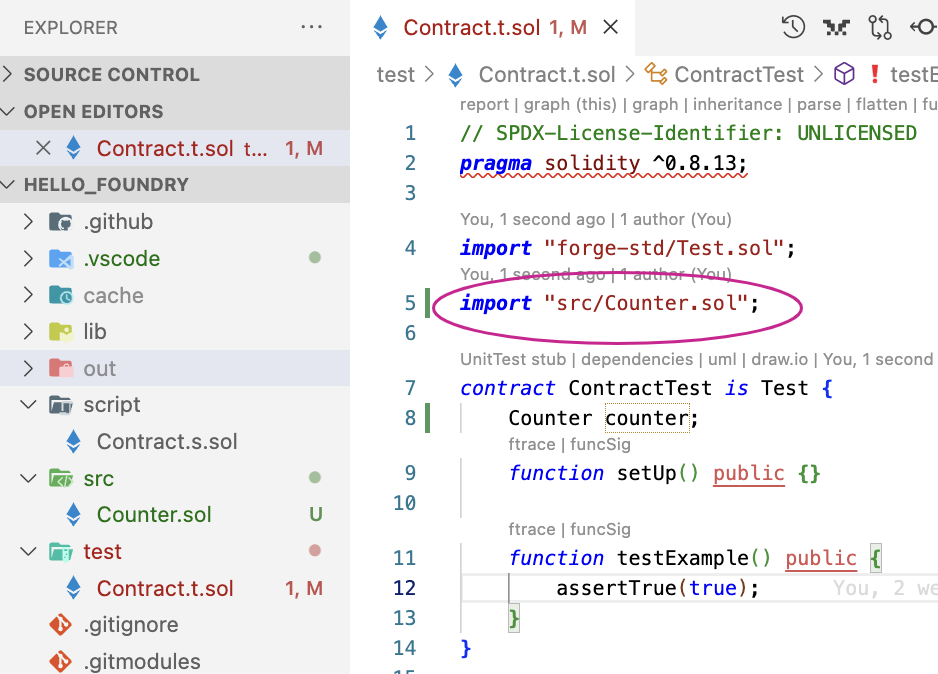

There are different ways to view the details/traces during test (found via `$ forge help test` or `$ forge test --help`):


> Ideally 3 to 4 levels of verbosity is enough.

---

`$ forge test -vv`

```console
[⠢] Compiling...
No files changed, compilation skipped

Running 2 tests for test/Contract.t.sol:ContractTest
[PASS] testGetCount() (gas: 7472)
[PASS] testIncrement() (gas: 11197)
Test result: ok. 2 passed; 0 failed; finished in 403.21µs
```

---

`$ forge test -vvvv` shows the traces

```console
[⠢] Compiling...
No files changed, compilation skipped

Running 2 tests for test/Contract.t.sol:ContractTest
[PASS] testGetCount() (gas: 7472)
Traces:
  [7472] ContractTest::testGetCount()
    ├─ [2261] Counter::count() [staticcall]
    │   └─ ← 10
    └─ ← ()

[PASS] testIncrement() (gas: 11197)
Traces:
  [11197] ContractTest::testIncrement()
    ├─ [5247] Counter::increment()
    │   └─ ← ()
    ├─ [261] Counter::count() [staticcall]
    │   └─ ← 11
    └─ ← ()

Test result: ok. 2 passed; 0 failed; finished in 279.50µs
```

---

To log (on console) a variable output, use `$ forge test -vv`

```solidity
function testGetCount() public {
  uint256 c = counter.count();
  assertEq(c, 10);
  emit log_named_uint("The value is: ", c);
}
```

---

In order to test the entire contract test file like `Pausable.t.sol` i.e. `$ forge test ---match-contract Pausable`:

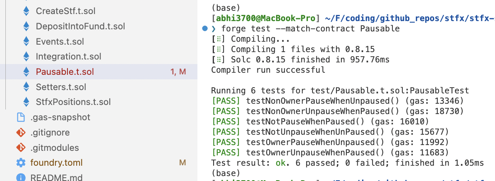

---

In order to test the functions named (with REGEX pattern) use like this:

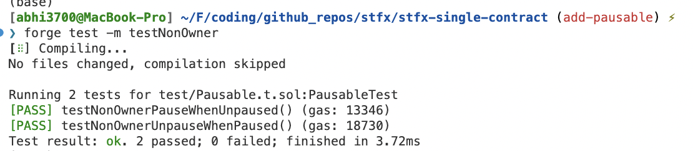

---

One can test single function as well by providing the exact testfile's function name:

```console
❯ forge test --match-test testNonOwner
[⠆] Compiling...
No files changed, compilation skipped

Running 2 tests for test/Pausable.t.sol:PausableTest
[PASS] testNonOwnerPauseWhenUnpaused() (gas: 13346)
[PASS] testNonOwnerUnpauseWhenPaused() (gas: 18730)
Test result: ok. 2 passed; 0 failed; finished in 3.72ms
```

---

Run a particular test file like `$ forge test ---match-path test/HelloWorld.t.sol -vvv`

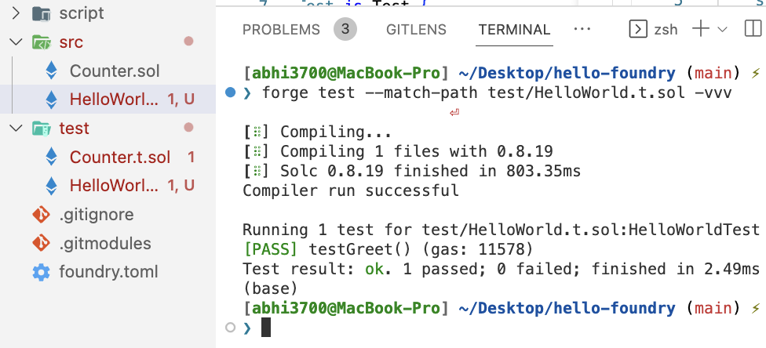

### Summary & Detailed

Use `--summary` & `--detailed` flags accordingly to get the summary & detailed report of the test functions.

Just summary looks like this:
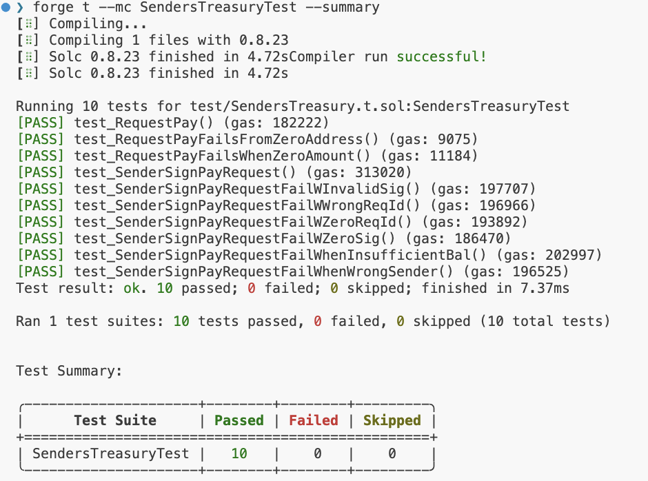

Detailed summary looks like this:
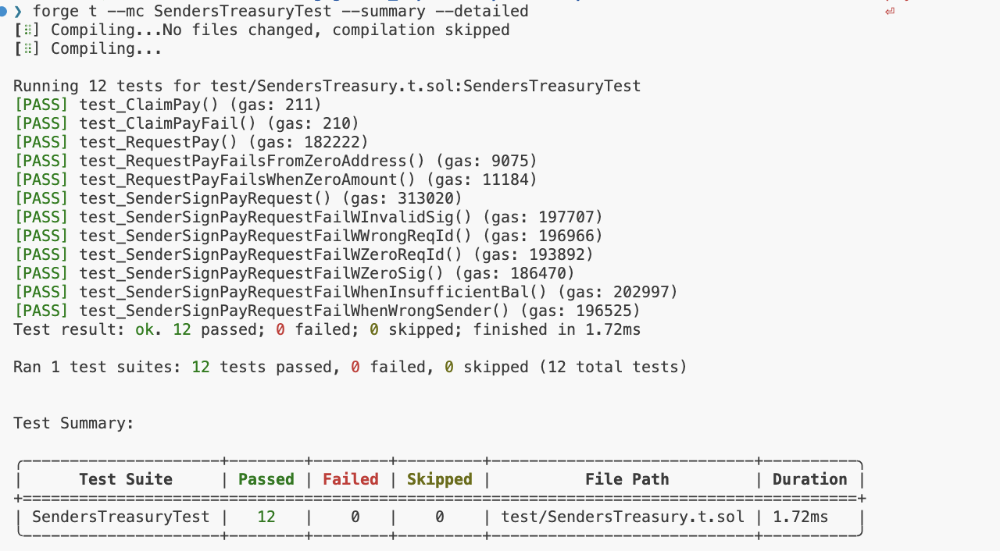

### Declare & Deploy contracts inside test

Please refer [this](../../utils/foundry/test/define_sc_deploy.md).

### Test Function Naming

The function naming (a choice) in foundry is different than the usual way of naming in other frameworks like Hardhat, Truffle, Brownie, etc.

> It's a good practice to name your function starting with `test`. This is to isolate the test functions in a foundry project as the entire repo would be in solidity language.

There are 2 ways to name the functions in foundry:

**M-1**:

Here, in order to create a test function that fails, **we need to use `testFail`** prefix & also ensure that the function fails, otherwise we get `AssertionError` like this:

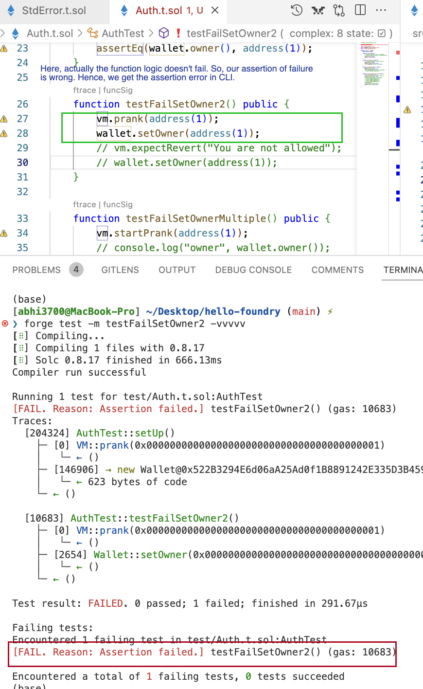

And then when applied correct logic inside that function, there is no assertion error as shown below:

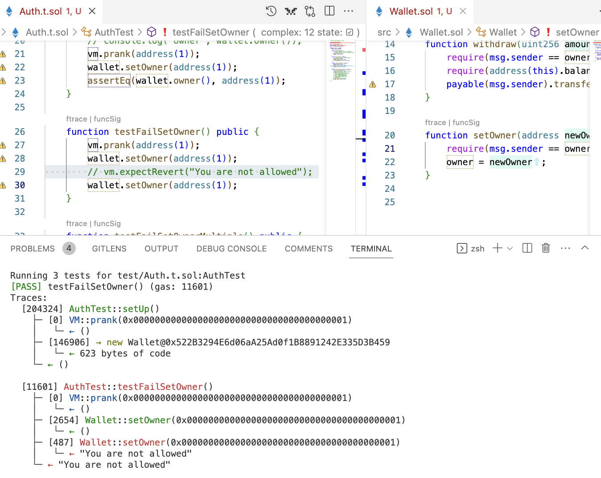

> Please note that `vm.expectRevert()` is not used here, otherwise there would be assertion error in console.

---

**M-2**:

Here, in order to create a test function that fails, **we don't need** to follow any naming pattern. But, we have to then use `vm.expectRevert()` just before the function call which is going to fail.

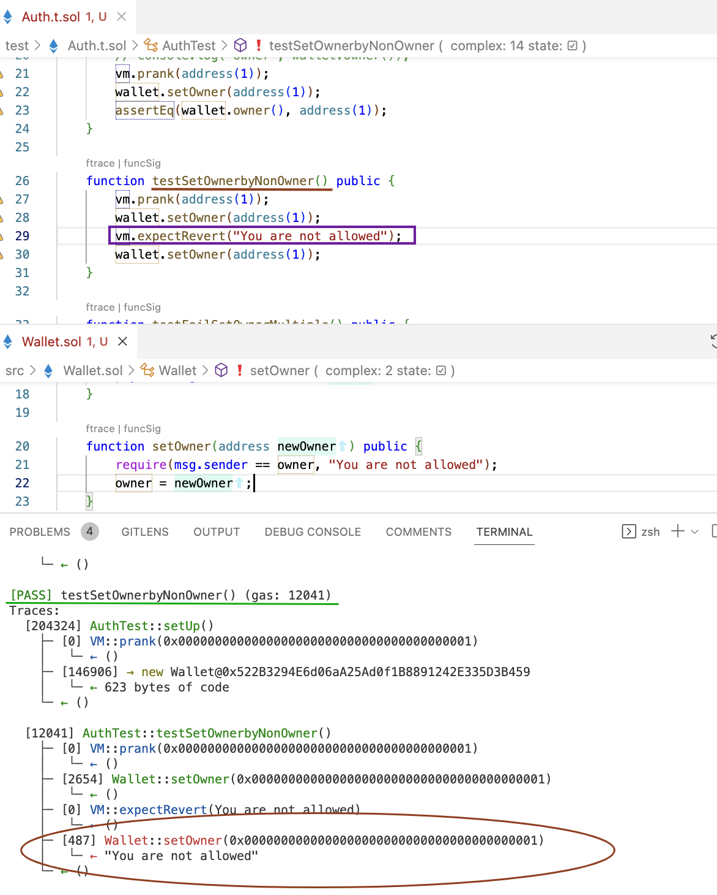

### Error

For a contract function like this:

```solidity
function throwError() external pure {
    require(false, "not authorized");
}
```

we can use the revert function (in foundry) for **M-2** (described above) as shown below:

- `vm.expectRevert()` is used to check if the function call is going to revert or not.
- `vm.expectRevert(bytes("onlyOwner"))` or `vm.expectRevert("onlyOwner")` is used to check if the function call is going to revert with the exact revert message or not.

```solidity
function testRevert() public {
    vm.expectRevert();  // NOTE
    error.throwError();
}

function testRequireMessage() public {
    vm.expectRevert(bytes("not authorized")); // NOTE
    error.throwError();
}
```

---

Similarly, for a contract function with custom error defined using `error` keyword like this:

```solidity
error NotAuthorized();

function throwCustomError() external pure {

    revert NotAuthorized();

}
```

we can use the revert function (in foundry) for **M-2** (described above) as shown below:

```solidity
function testCustomError() public {
    vm.expectRevert(Error.NotAuthorized.selector);  // NOTE
    error.throwCustomError();
}
```

---

Now, the error has an argument, look at this [example](../../utils/foundry/test/error_w_arg.md).

---

In order to consider testing arithmetic overflow/underflow, use like this:

```solidity
function testDecUnderflow() public {
    vm.expectRevert(stdError.arithmeticError);    // NOTE
    counter.dec();
}
```

---

**Assertion Error labels** are defined when the console error is not able to give more details:

**Before**:

`Contract.t.sol`:

```solidity
function testErrorLabel() public {
    assertEq(uint256(1), uint256(1));
    assertEq(uint256(1), uint256(1));
    assertEq(uint256(1), uint256(1));
    assertEq(uint256(1), uint256(2)); // suppose to fail
    assertEq(uint256(1), uint256(1));
}
```

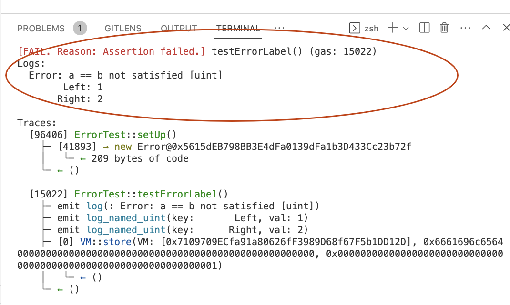

used `-vvvv` for more info here. But, still not clear. Here, not able to detect which line is failing, as it's shown only Assertion Error.

**After**:

`Contract.t.sol`:

```solidity
function testErrorLabel() public {
    assertEq(uint256(1), uint256(1), "test 1");
    assertEq(uint256(1), uint256(1), "test 2");
    assertEq(uint256(1), uint256(1), "test 3");
    assertEq(uint256(1), uint256(2), "test 4"); // suppose to fail
    assertEq(uint256(1), uint256(1), "test 5");
}
```

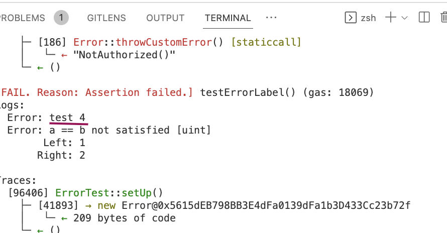

used `-vvvv` for more info here. Now, it's clear which line is failing i.e. the line with "test 4" error label.

### Event

We have 3 steps to follow:

```solidity
function testEmitTransferEvent() public {
    // 1. tell foundry which data to check for
    // (index_check, index_check, index_check, rest_data_check)
    vm.expectEmit(true, true, false, true);

    // 2. emit the expected event
    emit Transfer(address(1), address(2), 100, bytes32("fun"));

    // 3. call the function that should emit the actual event
    e.transfer(address(1), address(2), 100, bytes32("fun"));
}
```

Also, the `1`st step could have be done like this as well:

```solidity
function testEmitTransferEvent() public {
    // Here, we are checking for emitted as well i.e. the contract itself.
    vm.expectEmit(true, true, false, true, address(e));
}
```

We also have the freedom to check the params independently the params & ignore the rest of the params.

For detailed example, refer [this](../../utils/foundry/test/Event.t.sol) for [contract](../../utils/foundry/src/Event.sol).

[Source](https://www.youtube.com/playlist?list=PLO5VPQH6OWdUrKEWPF07CSuVm3T99DQki)

### Time

There are mainly 4 functions - time (3), block_num(1).

- `vm.warp`: set block timestamp to future timestamp
- `skip`: increment by time
- `rewind`: decrement by time
- `vm.roll`: set block.number

### Fund Test ETH

There is one function - `deal(to, value)` e.g. `deal(alice, 100)` using which any account can be funded with Test ETH inside foundry test script.

[utils doc](../../utils/foundry/test/transfer_eth.md).

[code](../../sc-sol-foundry/test/Payable.t.sol).

Another function is `hoax(to, value)`. This sets the balance & also sets the caller. So, we don't need to fund the account in `setUp()` function.

> If Alice is funded inside `setUp()` with 100 using `deal`, and if again it's funded with `200` (using `hoax`) inside a `testDeposit()` (say) function, then the total balance of Alice is `200` (not `300`) although `setUp()` is auto-executed before `testDeposit()` (or any test function). This is because `hoax` doesn't add that amount to pre-existing balance, rather it sets the balance.

### Signature

In Foundry, if we need to check for a message signer is the expected signer or not. We can follow this [example](../../sc-sol-foundry/test/Signature.t.sol).

---

**How to pack the r, s, v values into a single `bytes` signature value?**

Here, the signature is supposed to be parsed into a contract function.

```solidity
bytes32 message = sendersTreasury.constructMessageOf(id);
// construct the signature by alice
(uint8 v, bytes32 r, bytes32 s) = vm.sign(aliceSKey, message);

sendersTreasury.signPayReq{value: 10}(id, abi.encodePacked(r, s, v));
```

> NOTE: Just to remember, please observe that the order is in alphabetical order i.e. `r, s, v`.

### Gasless Token transfer

Here are the examples:

- [Contract](../../sc-sol-foundry/src/GaslessTokenTransfer.sol)
- [Test](../../sc-sol-foundry/test/GaslessTokenTransfer.t.sol)

### Fork

Just use `fork-url` flag of mainnet using alchemy, infura, etc.

> Here, a contract is reset to the state of the network at the start of each run. So, it remains in cache locally.

```sh
$ forge test --fork-url <mainnet-url> --mp test/Fork.t.sol -vvvv

Running 1 test for test/Fork.t.sol:ForkTest
[PASS] testDeposit() (gas: 41841)
Logs:
  Balance before:  0
  Balance after:  100

Traces:
  [41841] ForkTest::testDeposit()
    ├─ [2534] 0xC02aaA39b223FE8D0A0e5C4F27eAD9083C756Cc2::balanceOf(ForkTest: [0x7FA9385bE102ac3EAc297483Dd6233D62b3e1496]) [staticcall]
    │   └─ ← 0x0000000000000000000000000000000000000000000000000000000000000000
    ├─ [0] console::log(Balance before: , 0) [staticcall]
    │   └─ ← ()
    ├─ [21974] 0xC02aaA39b223FE8D0A0e5C4F27eAD9083C756Cc2::deposit{value: 100}()
    │   ├─ emit Deposit(param0: ForkTest: [0x7FA9385bE102ac3EAc297483Dd6233D62b3e1496], param1: 100)
    │   └─ ← ()
    ├─ [534] 0xC02aaA39b223FE8D0A0e5C4F27eAD9083C756Cc2::balanceOf(ForkTest: [0x7FA9385bE102ac3EAc297483Dd6233D62b3e1496]) [staticcall]
    │   └─ ← 0x0000000000000000000000000000000000000000000000000000000000000064
    ├─ [0] console::log(Balance after: , 100) [staticcall]
    │   └─ ← ()
    └─ ← ()

Test result: ok. 1 passed; 0 failed; 0 skipped; finished in 3.30s
Ran 1 test suites: 1 tests passed, 0 failed, 0 skipped (1 total tests)
```

### Fuzzy

Fuzz test basically means it'll randomly choose addresses and run the test 256 times by default depending on input type.

if you want to make it run more than 256, you can change `fuzz_runs` on `foundry.toml` to any number you want like 1000, 5000 or even 50k, but it'll change for all the fuzz tests, not for a particular test file/function.

E.g:

**Before**:

```solidity
function testNonOwnerPauseWhenUnpaused() public {
  vm.startPrank(alice);
  vm.expectRevert("onlyOwner");
  vault.pause();
  vm.stopPrank();
}
```

**After**:

```solidity
function testNonOwnerPauseWhenUnpaused(address testAddress) public {
  vm.assume((testAddress != address(0)) && (testAddress != vault.owner()));
  vm.startPrank(testAddress);
  vm.expectRevert("onlyOwner");
  vault.pause();
  vm.stopPrank();
}
```

---

For a simple example, refer this [code](../../sc-sol-foundry/test/Fuzzy.t.sol).

```solidity
// assume
vm.assume(<condition>);
// bound
uint256 x = bound(x, 1, 100);
```

## Gas report

Just use the flag `--gas-report` for respective test functions (using `--match-test`, `---match-testatch-path`, `---match-testatch-contract`):

```console
forge test ---match-testatch-path test/HelloWorld.t.sol -vvv --gas-report
```

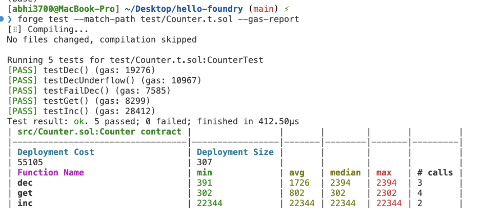

## Solidity compiler version

Set the solidity compiler version for your contracts in project.

```toml
# just need to add this line in foundry.toml
solc_version = "0.8.17"
```

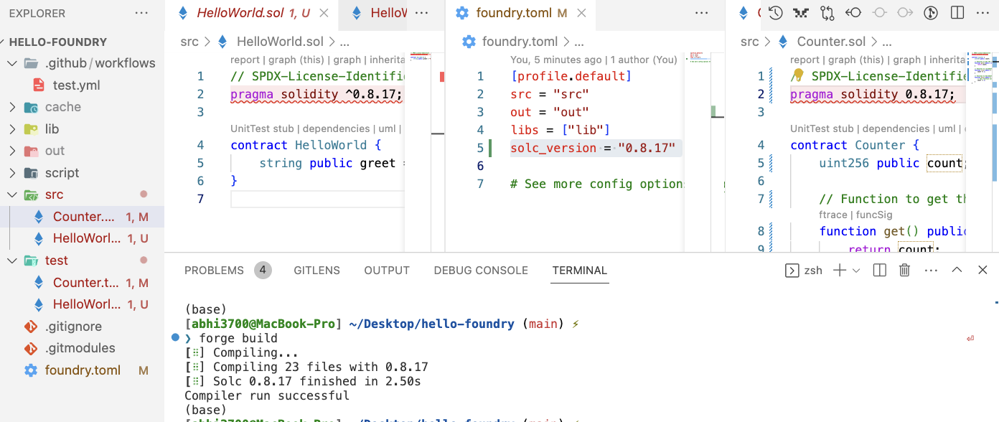

---

It is failing here because 1 of the contracts is using `0.8.17` and the other one is using `0.8.19`:

> All the contracts have to use the same version of solidity compiler as set in `foundry.toml` file.

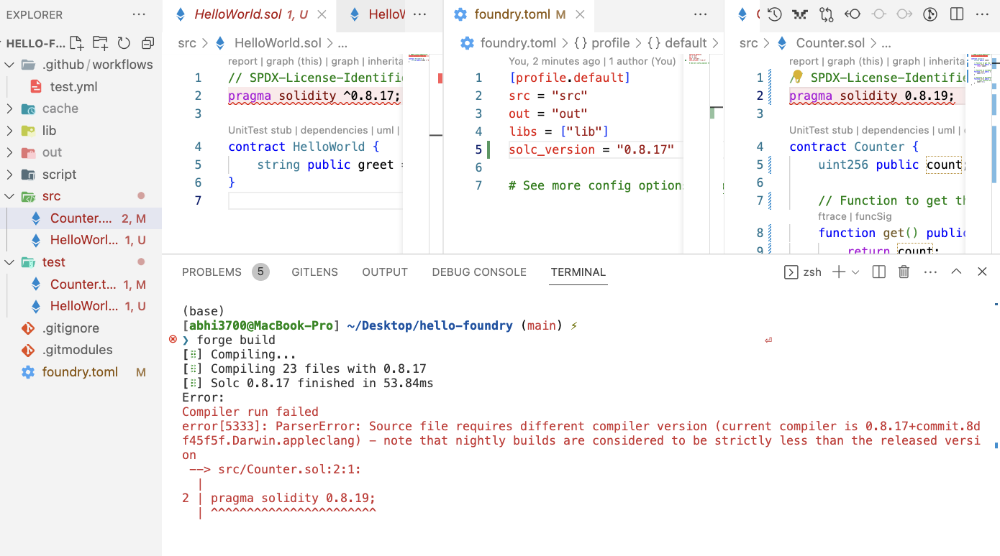

## Optimizer

Set optimizer for your contracts in project.

```toml
optimizer = true
optimizer_runs = 200
```

Then, build using `$ forge build`.

## Remapping, Lib, Dependencies, Imports

### Lib installed via `forge`

Import Solidity libraries like **Solmate** and **Openzeppelin** into your Foundry project.

Error when installing lib using `$ forge install` because there were untracked/modified files in the project. So, ensure we have a clean slate i.e. `$ git status` should be clean:

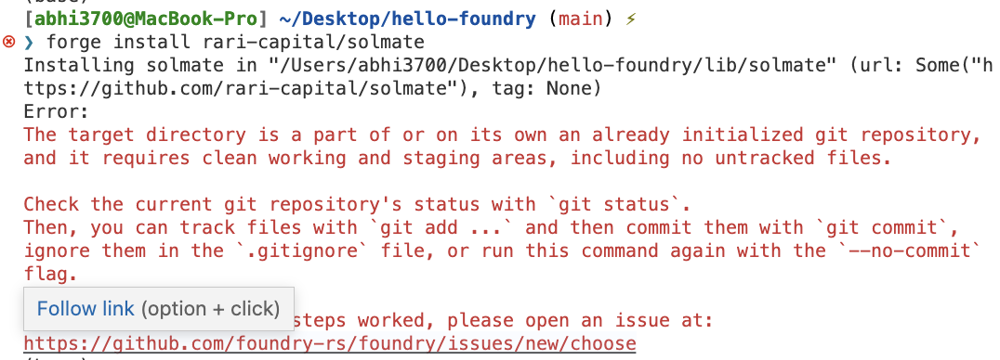

Otherwise, try with `--no-commit` flag:

```sh
forge install GIT_ACCOUNT/REPO --no-commit
```

This won't commit the required files.
> Basically, inherently it does `$ git submodule add ...` & then `git add ...` & then `git commit -m "..."` which is wrapped inside `forge install..`.

---

Success when the `git status` is clean:

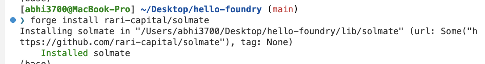

Also, the `solmate` folder is created inside `lib/` folder:

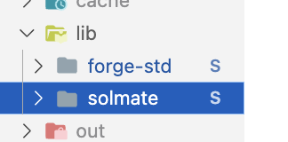

---

Then, we can import the `ERC20.sol` file from the Solmate library like this into our `Imports.sol` contract:

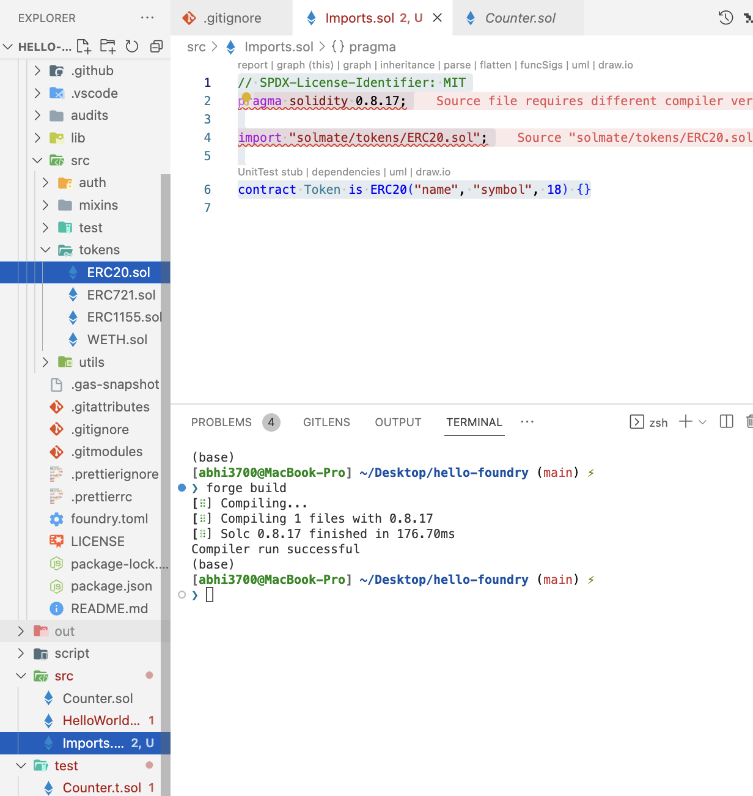

And then we can build the project using `$ forge build`

---

In order to see what dependencies (as libs) are being used in the project, use `$ forge remappings`:

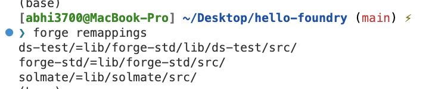

---

- `$ forge update`: update all dependencies.
- `$ forge update <lib_path>`: update a specific dependency.
  - `$ forge update lib/solmate`: update the `solmate` lib.
  - `$ forge update lib/forge-std`: update the `forge-std` lib.
  - `ds-test` gets updated as soon as the `lib/forge-std` gets updated.
- `$ forge remove GITHUB_ACCOUNT/REPO_NAME`: remove the `solmate` lib.

  ```sh
  forge remove OpenZeppelin/openzeppelin-contracts/
  forge remove transmissions11/solmate
  ```

---

After removing the `solmate` lib, the `Imports.sol` build would fail:

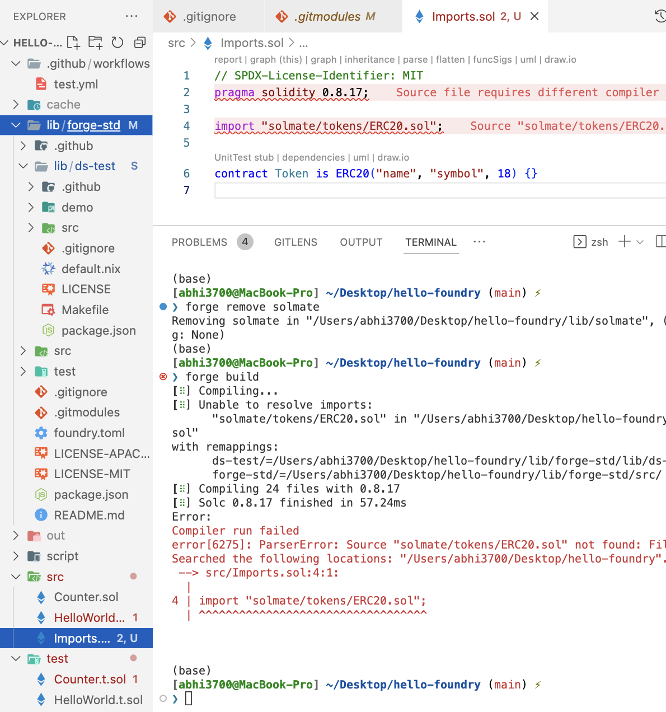

In order to fix this, we can reinstall the `solmate` lib using `$ forge install solmate`.

> Keep the `git status` clean before installing the lib.

And then, rebuild using `$ forge build`.

At the end, we can see the cumulative dependencies in the project using `$ forge remappings`.

### Lib installed via `npm`

Here, given we installed the `@openzeppelin/contracts` library via `npm` using `$ npm i @openzeppelin/contracts` command, we can import it into our Foundry project contracts (`src/*.sol`) properly.
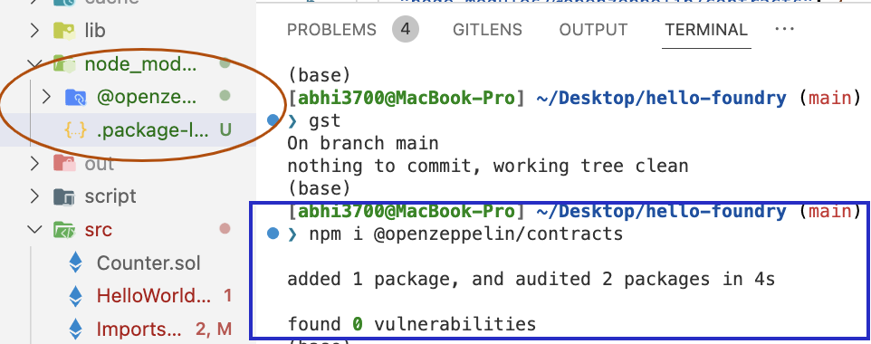

Now, let's import `Ownable.sol` file from the Openzeppelin contracts like this into our `Imports.sol` contract:
> Otherwise, we would have to import by path i.e. `../node_modules/@openzeppelin/contracts/access/Ownable.sol`

```solidity
import "@openzeppelin/contracts/access/Ownable.sol";

contract TestOz is Ownable {}
```

In order to achieve this, create a `remappings.txt` file & add this line:

```txt
@openzeppelin/=node_modules/@openzeppelin/
```

And then build using `$ forge build`.

Now, we can view the cumulative dependencies in the project using `$ forge remappings`:

```console
❯ forge remappings
@openzeppelin/=node_modules/@openzeppelin/
ds-test/=lib/forge-std/lib/ds-test/src/
forge-std/=lib/forge-std/src/
solmate/=lib/solmate/src/
```

| NOTE | No matter you install via foundry `forge`/hardhat (`npm`), all what matters is the remappings, if you don't prefer to literally import the file(s) by path. |
|--|--|

## Formatting

- M-1: Format your Solidity code using `$ forge format`.
- M-2: In my editor (VSC), I have the solidity extensions installed. So, my code gets auto-formatted on save <kbd>cmd+s</kbd>.
  - For this, all the used extensions can be synced as & when I login into my VSC account via Github.

> To save the code without formatting, use `cmd+k` + `cmd+s` (on Mac).

## Debuggging

In order to use `console2.log()`, import this into your solidity file (contract, test, deploy scripts):

```solidity
// console
import "forge-std/console.sol";

// console2
import {console2} from "forge-std/Test.sol";
```

> Normally, `logInt()`, `logUint()` doesn't support 256 bit in `console.sol`, instead import `console2.sol` for foundry only project. And for hardhat + foundry projects, use `forge-std/console.sol`.

Then, we get to test the file using `$ forge test ---mp test/Counter.t.sol -vv`:

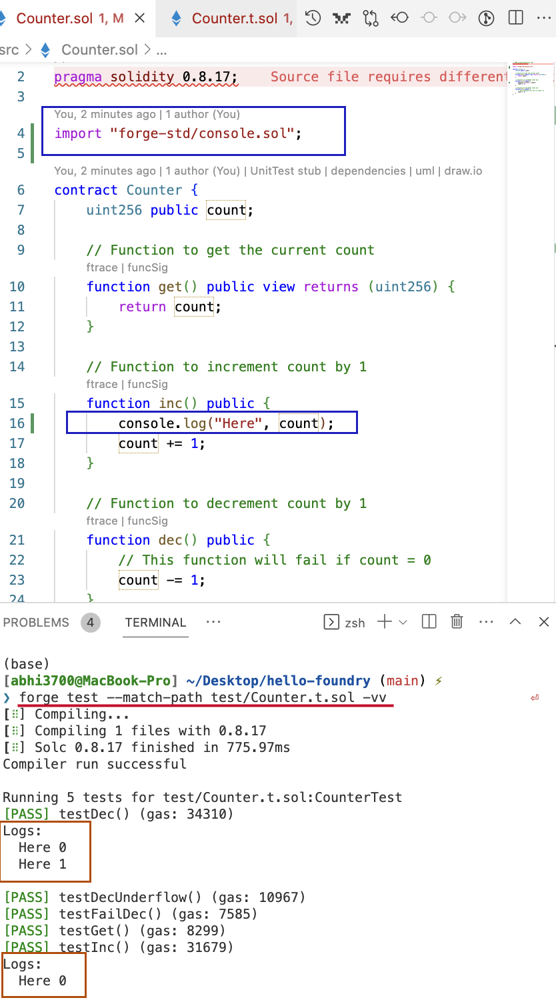

---

We can do this for test file as well. For example, in `Counter.t.sol`.

---

Before deployment, ensure that all the console logs related code are removed from the contracts (may exist in the test files).

---

**console log functions (most commonly used)**:

For more, refer this file: `forge-std/console.sol`

- `log(string memory message)`: log a message.

  ```solidity
  console2.log("Hello World");
  console2.log("Hello ", "World");
  console2.log("Hello times ", 1);
  ```

- `logInt(int)`: log int value.

  ```solidity
  console2.log(1);
  ```

- To log enum variants, use like this:

  ```solidity
  enum MyEnum {
    A,
    B,
    C
  }

  console2.log(uint256(MyEnum.A));
  ```

## Deployment

Run a local node via `$ anvil`:

```console
❯ anvil


                             _   _
                            (_) | |
      __ _   _ __   __   __  _  | |
     / _` | | '_ \  \ \ / / | | | |
    | (_| | | | | |  \ V /  | | | |
     \__,_| |_| |_|   \_/   |_| |_|

    0.1.0 (92f8951 2022-08-06T00:05:51.822342Z)
    https://github.com/foundry-rs/foundry

Available Accounts
==================

(0) 0xf39fd6e51aad88f6f4ce6ab8827279cfffb92266 (10000 ETH)
(1) 0x70997970c51812dc3a010c7d01b50e0d17dc79c8 (10000 ETH)
(2) 0x3c44cdddb6a900fa2b585dd299e03d12fa4293bc (10000 ETH)
(3) 0x90f79bf6eb2c4f870365e785982e1f101e93b906 (10000 ETH)
(4) 0x15d34aaf54267db7d7c367839aaf71a00a2c6a65 (10000 ETH)
(5) 0x9965507d1a55bcc2695c58ba16fb37d819b0a4dc (10000 ETH)
(6) 0x976ea74026e726554db657fa54763abd0c3a0aa9 (10000 ETH)
(7) 0x14dc79964da2c08b23698b3d3cc7ca32193d9955 (10000 ETH)
(8) 0x23618e81e3f5cdf7f54c3d65f7fbc0abf5b21e8f (10000 ETH)
(9) 0xa0ee7a142d267c1f36714e4a8f75612f20a79720 (10000 ETH)

Private Keys
==================

(0) 0xac0974bec39a17e36ba4a6b4d238ff944bacb478cbed5efcae784d7bf4f2ff80
(1) 0x59c6995e998f97a5a0044966f0945389dc9e86dae88c7a8412f4603b6b78690d
(2) 0x5de4111afa1a4b94908f83103eb1f1706367c2e68ca870fc3fb9a804cdab365a
(3) 0x7c852118294e51e653712a81e05800f419141751be58f605c371e15141b007a6
(4) 0x47e179ec197488593b187f80a00eb0da91f1b9d0b13f8733639f19c30a34926a
(5) 0x8b3a350cf5c34c9194ca85829a2df0ec3153be0318b5e2d3348e872092edffba
(6) 0x92db14e403b83dfe3df233f83dfa3a0d7096f21ca9b0d6d6b8d88b2b4ec1564e
(7) 0x4bbbf85ce3377467afe5d46f804f221813b2bb87f24d81f60f1fcdbf7cbf4356
(8) 0xdbda1821b80551c9d65939329250298aa3472ba22feea921c0cf5d620ea67b97
(9) 0x2a871d0798f97d79848a013d4936a73bf4cc922c825d33c1cf7073dff6d409c6

Wallet
==================
Mnemonic:          test test test test test test test test test test test junk
Derivation path:   m/44'/60'/0'/0/


Base Fee
==================

1000000000

Gas Limit
==================

30000000

Listening on 127.0.0.1:8545
```

### script

Here is the script to deploy the contract like this:

```solidity
// SPDX-License-Identifier: UNLICENSED
pragma solidity ^0.8.13;

import "forge-std/Script.sol";
import {AutoCompVault} from "../src/AutoCompVault.sol";
import {DepositToken} from "../src/DepositToken.sol";

contract AutoCompVaultScript is Script {
    function setUp() public {}

    function run() public {
        vm.startBroadcast();
        DepositToken token = new DepositToken("CRV:stETH Token", "CRVstETH", 1_000_0001e18);
        AutoCompVault acvault = new AutoCompVault(address(token), 100, 1 days);
        vm.stopBroadcast();
    }
}
```

Here,

- `vm.startBroadcast()` and `vm.stopBroadcast()` are used to wrap the contract deployment transaction.
- token, acvault are the contract instances that are used in the script.

#### on Local testnet (using anvil)

Run SIMULATION to estimate the gas cost to deploy the contract

```sh
$ forge script script/Contract.s.sol:ContractScript --fork-url http://localhost:8545 --private-key 0xac0974bec39a17e36ba4a6b4d238ff944bacb478cbed5efcae784d7bf4f2ff80
[⠢] Compiling...
No files changed, compilation skipped
Script ran successfully.

==========================

Estimated total gas used for script: 170710

Estimated amount required: 0.00085355 ETH

==========================

SIMULATION COMPLETE. To broadcast these transactions, add --broadcast and wallet configuration(s) to the previous command. See forge script --help for more.

Transactions saved to: broadcast/Contract.s.sol/31337/run-latest.json
```

---

Run this to broadcast the transaction

```console
❯ forge script script/Contract.s.sol:ContractScript --fork-url http://localhost:8545 --private-key 0xac0974bec39a17e36ba4a6b4d238ff944bacb478cbed5efcae784d7bf4f2ff80 --broadcast
[⠢] Compiling...
No files changed, compilation skipped
Script ran successfully.

==========================

Estimated total gas used for script: 170710

Estimated amount required: 0.00085355 ETH

==========================

###
Finding wallets for all the necessary addresses...
##
Sending transactions [0 - 0].
⠁ [00:00:00] [##################################] 1/1 txes (0.0s)
Transactions saved to: broadcast/Contract.s.sol/31337/run-latest.json

##
Waiting for receipts.
⠉ [00:00:00] [##############################] 1/1 receipts (0.0s)
#####
✅ Hash: 0x4608c98102dcdfbe2e4c8f268f0c77bad139027e8e347aa8324ecebc649d9a3b
Contract Address: 0x5fbdb2315678afecb367f032d93f642f64180aa3
Block: 1
Paid: 0.0005089931990988 ETH (131316 gas * 3.8760943 gwei)


Transactions saved to: broadcast/Contract.s.sol/31337/run-latest.json


==========================

ONCHAIN EXECUTION COMPLETE & SUCCESSFUL. Transaction receipts written to "broadcast/Contract.s.sol/31337/run-latest.json"

Transactions saved to: broadcast/Contract.s.sol/31337/run-latest.json
```

#### Deploy a contract with broadcast of the transaction

```sh
forge script script/Load.s.sol:LoadScript --rpc-url $SUBSPACE_EVM_RPC_URL --private-key $DEPLOYER_PRIVATE_KEY --broadcast
```

#### Deploy a contract with broadcast and verification on etherscan

This is on Sepolia testnet.

```sh
forge script script/Load.s.sol:LoadScript --rpc-url $SEPOLIA_RPC_URL --private-key $DEPLOYER_PRIVATE_KEY --broadcast --verify
```

By default, the verifier is etherscan. So, no need to specify it.

#### Deploy a contract with broadcast and verification on etherscan with api key

This is on Polygon mainnet.

```sh
$ forge script script/NFT.s.sol:MyScript --chain-id 137 --rpc-url $RPC_URL \
    --etherscan-api-key $POLYGONSCAN_API_KEY --verifier-url https://api.polygonscan.com/api \
    --broadcast --verify
```

> Here, `chain-id` is optional though.

#### Deploy a contract with broadcast and verification on blockscout

This is on Subspace Nova testnet.

```sh
forge script script/Load.s.sol:LoadScript --rpc-url $SUBSPACE_EVM_RPC_URL --private-key $DEPLOYER_PRIVATE_KEY --broadcast --verify --verifier blockscout --verifier-url $VERIFIER_URL
```

> Please add /api? to the end of explorer url like this: "<https://nova.subspace.network/api>?". This is without any api key. Here, the block explorer is: "<https://nova.subspace.network/>".

### create

**Using `forge create` to deploy the contract in CLI**:

```sh
# without args
$ forge create --rpc-url <RPC_URL> --private-key <PRIVATE_KEY_w_0x> src/Counter.sol:Counter --constructor-args ""
# with args
$ forge create --rpc-url <RPC_URL> --private-key <PRIVATE_KEY_w_0x> src/MyToken.sol:MyToken --constructor-args "DAI" "DAI" 18
```

## Verify contract

This is to verify contract on the block explorer like etherscan, blockscout, etc.

### blockscout

check verification status of a contract on blockscout:

```sh
# forge verify-check <GUID>
forge verify-check 7a363ef616bdd60cf3e6b760f0a5672b77c5d9f265a6c5c2
```

> Here, **GUID** is the unique id of the contract when verifying on blockscout. Basically, each time when we verify a contract on blockscout, it generates a unique id for that contract.

---

verify contract if you think the previous verification failed:

```sh
forge verify-contract 0x7A363EF616bdd60cF3E6B760F0a5672b77c5d9f2 src/SendersTreasury.sol:SendersTreasury --verifier blockscout --verifier-url $VERIFIER_URL
```

## Interaction with Contract

Use `cast` tool to interact with

**get function**

```console
❯ cast call 0x5fbdb2315678afecb367f032d93f642f64180aa3 "count()(uint256)"
10
```

---

**set function**

To set a number via `setNumber(uint256)`

```console
❯ cast send 0x5fbdb2315678afecb367f032d93f642f64180aa3 "setNumber(uint256)" 20 --private-key 0xac0974bec39a17e36ba4a6b4d238ff944bacb478cbed5efcae784d7bf4f2ff80

blockHash               0xfa27deda66eb7e9d7211c225bb41f462a71222e8b7e878455ca13bbaaf87920c
blockNumber             4
contractAddress
cumulativeGasUsed       26394
effectiveGasPrice       3671048153
gasUsed                 26394
logs                    []
logsBloom               0x00000000000000000000000000000000000000000000000000000000000000000000000000000000000000000000000000000000000000000000000000000000000000000000000000000000000000000000000000000000000000000000000000000000000000000000000000000000000000000000000000000000000000000000000000000000000000000000000000000000000000000000000000000000000000000000000000000000000000000000000000000000000000000000000000000000000000000000000000000000000000000000000000000000000000000000000000000000000000000000000000000000000000000000000000000000
root
status                  1
transactionHash         0xf1114cda0205944aaec727b0bcb6bd99c0edc3d41b517d3eecb618296dcc86ba
transactionIndex        0
type                    2
```

---

To increment the count via `increment()`

```console
❯ cast send 0x5fbdb2315678afecb367f032d93f642f64180aa3 "increment()" --private-key $PRIVATE_KEY

blockHash               0xcc0b40fd1e02027d37c59664ae73ec5dfd44d238a54ea889e5f011750949d183
blockNumber             2
contractAddress
cumulativeGasUsed       26311
effectiveGasPrice       3766774603
gasUsed                 26311
logs                    []
logsBloom               0x00000000000000000000000000000000000000000000000000000000000000000000000000000000000000000000000000000000000000000000000000000000000000000000000000000000000000000000000000000000000000000000000000000000000000000000000000000000000000000000000000000000000000000000000000000000000000000000000000000000000000000000000000000000000000000000000000000000000000000000000000000000000000000000000000000000000000000000000000000000000000000000000000000000000000000000000000000000000000000000000000000000000000000000000000000000
root
status                  1
transactionHash         0xfa3250b9aebcceba276b52a8939c9036982114f3f5c07d45c08b4e715c1e669b
transactionIndex        0
type
```

---

To decrement the count via `decrement()`

```console
❯ cast send 0x5fbdb2315678afecb367f032d93f642f64180aa3 "decrement()" --private-key $PRIVATE_KEY

blockHash               0x1f7e29a722f7dddec48993cb4493b748d03536844394f172c16e4e026f8a7d3e
blockNumber             3
contractAddress
cumulativeGasUsed       26286
effectiveGasPrice       3671095739
gasUsed                 26286
logs                    []
logsBloom               0x00000000000000000000000000000000000000000000000000000000000000000000000000000000000000000000000000000000000000000000000000000000000000000000000000000000000000000000000000000000000000000000000000000000000000000000000000000000000000000000000000000000000000000000000000000000000000000000000000000000000000000000000000000000000000000000000000000000000000000000000000000000000000000000000000000000000000000000000000000000000000000000000000000000000000000000000000000000000000000000000000000000000000000000000000000000
root
status                  1
transactionHash         0x95fe234128f9078e22f9bf082c0b80732aee665405f68a8680b5964a8eb31376
transactionIndex        0
type
```

For more such commands, refer [this](./cast.md).

## List selectors from a contract's source code

> Selectors are functions (setter, getter), errors, and events.

```sh
$ forge selectors list -C ./src/SendersTreasury.sol
Listing selectors for contracts in the project...
SendersTreasury
+----------+---------------------------------------------------+--------------------------------------------------------------------+
| Type     | Signature                                         | Selector                                                           |
+===================================================================================================================================+
| Function | balances(address)                                 | 0x27e235e3                                                         |
|----------+---------------------------------------------------+--------------------------------------------------------------------|
| Function | claimPayment(uint256)                             | 0xc63fdcc7                                                         |
|----------+---------------------------------------------------+--------------------------------------------------------------------|
| Function | constructMessageOf(uint256)                       | 0xc4ca172c                                                         |
|----------+---------------------------------------------------+--------------------------------------------------------------------|
| Function | getBalanceOf(address)                             | 0x9b96eece                                                         |
|----------+---------------------------------------------------+--------------------------------------------------------------------|
| Function | getPaymentRequest(uint256)                        | 0xb09fbe1a                                                         |
|----------+---------------------------------------------------+--------------------------------------------------------------------|
| Function | getRequestedPayIdsOf(address)                     | 0x2d769a1e                                                         |
|----------+---------------------------------------------------+--------------------------------------------------------------------|
| Function | requestPayId()                                    | 0x9fdbed5c                                                         |
|----------+---------------------------------------------------+--------------------------------------------------------------------|
| Function | requestPayment(address,uint256)                   | 0x9f0c592e                                                         |
|----------+---------------------------------------------------+--------------------------------------------------------------------|
| Function | signPayReq(uint256,bytes)                         | 0x0769ec46                                                         |
|----------+---------------------------------------------------+--------------------------------------------------------------------|
| Function | verifySignature(bytes,uint256,address)            | 0xc2f0df64                                                         |
|----------+---------------------------------------------------+--------------------------------------------------------------------|
| Function | withdraw(uint256)                                 | 0x2e1a7d4d                                                         |
|----------+---------------------------------------------------+--------------------------------------------------------------------|
| Event    | PayRequestSigned(address,uint256)                 | 0x3cbe390e6be8460da82fbf1001aab39207f3d6bbd88a9efb99f6bfcbbc540fae |
|----------+---------------------------------------------------+--------------------------------------------------------------------|
| Event    | PaymentDone(uint256,address,address,uint256)      | 0xd5d2af3aef795f5af40adb72b39dd23ef18b5c5b0d08fde329ef213ab6e2c0df |
|----------+---------------------------------------------------+--------------------------------------------------------------------|
| Event    | PaymentRequested(address,uint256,address,uint256) | 0xb6edfd3e1a01dc3ba1d70b628dd73a9b23154d7e0a4d1fe466e97c9764570cef |
|----------+---------------------------------------------------+--------------------------------------------------------------------|
| Error    | CallerIsNotReceiver()                             | 0xd0d46358                                                         |
|----------+---------------------------------------------------+--------------------------------------------------------------------|
| Error    | CallerIsNotSender()                               | 0xef30440e                                                         |
|----------+---------------------------------------------------+--------------------------------------------------------------------|
| Error    | InsufficientBalanceOf(address)                    | 0x0fdd2c54                                                         |
|----------+---------------------------------------------------+--------------------------------------------------------------------|
| Error    | InvalidDepositAmount()                            | 0xfe9ba5cd                                                         |
|----------+---------------------------------------------------+--------------------------------------------------------------------|
| Error    | InvalidRequestId(uint256)                         | 0xc969e0f2                                                         |
|----------+---------------------------------------------------+--------------------------------------------------------------------|
| Error    | InvalidSignature()                                | 0x8baa579f                                                         |
|----------+---------------------------------------------------+--------------------------------------------------------------------|
| Error    | ZeroAddress()                                     | 0xd92e233d                                                         |
|----------+---------------------------------------------------+--------------------------------------------------------------------|
| Error    | ZeroAmount()                                      | 0x1f2a2005                                                         |
+----------+---------------------------------------------------+--------------------------------------------------------------------+
```

## Code snippets

More can be found [here](../../utils/foundry/)

## Troubleshoot

### 1. Error: "solc": No such file or directory (os error 2)

- _Cause_: `solc` is set to false
- _Solution_: set `auto_detect_solc` to `true` in `foundry.toml`

### 2. FAIL. Reason: Call did not revert as expected Counterexample: calldata=

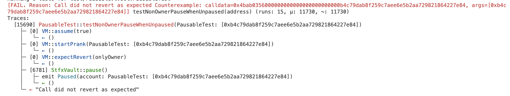

- _Cause_: so what that means is, basically, on the 150th run, the fuzzer chose the test contract's address itself.
- _Solution_: since that's the owner, it actually didn't revert back. so you can add another assumption and mention `vm.assume(testAddress != address(this))`;

Before:

```solidity
function testNonOwnerPauseWhenUnpaused(address testAddress) public {
  vm.assume(testAddress != address(0));

  vm.startPrank(testAddress);
  vm.expectRevert("onlyOwner");
  vault.pause();
  vm.stopPrank();
}
```

After:

```solidity
function testNonOwnerPauseWhenUnpaused(address testAddress) public {
  vm.assume((testAddress != address(0)) && (testAddress != vault.owner()));

  vm.startPrank(testAddress);
  vm.expectRevert("onlyOwner");
  vault.pause();
  vm.stopPrank();
}
```

### 3. Blank `solc error:` during `$ forge build`

- _Solution_:

1. `$ rm -rf ~/.svm`
2. `$ brew install z3`
3. `$ forge build`

### 4. Compilation error related to `ds-test` lib installation while running hardhat into Foundry project

- _Cause_: `ds-test` lib is missing

Error:

```console
❯ yarn compile
yarn run v1.22.17
warning ../../../../../package.json: No license field
$ hardhat compile
Error HH411: The library ds-test, imported from lib/forge-std/src/Test.sol, is not installed. Try installing it using npm.

For more info go to https://hardhat.org/HH411 or run Hardhat with --show-stack-traces
error Command failed with exit code 1.
info Visit https://yarnpkg.com/en/docs/cli/run for documentation about this command.
```

- _Solution_: Just add this line into `remappings.txt` file

```
ds-test/=lib/forge-std/lib/ds-test/src/
```

### 5. Assertion failure with `assertApproxEqAbs`

- _Cause_: It's going to fail most of the times.
- _Solution_: Leave the code as is. Or try changing the delta by increasing or decreasing.

### 6. Dependency installation error

- _Cause_: the `git status` is not clean i.e. need to commit the changes.
- _Solution_: commit the changes and then run `$ forge install <package-name-as-in-github>` like `$ forge install rari-capital/solmate`

### 7. [FAIL. Reason: Error != expected error: 0xaf4e51c7 != * ]

- _Cause_: the error message is not matching with the expected error message. Hence, `0xaf4e51c7` is the selector of the error message - `ZeroAmount`
- _Solution_: change the error message to the actual.

**Before**:

```solidity
vm.expectRevert(AutoCompVault.ZeroAmount.selector);
acvault.redeem(shareAmt + 1);
```

**After**:

```solidity
vm.expectRevert(AutoCompVault.InsufficientShareBalance.selector);
acvault.redeem(shareAmt + 1);
```
