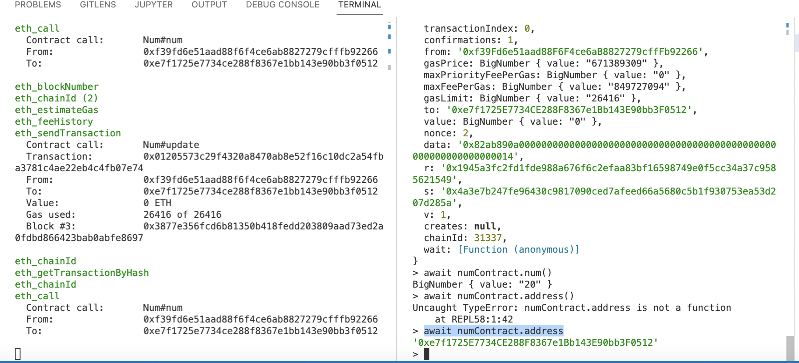
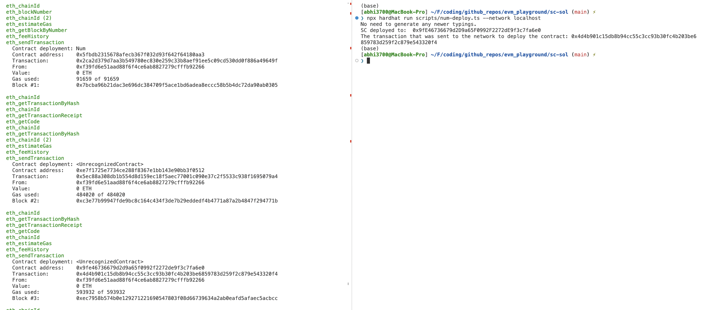
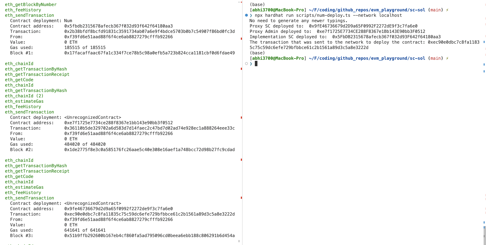
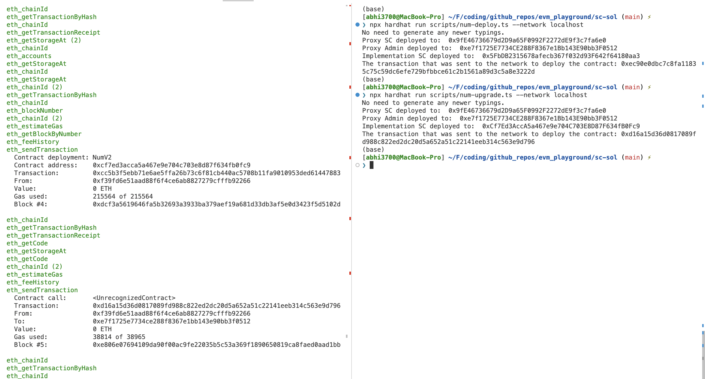
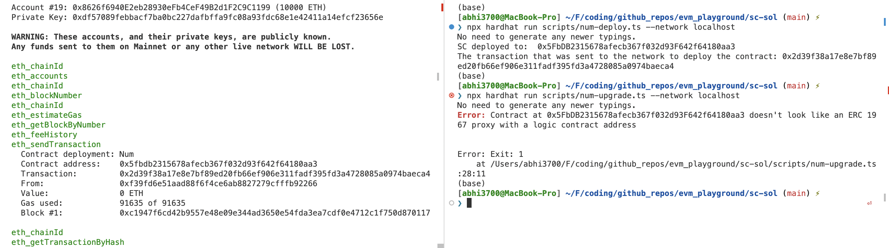

# Hardhat

## About

- Hardhat is a development environment to compile, deploy, test, and debug your Ethereum software.
- Hardhat comes built-in with Hardhat Network, a local Ethereum network designed for development. Its functionality focuses around Solidity debugging, featuring stack traces, console.log() and explicit error messages when transactions fail.
- Hardhat vs Truffle
  - Unlike Truffle, in Hardhat, there is a print option using `console.log` present inside `hardhat/console.sol` lib.
- There are

## Installation

- Ensure installation of nvm, npm, nodejs
- `$ npm install --save-dev hardhat` inside a project directory

## Config

Parameters inside `hardhat.config.ts`.

### Paths

```ts
    paths: {
        sources: "./src",
        artifacts: "./build/artifacts",
        cache: "./cache_hardhat",
        tests: "./test",
    },
```

## Hardhat Console

This is to play with the contract on localhost on CLI.

Open CLI on a localhost: `$ npx hardhat node --network localhost`

> Prior to this step, local node must be running in another terminal via `$ npx hardhat node`



### Functionality

All the commands are written on CLI.

> Shown for a contract named - `Num` with a constructor with input parameter of a number.

- Define a contract factory:
  > Done to call the ABI (typechain in case of typescript)

```ts
> const numFactory = await ethers.getContractFactory("Num");
```

- Define/Deploy a new contract:

```ts
> const numContract = await numFactory.deploy(10);
```

- Attach a deployed contract to a variable":

> the deployed contract address: `0xe7f1725E7734CE288F8367e1Bb143E90bb3F0512`

```ts
> await num1 = numFactory.attach("0xe7f1725E7734CE288F8367e1Bb143E90bb3F0512");
```

- Now, call the function of deployed contract at this address:

```ts
> await num1.num()
```

Use `update` function.

```ts
> await num1.update(30)
```

## Architecture

- Hardhat is designed around the concepts of tasks and plugins. The bulk of Hardhat's functionality comes from plugins, which as a developer you're free to choose the ones you want to use.

### [Tasks](https://hardhat.org/tutorial/creating-a-new-hardhat-project.html#tasks)

- Available tasks (by default): `compile`, `check`, `test`, etc.
- Create a new task [here](https://hardhat.org/guides/create-task.html)
- Example inside `hardhat.config.js` config file:

```
// https://hardhat.org/guides/create-task.html
/*task("accounts", "Prints the list of accounts", async (taskArgs, hre) => {
  const accounts = await hre.ethers.getSigners();

  for (const account of accounts) {
    console.log(account.address);
  }
});
```

### [Plugins](https://hardhat.org/tutorial/creating-a-new-hardhat-project.html#plugins)

- `$ npm install --save-dev @nomiclabs/hardhat-ethers ethers @nomiclabs/hardhat-waffle ethereum-waffle chai`
- Add line to your config file - `hardhat.config.js`

```js
require("@nomiclabs/hardhat-waffle");

/**
 * @type import('hardhat/config').HardhatUserConfig
 */
module.exports = {
  solidity: "0.7.3",
};
```

## Getting Started

- [Follow this tutorial](https://hardhat.org/tutorial/)
- After `$ npx hardhat`, If you select `Create a sample project a simple project` creation wizard will ask you some questions and create a project with the following structure:

```
contracts/			- is where the source files for your contracts should be.
scripts/				- is where your tests should go.
test/						- is where simple automation scripts go.
hardhat.config.js
```

## Testing & Ethereum networks

- When it comes to testing your contracts, Hardhat comes with some built-in defaults:
  - The built-in Hardhat Network as the development network to test on
  - Mocha as the test runner
- If you need to use an external network, like an Ethereum testnet, mainnet or some other specific node software, you can set it up using the networks configuration entries in the exported object in hardhat.config.js, which is how Hardhat projects manage settings.

You can use of the `--network` CLI parameter to quickly change the network. Click more for `set up your ethereum network` - https://hardhat.org/config/#networks-configuration

## Plugins & Dependencies

- [`Ether.js`](https://docs.ethers.io/)
- [`Waffle`](https://getwaffle.io/)
  - a framework for testing smart contracts.
  - used in config file
- `hardhat-deploy` is a plugin for deployment in case of typescript.
- [`Chai`](https://www.chaijs.com/)
  - used for assertion, which comes from `Waffle`
- [`Mocha`](https://mochajs.org/)
  - test runner to organized your tests. All Mocha functions are available in the global scope.
  - has 4 functions: `before`, `beforeEach`, `after`, `afterEach`.
  - They're very useful to setup the environment for tests, and to clean it up after they run.
- OpenZeppelin gives us a Solidity template for our ERC-20 contract & many more like `OnlyOwner`, `Reentrancy`.
- In Typescript, `hardhat-gas-reporter` (for gas amount) along with `hardhat-deploy` (for txn_id, gas amount) gives the gas amount like this:

```bash
Nothing to compile
deploying "Token" (tx: 0x259d19f33819ec8d3bd994f82912aec6af1a18ec5d74303cfb28d793a10ff683)...: deployed at 0x5FbDB2315678afecb367f032d93F642f64180aa3 with 592983 gas
Done in 3.66s.
```

- You may have seen this notice when creating the sample project:

```
You need to install these dependencies to run the sample project:
  npm install --save-dev @nomiclabs/hardhat-waffle ethereum-waffle chai @nomiclabs/hardhat-ethers ethers
```

- The sample project uses the @nomiclabs/hardhat-waffle plugin, which depends on the @nomiclabs/hardhat-ethers plugin. These integrate the Ethers.js and Waffle tools into your project. Following is to be present in the `hardhat.config.js` config file:

```
require("@nomiclabs/hardhat-waffle");

module.exports = {};
```

- Typechain: Automatically generate TypeScript bindings for smartcontracts while using Hardhat.
  - [Source](https://www.npmjs.com/package/typechain)
  - installation:
    - `$ npm install --save-dev typechain @typechain/hardhat @typechain/ethers-v5`
    - `$ npm install --save-dev typechain @typechain/ethers-v5`

## Project Setup

### JavaScript

[Example](https://github.com/abhi3700/eth-sol-hardhat-js)

1. Open bash in a folder & then run `$ npm init -y` or `$ npm init --yes` to create a `package.json`
1. Then, download hardhat using `$ npm install --save hardhat` in `node_modules/` folder.
1. `$ npx hardhat` >> Choose "Create an empty hardhat.config.js". Now, config file created
1. Hardhat will install plugins like `hardhat-waffle`, `hardhat-ethers`. If missed, install using `$ npm install --save-dev @nomiclabs/hardhat-waffle ethereum-waffle chai @nomiclabs/hardhat-ethers ethers hardhat-gas-reporter hardhat-deploy @openzeppelin/contracts typechain @typechain/hardhat @typechain/ethers-v5`
1. To first get a quick sense of what's available and what's going on, run `$ npx hardhat` in your project folder.
1. Next add the line `require('@nomiclabs/hardhat-waffle');` in file `hardhat.config.js`

   > We're only requiring hardhat-waffle here because it depends on hardhat-ethers so adding both isn't necessary.

1. If you take a look at the `hardhat.config.js` file, you will find the definition of the task `accounts`. Now, list down the accounts `$ npx hardhat accounts`
1. Now, to compile use `$ npx hardhat compile`
   - the compiled artifacts saved in the `artifacts/` directory by default or whatever your configured artifacts path is.
   - If you didn't change any files since the last compilation, nothing will be compiled & it shows like this: `Nothing to compile`
   - Enforce a recompilation using `npx hardhat compile --force`
1. Now, for testing use `$ npx hardhat test` after creating a file `test/test.js` (filename doesn't matter.). Here, the contract(s) have been tested w/o deployment.

   > 3 main concepts: `Signer`, `ContractFactory` and `Contract` are explained here.

1. To deploy the contract, [source](https://hardhat.org/tutorial/debugging-with-hardhat-network.html) after creating the `scripts/deploy.js`:

   - **Hardhat network**: use `$ npx hardhat run scripts/deploy.js`
   - **local network**: use `$ npx hardhat run scripts/deploy.js --network local` using Ganache local chain & to see rich contract data, compile using truffle. View the contract in Ganache.

   ```console
   $ npx hardhat run scripts/deploy.js --network local
   Deploying contracts with the account: 0xef92fAA501c2B7F84763066fE382DfC455A2Bf82
   Account balance: 99558873620000000000
   Token address: 0xBC9b6a9Ba4C0C83F4A8BE90D32419365ACeB10B9
   ```

   - Add the `network` in config file `hardhat.config.js`:

   ```
   module.exports = {
     solidity: "0.8.6",
     networks: {
       local: {
         url: 'http://127.0.0.1:7545/',
         accounts: ['0xe0db4b3fa4af41d065eb3c2e5df3dfbed18203607e59ec428e225e7b2d23c194'],
       },
     },
   };
   ```

   - **Rinkeby network**: use `$ npx hardhat run scripts/deploy.js --network rinkeby`. View the contract - https://rinkeby.etherscan.io/address/<contract_address>

### TypeScript

[Example](https://github.com/abhi3700/eth-sol-hardhat-ts)

1. Open bash in a folder & then run `$ npm init -y` or `$ npm init --yes` to create a `package.json`
1. Then, download hardhat using `$ npm install --save hardhat` in `node_modules/` folder.
1. `$ npx hardhat` >> Choose "Create an empty hardhat.config.js". Now, config file created
1. Now, convert JS to TS

   ```bash
   $ npm install --save-dev ts-node typescript
   $ npm install --save-dev chai @types/node @types/mocha @types/chai
   $ mv hardhat.config.js hardhat.config.ts
   ```

1. Dependency packages like `hardhat-waffle`, `hardhat-ethers`. If missed, install using

   ```bash
   $ npm install --save-dev @nomiclabs/hardhat-waffle ethereum-waffle chai @nomiclabs/hardhat-ethers ethers hardhat-gas-reporter @openzeppelin/contracts typechain @typechain/hardhat @typechain/ethers-v5 dotenv
   ```

1. To first get a quick sense of what's available and what's going on, run `$ npx hardhat` in your project folder.
1. Next add the line `import '@nomiclabs/hardhat-waffle';` in file `hardhat.config.ts`

   > We're only requiring hardhat-waffle here because it depends on hardhat-ethers so adding both isn't necessary.

1. If you take a look at the `hardhat.config.ts` file, you will find the definition of the task `accounts`. Now, list down the accounts `$ npx hardhat accounts`
1. Now, to compile use `$ npx hardhat compile`
   - the compiled artifacts saved in the `artifacts/` directory by default or whatever your configured artifacts path is.
   - If you didn't change any files since the last compilation, nothing will be compiled & it shows like this: `Nothing to compile`
   - Enforce a recompilation using `npx hardhat compile --force`
1. Now, for testing use `$ npx hardhat test` after creating a file `test/test.ts` (filename doesn't matter.). Here, the contract(s) have been tested locally w/o deployment.

   > 3 main concepts: `Signer`, `ContractFactory` and `Contract` are explained here.

1. To deploy the contract, [source](https://hardhat.org/tutorial/debugging-with-hardhat-network.html) after creating the `scripts/deploy.ts`:

   - **Hardhat network**: use `$ npx hardhat run scripts/deploy.ts`
   - **local network**: use `$ npx hardhat run scripts/deploy.ts --network local` using Ganache local chain & to see rich contract data, compile using truffle. View the contract in Ganache.

   ```console
   $ npx hardhat run scripts/deploy.ts --network local
   Deploying contracts with the account: 0xef92fAA501c2B7F84763066fE382DfC455A2Bf82
   Account balance: 99558873620000000000
   Token address: 0xBC9b6a9Ba4C0C83F4A8BE90D32419365ACeB10B9
   ```

   - Add the `network` in config file `hardhat.config.ts`:

   ```
   const config: HardhatUserConfig = {
     solidity: "0.8.6",
     networks: {
       local: {
         url: 'http://127.0.0.1:7545/',
         accounts: ['0xe0db4b3fa4af41d065eb3c2e5df3dfbed18203607e59ec428e225e7b2d23c194'],
       },
     },
   };
   ```

   - **Rinkeby network**: use `$ npx hardhat run scripts/deploy.ts --network rinkeby`. View the contract - https://rinkeby.etherscan.io/address/<contract_address>

#### Points to Ponder

- In **namedAccounts** key of `hardhat.config.ts`, `deployer` is the 0th index & the `tokenOwner` is the 1st index, here in `const {deployer, tokenOwner} = await getNamedAccounts();` of `deploy.ts` file.

```ts
	namedAccounts: {
    deployer: 0,
    tokenOwner: 1,
  },
```

```ts
import { HardhatRuntimeEnvironment } from "hardhat/types"; // This adds the type from hardhat runtime environment.
import { DeployFunction } from "hardhat-deploy/types"; // This adds the type that a deploy function is expected to fulfill.

const func: DeployFunction = async function (hre: HardhatRuntimeEnvironment) {
  // the deploy function receives the hardhat runtime env as an argument
  const { deployments, getNamedAccounts } = hre; // we get the deployments and getNamedAccounts which are provided by hardhat-deploy.
  const { deploy } = deployments; // The deployments field itself contains the deploy function.

  const { deployer, tokenOwner } = await getNamedAccounts(); // Fetch the accounts. These can be configured in hardhat.config.ts as explained above.

  await deploy("Token", {
    // This will create a deployment called 'Token'. By default it will look for an artifact with the same name. The 'contract' option allows you to use a different artifact.
    from: deployer, // Deployer will be performing the deployment transaction.
    args: [tokenOwner], // tokenOwner is the address used as the first argument to the Token contract's constructor.
    log: true, //display the address and gas used in the console (not when run in test though).
  });
};
export default func;
func.tags = ["Token"]; // This sets up a tag so you can execute the script on its own (and its dependencies).
```

- The plugin hardhat-deploy allows you to name your accounts. Here there are 2 named accounts:
  - `deployer` will be the account used to deploy the contract.
  - `tokenOwner` which is passed to the constructor of Token.sol and which will receive the initial supply.
- Another way to write `deploy` function in `deploy.ts`:

```ts
await deploy("MyToken_1", {
  // name of the deployed contract
  contract: "Token", // name of the token source
  from: deployer,
  args: [tokenOwner],
  log: true,
});
```

- 3 methods to write deploy script:

  - M-1: traditional method using etherjs, web3js lib [link](https://github.com/amanusk/hardhat-template/blob/main/scripts/deploy.ts)
  - M-2: using hardhat-deploy [link](https://github.com/kalouo/hardhat-deployer/blob/master/deploy/00_deploy_test.ts)

    ```ts
    import { HardhatRuntimeEnvironment } from "hardhat/types";
    import { DeployFunction } from "hardhat-deploy/types";

    const func: DeployFunction = async function (
      hre: HardhatRuntimeEnvironment
    ) {
      const {
        deployments: { deploy },
        getNamedAccounts,
      } = hre;
      const { deployer } = await getNamedAccounts();

      await deploy("MyToken", {
        from: deployer,
        args: ["Medium", "MDM"],
        log: true,
      });
    };

    export default func;
    func.tags = ["MyToken"];
    ```

  - M-3: using deployContract, deployContractwithLibraries [link](https://github.com/bootfinance/boot-customswap.git)

    ```ts
    async function deploySwap(): Promise<void> {
      const [deployer]: SignerWithAddress[] = await ethers.getSigners();
      console.log(`Deploying with ${deployer.address}`);

      // Deploy FRAX token
      const fraxToken = (await deployContract(deployer, GenericERC20Artifact, [
        "Frax",
        "FRAX",
        "18",
      ])) as GenericERC20;
      await fraxToken.deployed();
      console.log(`FRAX token address: ${fraxToken.address}`);

      // Deploy SwapUtils with MathUtils library
      const swapUtils = (await deployContractWithLibraries(
        deployer,
        SwapUtilsArtifact,
        {
          MathUtils: mathUtils.address,
        }
      )) as SwapUtils;
      await swapUtils.deployed();
      console.log(`swapUtils address: ${swapUtils.address}`);
    }
    ```

## Commands

- `$ npx hardhat compile`: compile a contract
- `$ npx hardhat compile --force`: compile a contract, even if it's compiled already
- `$ npx hardhat clean`: clear the `cache` folder and delete the `artifacts/` folder.
- Multiple Solidity versions compilation within same folder - [here](https://hardhat.org/guides/compile-contracts.html#multiple-solidity-versions)
- `npx hardhat test` - runs all the files in the folder
- `npx hardhat test ./test/Greeter-test.js` - runs particularly the file
- [testing for selected `describe` inside `*.js` file, add `.only`](https://mochajs.org/#exclusive-tests)
- `npx hardhat node` - start a hardhat node at an address
- `$ npx hardhat deploy --network <name>`: deploy to any network configured under the networks key in [`hardhat.config.ts`](./hardhat.config.ts).
- `$ npx hardhat deploy --network <NETWORK> --tags <SOLIDITY_CONTRACT>`: `NETWORK` must be defined in the `hardhat.config.ts`. E.g. `$ npx hardhat deploy --network rinkeby --tags MyToken`
- `$ npx hardhat console --network <NETWORK>`: Run a console for the localhost network. E.g. `$ npx hardhat console --network localhost`.
  > Here, the generated contract address can be attached to a Contract factory based variable & then run the functions available inside. To access the state variables, just call by their name with `()` suffixed as if it's a function inside SC.

### OpenZeppelin plugin

To add immutable contracts dependency:

```console
// (-g for global, --save-dev for local in node_modules folder)
$ npm install @openzeppelin/contracts

OR

// (global for global, --dev for local in node_modules folder)
$ yarn add @openzeppelin/contracts
```

---

To add upgradeable contracts dependency:

```console
// (-g for global, --save-dev for local in node_modules folder)
$ npm install @openzeppelin/contracts-upgradeable

OR

// (global for global, --dev for local in node_modules folder)
$ yarn add @openzeppelin/contracts-upgradeable
```

#### OZ hardhat upgrade

In order to upgrade an existing instance of smart contract, follow this:

1. Add a pkg/plugin/dependency

```console
$ npm install --save-dev @openzeppelin/hardhat-upgrades

OR

$ yarn add --dev @openzeppelin/hardhat-upgrades
```

2. Register the plugin in `hardhat.config.js`/`hardhat.config.ts`

```js
// Javascript
require("@openzeppelin/hardhat-upgrades");

// Typescript
import "@openzeppelin/hardhat-upgrades";
```

Watch [this](https://www.youtube.com/watch?v=uqzM_KAMvEw) video.

---

#### Example 0

A non-upgradeable contract without `constructor` function.

**Contract**:

```solidity
//SPDX-License-Identifier: MIT
pragma solidity 0.8.6;

import "hardhat/console.sol";

contract Num {
    uint256 public num;

    function update(uint256 _num) external {
        num = _num;
    }
}
```

**Deploy Script**:

```ts
import { ethers, upgrades } from "hardhat";
import { Contract, ContractFactory /* , BigNumber */ } from "ethers";
import { config as dotenvConfig } from "dotenv";
import { resolve } from "path";
dotenvConfig({ path: resolve(__dirname, "./.env") });

async function main(): Promise<void> {
  // ==============================================================================
  // We get the contract to deploy
  const numFactory: ContractFactory = await ethers.getContractFactory("Num");

  // M-1
  const numContract: Contract = await numFactory.deploy();
  // OR
  // M-2
  // const numContract: Contract = await upgrades.deployProxy(numFactory);

  await numContract.deployed();
  console.log("SC deployed to: ", numContract.address);
  console.log(
    `The transaction that was sent to the network to deploy the contract: ${numContract.deployTransaction.hash}`
  );
}

// We recommend this pattern to be able to use async/await everywhere
// and properly handle errors.
main()
  .then()
  .catch((error: Error) => {
    console.error(error);
    throw new Error("Exit: 1");
  });
```

**CLI**: ✅

M-1:

```console
❯ npx hardhat run scripts/num-deploy.ts --network localhost
No need to generate any newer typings.
SC deployed to:  0x610178dA211FEF7D417bC0e6FeD39F05609AD788
The transaction that was sent to the network to deploy the contract: 0x549b48e61c07465367bec1c8c2234069023b14a2e961f2158f9cad97ffdff593
```

M-2:


**LESSONS**:

- As usual, in M-1, only 1 transaction occurred.
- But, in M-2, 3 transactions occurred to generate 3 contract addresses:
  1. Implementation Contract (logic i.e. Num)
  2. Proxy Admin
  3. Proxy Contract

---

#### Example 1

A non-upgradeable contract with `constructor` function.

**Contract**:

```solidity
//SPDX-License-Identifier: MIT
pragma solidity 0.8.6;

import "hardhat/console.sol";

contract Num {
    uint256 public num;

    constructor(uint256 _num) {
        num = _num;
    }

    function update(uint256 _num) external {
        num = _num;
    }
}
```

**Deploy Script**:

Wrong way ❌:

```ts
import { ethers, upgrades } from "hardhat";
import { Contract, ContractFactory /* , BigNumber */ } from "ethers";
import { config as dotenvConfig } from "dotenv";
import { resolve } from "path";
dotenvConfig({ path: resolve(__dirname, "./.env") });

async function main(): Promise<void> {
  // ==============================================================================
  // We get the contract to deploy
  const numFactory: ContractFactory = await ethers.getContractFactory("Num");
  const numContract: Contract = await upgrades.deployProxy(numFactory);
  await numContract.deployed();
  console.log("SC deployed to: ", numContract.address);
  console.log(
    `The transaction that was sent to the network to deploy the contract: ${numContract.deployTransaction.hash}`
  );
}

// We recommend this pattern to be able to use async/await everywhere
// and properly handle errors.
main()
  .then()
  .catch((error: Error) => {
    console.error(error);
    throw new Error("Exit: 1");
  });
```

Correct way ✅:

```ts
...
...
  const numContract: Contract = await numFactory.deploy(10);
...
...
```

**CLI**:

Wrong way ❌

```console
❯ npx hardhat run scripts/num-deploy.ts --network localhost
No need to generate any newer typings.
Error: types/values length mismatch (count={"types":1,"values":0}, value={"types":[{"name":"_num","type":"uint256","indexed":null,"components":null,"arrayLength":null,"arrayChildren":null,"baseType":"uint256","_isParamType":true}],"values":[]}, code=INVALID_ARGUMENT, version=abi/5.7.0)
    ...
    ...
    at async main (/Users/abhi3700/F/coding/github_repos/evm_playground/sc-sol/scripts/num-deploy.ts:11:33) {
  reason: 'types/values length mismatch',
  code: 'INVALID_ARGUMENT',
  count: { types: 1, values: 0 },
  value: { types: [ [ParamType] ], values: [] }
}
Error: Exit: 1
    at /Users/abhi3700/F/coding/github_repos/evm_playground/sc-sol/scripts/num-deploy.ts:25:11
```

Correct way ✅:

```console
❯ npx hardhat run scripts/num-deploy.ts --network localhost
No need to generate any newer typings.
SC deployed to:  0x610178dA211FEF7D417bC0e6FeD39F05609AD788
The transaction that was sent to the network to deploy the contract: 0x549b48e61c07465367bec1c8c2234069023b14a2e961f2158f9cad97ffdff593
```

**LESSONS**:

- **Failure REASON: For a Upgradeable SC, we can't use `constructor` function with `upgrades.deployProxy(numFactory)` in script so as to deploy. We are also not able to feed an input param like this**:

```ts
const numContract: Contract = await upgrades.deployProxy(numFactory, 10);

// OR

const numContract: Contract = await upgrades.deployProxy(numFactory, [10]);
```

- For an non-upgradeable contract, we can't use `upgrades.` available within `@openzeppelin/hardhat-upgrades`.

---

#### Example 2

An upgradeable contract (v1) with `initialize` (in place of `constructor`) function.

**Contract**:

```solidity
//SPDX-License-Identifier: MIT
pragma solidity 0.8.6;

import "@openzeppelin/contracts-upgradeable/proxy/utils/Initializable.sol";
import "hardhat/console.sol";

contract Num is Initializable {
    uint256 public num;

    function initialize(uint256 _num) external initializer {
        num = _num;
    }

    function update(uint256 _num) external {
        num = _num;
    }
}
```

**Deploy Script**:

```ts
import { ethers, upgrades } from "hardhat";
import { Contract, ContractFactory /* , BigNumber */ } from "ethers";
import { config as dotenvConfig } from "dotenv";
import { resolve } from "path";
dotenvConfig({ path: resolve(__dirname, "./.env") });

async function main(): Promise<void> {
  // ==============================================================================
  // We get the contract to deploy
  const numFactory: ContractFactory = await ethers.getContractFactory("Num");
  const proxyContract: Contract = await upgrades.deployProxy(numFactory, [10]);
  await proxyContract.deployed();
  const proxyAdminAddress: String = await upgrades.erc1967.getAdminAddress(
    proxyContract.address
  );
  const numContractAddress: string =
    await upgrades.erc1967.getImplementationAddress(proxyContract.address);
  console.log("Proxy SC deployed to: ", proxyContract.address);
  console.log("Proxy Admin deployed to: ", proxyAdminAddress);
  console.log("Implementation SC deployed to: ", numContractAddress);
  console.log(
    `The transaction that was sent to the network to deploy the contract: ${proxyContract.deployTransaction.hash}`
  );
}

// We recommend this pattern to be able to use async/await everywhere
// and properly handle errors.
main()
  .then()
  .catch((error: Error) => {
    console.error(error);
    throw new Error("Exit: 1");
  });
```

**CLI**: ✅



**LESSONS**:

- The `constructor` function is replaced with `initialize` function now:

```solidity
// removed so as to make the contract upgradeable
// constructor(uint256 _num) {
//     num = _num;
// }

// replaced with this, so as to make the contract upgradeable
function initialize(uint256 _num) external initializer {
    num = _num;
}
```

- Just like `constructor`, the `initialize` function is automatically called during 1st time deployment.
- Like in Eg-0:M-2, 3 transactions occurred. The contract address which is shown in the right terminal is `proxy contract` address, not the `Num` (implementation SC) one.
- The latest transaction hash is shown in the right terminal. This also contains the proxy contract address.
- In comparison to Eg-1, the deploy script is modified with `upgrades.deployProxy(numFactory, [10])`.
- All the logic is present in the **Implementation/Logic Contract**. And all the states are maintained in the **Proxy Contract**.
- We are following OpenZeppelin Transparent Proxy pattern.
- All the proxy related info is available in a folder named `.openzeppelin/`.

---

#### Example 3

An upgradeable contract (v2) with `initialize` (in place of `constructor`) function.

> This is the continuation of **Example-2**.

**Contract**:

v1:

```solidity
//SPDX-License-Identifier: MIT
pragma solidity 0.8.6;

import "@openzeppelin/contracts-upgradeable/proxy/utils/Initializable.sol";
import "hardhat/console.sol";

contract Num is Initializable {
    uint256 public num;

    function initialize(uint256 _num) external initializer {
        num = _num;
    }

    function update(uint256 _num) external {
        num = _num;
    }
}
```

v2:

```solidity
//SPDX-License-Identifier: MIT
pragma solidity 0.8.6;

import "@openzeppelin/contracts-upgradeable/proxy/utils/Initializable.sol";
import "hardhat/console.sol";

contract NumV2 is Initializable {
    uint256 public num;

    function initialize(uint256 _num) external initializer {
        num = _num;
    }

    function update(uint256 _num) external {
        num = _num;
    }

    function increment() external {
        ++num;
    }
}
```

**Upgrade Script**:

```ts
import { ethers, upgrades } from "hardhat";
import { Contract, ContractFactory /* , BigNumber */ } from "ethers";
import { config as dotenvConfig } from "dotenv";
import { resolve } from "path";
dotenvConfig({ path: resolve(__dirname, "./.env") });

async function main(): Promise<void> {
  // ==============================================================================
  // We get the contract to deploy
  const numV2Factory: ContractFactory = await ethers.getContractFactory(
    "NumV2"
  );
  const proxyContract: Contract = await upgrades.upgradeProxy(
    "0x9fE46736679d2D9a65F0992F2272dE9f3c7fa6e0",
    numV2Factory
  );
  await proxyContract.deployed();
  const proxyAdminAddress: String = await upgrades.erc1967.getAdminAddress(
    proxyContract.address
  );
  const numContractAddress: string =
    await upgrades.erc1967.getImplementationAddress(proxyContract.address);
  console.log("Proxy SC deployed to: ", proxyContract.address);
  console.log("Proxy Admin deployed to: ", proxyAdminAddress);
  console.log("Implementation SC deployed to: ", numContractAddress);
  console.log(
    `The transaction that was sent to the network to deploy the contract: ${proxyContract.deployTransaction.hash}`
  );
}

// We recommend this pattern to be able to use async/await everywhere
// and properly handle errors.
main()
  .then()
  .catch((error: Error) => {
    console.error(error);
    throw new Error("Exit: 1");
  });
```

**CLI**: ✅



**LESSONS**:

- The proxy SC address remains same as in **Example-2** i.e. `0x9fE46736679d2D9a65F0992F2272dE9f3c7fa6e0`.
- Here, the proxy Admin SC address remains same as in **Example-2** i.e.`0xe7f1725E7734CE288F8367e1Bb143E90bb3F0512`.
- Now, while upgrading, 2 transactions occurred.
  1. `NumV2` implementation contract address got generated.
  2. `ProxyAdmin` SC called by caller to set the new address into `ProxySC`.

---

**Source code**:

- [Num V1](../../sc-sol/contracts/Num.sol)
- [Num V2](../../sc-sol/contracts/NumV2.sol)
- [Deploy Script](../../sc-sol/scripts/num-deploy.ts)
- [Upgrade Script](../../sc-sol/scripts/num-upgrade.ts)

## Troubleshooting

### 1. Nothing to compile

- _Cause_: This gets displayed, when there is an already existing `artifacts/` folder.
- _Solution_: delete the folder & then `$ npx hardhat compiled`

### 2. TypeError: Cannot read property 'address' of undefined

- _Solution_: remove the `const` from this line:

```js
const [owner, addr1, addr2, ...addrs] = await ethers.getSigners();

To

[owner, addr1, addr2, ...addrs] = await ethers.getSigners();
```

### 3. Console.log Support error

- _Solution_: Check the type of variables parsed. Ensure it's of these supported types: Integer, String, Bool, address

### 4. Error: Contract at 0x5F..... doesn't look like an ERC 1967 proxy with a logic contract address

- _Problem_:
  

- _Cause_: The v1 contract address fed was deployed using `.deploy()` function when deployed 1st time.

- _Solution_: Use `upgrades.deployProxy()` function here to deploy for v1 (1st time). Feed the address which is a proxy contract address. And that address can be obtained directly via `upgrades.deployProxy()`.

Before:

```ts
// num-deploy.ts
import { ethers } from "hardhat";
import { Contract, ContractFactory /* , BigNumber */ } from "ethers";
import { config as dotenvConfig } from "dotenv";
import { resolve } from "path";
dotenvConfig({ path: resolve(__dirname, "./.env") });

async function main(): Promise<void> {
  // ==============================================================================
  // We get the contract to deploy
  const numFactory: ContractFactory = await ethers.getContractFactory("Num");
  const numContract: Contract = await numFactory.deploy();
  await numContract.deployed();
  console.log("SC deployed to: ", numContract.address);
  console.log(
    `The transaction that was sent to the network to deploy the contract: ${numContract.deployTransaction.hash}`
  );
}

// We recommend this pattern to be able to use async/await everywhere
// and properly handle errors.
main()
  .then()
  .catch((error: Error) => {
    console.error(error);
    throw new Error("Exit: 1");
  });
```

After:

> In order to use the following code with `upgrades.deployProxy()`, the contract (logic/implementation) shouldn't have any constructor. Instead, the contract can have an external `initialize()` function inherited from `Initializable.sol` in OZ's `contracts-upgradeable` repo. Otherwise, if deployed with constructor, it will throw error like this:

``

```ts
// num-deploy.ts
import { ethers, upgrades } from "hardhat";
import { Contract, ContractFactory /* , BigNumber */ } from "ethers";
import { config as dotenvConfig } from "dotenv";
import { resolve } from "path";
dotenvConfig({ path: resolve(__dirname, "./.env") });

async function main(): Promise<void> {
  // ==============================================================================
  // We get the contract to deploy
  const numFactory: ContractFactory = await ethers.getContractFactory("Num");
  const numContract: Contract = await upgrades.deployProxy(numFactory);
  await numContract.deployed();
  console.log("SC deployed to: ", numContract.address);
  console.log(
    `The transaction that was sent to the network to deploy the contract: ${numContract.deployTransaction.hash}`
  );
}

// We recommend this pattern to be able to use async/await everywhere
// and properly handle errors.
main()
  .then()
  .catch((error: Error) => {
    console.error(error);
    throw new Error("Exit: 1");
  });
```

## References

- [Getting Started guide](https://hardhat.org/getting-started/)
- [Solidity Writing To Console (console.log) - Hardhat Introduction](https://www.youtube.com/watch?v=5V5vDJhafwk)
- [Hardhat with Typescript](https://github.com/amanusk/hardhat-template)
- [TypeScript Support by Hardhat](https://hardhat.org/guides/typescript.html)
- [Writing automated smart contract tests](https://docs.openzeppelin.com/learn/writing-automated-tests?pref=hardhat#about_testing)
- Github repo templates for Hardhat + TypeScript
  - Using `hardhat-deploy`: https://github.com/wighawag/tutorial-hardhat-deploy
  - https://github.com/kalouo/hardhat-deployer
  - Template to build smart contract with hardhat + typechain + typescript: https://github.com/amanusk/hardhat-template
- [`hardhat-etherscan`: Hardhat plugin for integration with Etherscan's contract verification service](https://hardhat.org/plugins/nomiclabs-hardhat-etherscan.html)
  - This plugin helps you verify the source code for your Solidity contracts on Etherscan
- [`hardhat-gas-reporter`](https://hardhat.org/plugins/hardhat-gas-reporter.html)
- [Introducing TypeChain — Typescript bindings for Ethereum smart contracts](https://blog.neufund.org/introducing-typechain-typescript-bindings-for-ethereum-smart-contracts-839fc2becf22)
- Get your network chain id from [here](https://chainlist.org/).
- Combines Hardhat, TypeChain, Ethers, Waffle, Solhint, Solcover and Prettier - https://github.com/paulrberg/solidity-template
- [Upgrading Smart Contract | Proxy Smart Contract | Code Eater - Blockchain | Hindi](https://www.youtube.com/watch?v=uqzM_KAMvEw)
