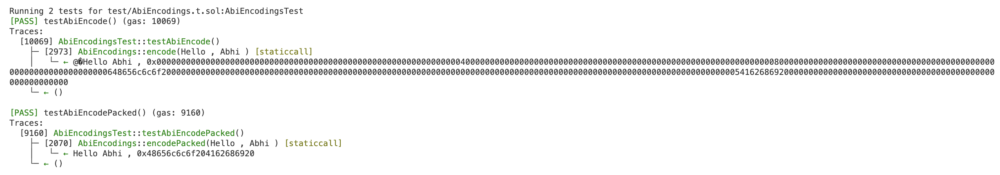

- `encode`: has zero padding.
- `encodePacked`: doesn't have zero padding.
  - It is mainly used for saving the storage space (if stored) & definitely can save the gas cost

- It returns different string & bytes output for the same input `"Hello Abhi "`.
  > NOTE: The output is not trimmed from the start & end for either functions.
- The gas cost for `encode` is higher than `encodePacked`.

The solidity code can be referred [here](../../sc-sol-foundry/src/AbiEncodings.sol).
