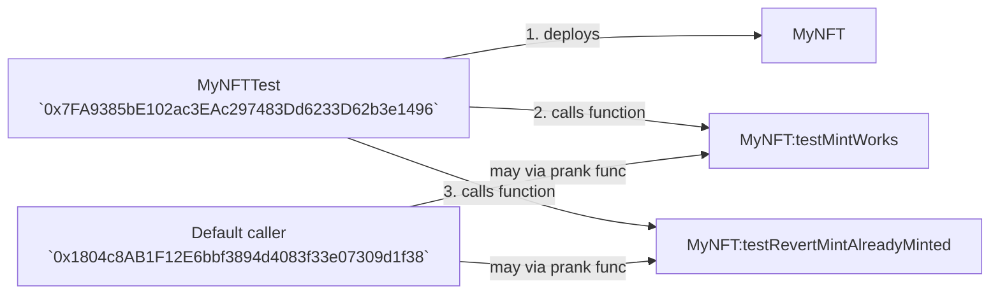

- caller (`msg.sender`) in foundry is default to `0x1804c8AB1F12E6bbf3894d4083f33e07309d1f38` (not used much).
- `address(this)` (defaults to `0x7FA9385bE102ac3EAc297483Dd6233D62b3e1496`) is the address of the contract that (Test/Script SC) deploys (used in most cases) as caller for the contract.
- SC Owner is the Test/Script SC which deploys the contract (used in most cases) as caller for the contract functions during test i.e. `address(this)`

**Architecture**:



> Here, Default caller is not used unless set like this `vm.prank(msg.sender)` for testing purposes.

**Code**:

```solidity
console2.log("myNFT SC owner: ", myNFT.owner());
console2.log("default caller: ", msg.sender);
console2.log("MyNFTTest address: ", address(this));
```

**Output**:

```sh
myNFT SC owner:  0x7FA9385bE102ac3EAc297483Dd6233D62b3e1496
default caller:  0x1804c8AB1F12E6bbf3894d4083f33e07309d1f38
MyNFTTest address:  0x7FA9385bE102ac3EAc297483Dd6233D62b3e1496
```
